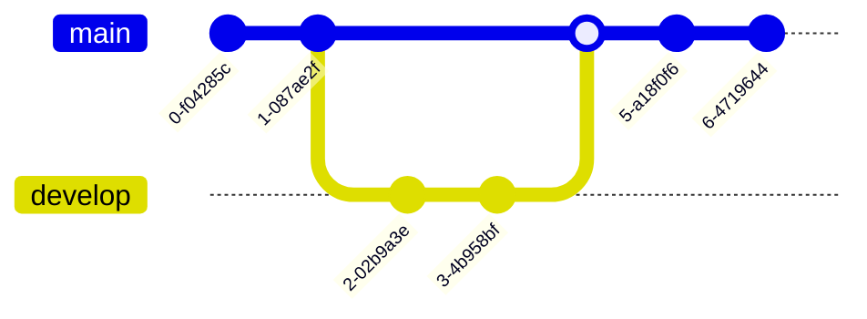

[![Netlify Status][nt-status]][nt-deploy]

[nt-status]: https://api.netlify.com/api/v1/badges/f5780fca-8fa1-4eb6-a8ff-1d8ca6821311/deploy-status?branch=production
[nt-deploy]: https://app.netlify.com/sites/magnoblog/deploys

# Magno Blog

Este es el código de [mi web personal](https://magnoblog.netlify.com), publicada
en los servidores de [Netlify](https://netlify.com) utilizando el generador de
sitios estáticos [Hugo](https://www.gohugo.io).

El HTML, CSS y JS los he creado yo, no esto usando ningún _tema_. Esta es la
estructura:

```
                      ┌──────────────┐        ┌───────────────────┐             ┌──────────┐
                      │ partials     ╠════════╣ baseof.html       ╠═════════════╣ base.css │
                      ├──────────────┤        ├───────────────────┤             └──────────┘
                      │ social-media │        │ » head            │
                      │ page-entry   │        │    ├─ metadata    │
                      │ latex        │        │    ├─ styles      │
                      └──────────────┘        │    └─ fonts       │
                                              │ » body            │
                                              │    ├─ intro       │
                                              │    ├─ header      │
                                           ╔══╣▒▒▒▒├─ main ▒▒▒▒▒▒▒│
                                           ║  │    └─ footer      │
                                           ║  │ » scripts         │
                                           ║  └───────────────────┘
                                           ║
           ╔═════════════════════╦═════════╩═════════╦════════════════════╗
           ║                     ║                   ║                    ║
┌──────────╩──────────┐  ┌───────╩────────┐  ┌───────╩───────┐  ┌─────────╩─────────┐
│ home.html           │  │ list.html      │  │ single.html   │  │ 404.html          │
├─────────────────────┤  ├────────────────┤  ├───────────────┤  ├───────────────────┤
│ » #animation #start │  │ » .main-title  │  │ » .main-title │  │ » custom styles   │
│    └─ animation.js  │  │ » article      │  │ » .toc        │  │ » #not-found      │
│ » #about            │  │ » nav          │  │ » article     │  │    └─ .main-title │
│    └─ .social_media │  │ » .blog-entry  │  │ » .prev-next  │  └───────────────────┘
│ » #portfolio        │  └────────────────┘  └───────────────┘
│    ├─ .project      │
│    ├─ .project      │
│    └─ ...           │
│ » #portfolio        │
│ » #blog             │
│    └─ .entry        │
└──────────╦──────────┘
           ║
     ┌─────╩─────┐
     │ home.css  │
     └───────────┘
```

# Cómo usar

Se necesita tener instalado Hugo SSG al menos v0.126.2.

La opción recomendada para ver el contenido del blog en local es usar el
servidor de Hugo:

```sh
hugo server --environment production
```

Alternativamente, para generar el sitio a la carpeta `public/`:

```sh
hugo
```

> [!NOTE]
> Para ver la versión en desarrollo (posts y contenidos sin terminar):
>
> ```sh
> hugo server -D
> ```

# Formatos

- Código en línea y bloque con resaltado de sintaxis
- Listas y enumeraciones
- Tablas
- Uso de LaTeX para expresiones matemáticas
- Diagramas con [Mermaid] y [GoAT]
- Bloques: notas, observaciones, teoremas, definiciones, etc
- Desplegables

# Notas sobre Markdown

Hugo utiliza [goldmark], y en combinación con mi CSS personalizado, hay algunos
matices a tener en cuenta al escribir artículos en Markdown para MagnoBlog.

Combinaciones especiales que convierten caracteres ASCII a tipográficos
([Typographer extension]):

- `--`, `---`
- `'`, `"`, `<<`, `>>`
- `...`

Otras combinaciones especiales son:

-   Entre `:` se pueden especificar emojis, por ejemplo `:warning:`
    ([referencia], [referencia oficial]).
-   Se pueden añadir clases CSS añadiendo `{.class}` después de los bloques
    o en la primera línea de los bloques de código y títulos ([Markdown
    atributtes]).
-   Con esta misma sintaxis, se pueden definir IDs para crear links a párrafos
    específicos: `{#id}`.

Y un recordatorio sobre sintaxis de Markdown no tan usual.

-   Para crear un salto de línea se puede usar `<br>`, `\` o dos espacios en
    blanco al final de la línea.
-   Tachar texto con `~~ejemplo~~` (extensión [goldmark extras])
-   Resaltar texto con `==ejemplo==` (extensión [goldmark extras])
-   Texto insertado con `++ejemplo++` (extensión [goldmark extras])

## Listas

Si se separa cada elemento de una lista con líneas en blanco, se considera cada
uno un párrafo diferente, lo que implica varios `<p>`. Estos tienen un margen,
por lo que se añade un espacio entre cada uno. **Ideal para elementos con mucho
texto**.

```md
-   Lorem ipsum dolor sit amet, consectetur adipiscing elit. Aliquam feugiat
    nibh ex, eu convallis dolor efficitur a. Lorem ipsum dolor sit amet,
    consectetur adipiscing elit. Sed vulputate mauris non interdum posuere.
    Suspendisse nisl tellus, ultricies nec eleifend id, suscipit in mi.

-   Praesent malesuada sed arcu at eleifend. Aliquam erat volutpat. Ut et mi
    magna. Nunc quis tortor ante. Integer vitae convallis augue. Pellentesque
    laoreet, dolor eu molestie porttitor, orci diam bibendum quam, non lacinia
    nisl metus nec sapien.

-   Aliquam erat volutpat. Maecenas pellentesque convallis libero, at convallis
    nibh mollis non. Curabitur pretium ligula eu auctor vestibulum.
```

Si no hay espacios entre los elementos, se considera todo un párrafo y no se
añade separación:

```md
-   Lorem ipsum dolor sit amet, consectetur adipiscing elit.
-   Sed vulputate mauris non interdum posuere. Suspendisse nisl tellus,
    ultricies nec eleifend id, suscipit in mi.
-   Aliquam feugiat nibh, eu convallis dolor efficitur a.
```

Para separar dos listas solamente en un punto en concreto puedes usar un
comentario vacio.

También se pueden hacer links a modo de referencias:

```md
Lorem ipsum dolor sit amet, consectetur adipiscing elit. Aliquam feugiat nibh
ex, eu convallis dolor efficitura [^1]. Lorem ipsum dolor sit amet, consectetur
adipiscing elit. Sed vulputate mauris non interdum posuere. Suspendisse nisl
tellus, ultricies nec eleifend id, suscipit in mi.

...

[^1]: https://example.com
```

## Código

Hay 3 tipos de formas de representar código en el markdown. Todas ellas usan la
fuente [Fira Code] con las ligaduras activadas, por lo que `->` se verá como una
flecha. El primer método se utiliza para colorear el código según su lenguaje.
Puedes añadir `{linenos=false}` para quitar los números de línea.

~~~md

```c {linenos=false}
#include <stdio.h>

int main() {
  printf("Hola Mundo!\n");
  return 0;
}
```
~~~

El siguiente tipo es para remarcar código dentro de un párrafo. Se cambiará el
fondo a otro color para remarcarlo.

```md
Lorem ipsum dolor sit amet, consectetur adipiscing elit. Aliquam feugiat nibh
ex, eu convallis `dolor` efficitura. Lorem ipsum dolor sit amet, consectetur
adipiscing elit. Sed vulputate mauris `non interdum` posuere. Suspendisse nisl
tellus, ultricies nec `eleifend` id, suscipit in mi.
```

Y el último tipo es para usar letra monoespaciada directamente, sin que se
cambie el fondo ni se resalte nada. Simplemente indenta el texto con 4 espacios
(si se añaden más, aparecerán el en resultado):

```md
    Lorem ipsum dolor sit amet, consectetur adipiscing elit.
    Aliquam feugiat nibh ex, eu convallis dolor efficitura.
```

# Estilo

> Basado en el [formato de Google]

1.  Ajusta el texto en líneas de 80 caracteres, salvo las siguientes excepciones:
    - Links
    - Tablas
    - Código
    - Expresiones LaTeX muy largas
2.  Minimiza el número de errores de ortografía: tildes, letras mayúsculas,
    puntación, etc.
3.  Prefiere la sintaxis de Markdown siempre que sea posible. Utiliza solo HTML
    cuando sea la única forma de representar lo que quieres.
4.  Para el salto de línea usa `\` en lugar de 2 espacios o `<br>`.
5.  Define las cabeceras con `#` a usar `====` o `----`.
6.  Inserta al menos una línea en blanco entre cabecera y texto.
7.  Usa nombres de links descriptivos y prefiere definirlos todos al final del
    documento. Para links a otros posts de blog, usa el shortcode `ref`, dado
    que dará un error si no se encuentra.
8.  Indenta las listas 4 espacios de la siguiente forma:

    ```md
    1.  Lorem ipsum dolor sit amet, consectetur adipiscing elit. Aliquam feugiat nibh
        ex, eu convallis `dolor` efficitura. Lorem ipsum dolor sit amet, consectetur
        adipiscing elit.
    2.  Lorem ipsum dolor sit amet, consectetur adipiscing elit. Aliquam feugiat nibh
        ex, eu convallis `dolor` efficitura. Lorem ipsum dolor sit amet, consectetur
        adipiscing elit.
    ```

    Lo mismo para las no ordenadas:

    ```md
    -   Lorem ipsum dolor sit amet, consectetur adipiscing elit. Aliquam feugiat nibh
        ex, eu convallis `dolor` efficitura. Lorem ipsum dolor sit amet, consectetur
        adipiscing elit.
    -   Lorem ipsum dolor sit amet, consectetur adipiscing elit. Aliquam feugiat nibh
        ex, eu convallis `dolor` efficitura. Lorem ipsum dolor sit amet, consectetur
        adipiscing elit.
    ```

    La única excepción es cuando **todos** los elementos de la lista ocupan
    menos de una línea:

    ```md
    - Lorem ipsum dolor sit amet, consectetur adipiscing elit.
    - Aliquam feugiat nibh ex, eu convallis `dolor` efficitura.
    ```

    De esta forma todo el documento se rige por identaciones de 4 espacios.

> [!NOTE]
> En Vim, con `smartindent`, `autoindent`, `textwidth=80` y `shiftwidth=4`, es
> más fácil escribir listas largas así, ya que detecta que es un elemento dentro
> de la lista. De lo contrario, la identación no lo hará bien.
>
> ```md
> -
>     Lorem ipsum dolor sit amet, consectetur adipiscing elit. Aliquam feugiat
>     nibh ex, eu convallis `dolor` efficitura. Lorem ipsum dolor sit amet,
>     consectetur adipiscing elit.
> -
>     Lorem ipsum dolor sit amet, consectetur adipiscing elit. Aliquam feugiat
>     nibh ex, eu convallis `dolor` efficitura. Lorem ipsum dolor sit amet,
>     consectetur adipiscing elit.
> ```
>
> El siguiente macro junta una las líneas para obtener el formato deseado
> (iniciado en la línea de `-`):
>
> ```
> 0f-Ji  <Esc>/^[ \t>]*-$<Enter>
> ```

## Otras normas a tener en cuenta

-   Las definiciones de **los conceptos deben estar claros en todo momento**
    (usa `block` en color `--magno-blue`). Los ejemplos están bien, pero para
    aclarar la propia definición; **no al revés**: que el lector tenga que
    inferir la definición a partir del ejemplo.
-   Evitar las repeticiones lo máximo posible: cuando se defina algo y luego ese
    concepto vuelva a aparecer, no definirlo otra vez, sino añadir un link.
-   No usar subencabezados mayores que el 4 nivel, preferiblemente el 3 nivel.

# Diagramas

Especificando `goat` como resaltado de sintaxis en un bloque de código, puedes
dibujar diagramas usando ASCII.

~~~md
```goat
+-------------------+                           ^                      .---.
|    A Box          |__.--.__    __.-->         |      .-.             |   |
|                   |        '--'               v     | * |<---        |   |
+-------------------+                                  '-'             |   |
                       Round                                       *---(-. |
  .-----------------.  .-------.    .----------.         .-------.     | | |
 |   Mixed Rounded  | |         |  / Diagonals  \        |   |   |     | | |
 | & Square Corners |  '--. .--'  /              \       |---+---|     '-)-'       .--------.
 '--+------------+-'  .--. |     '-------+--------'      |   |   |       |        / Search /
    |            |   |    | '---.        |               '-------'       |       '-+------'
    |<---------->|   |    |      |       v                Interior                 |     ^
    '           <---'      '----'   .-----------.              ---.     .---       v     |
 .------------------.  Diag line    | .-------. +---.              \   /           .     |
 |   if (a > b)     +---.      .--->| |       | |    | Curved line  \ /           / \    |
 |   obj->fcn()     |    \    /     | '-------' |<--'                +           /   \   |
 '------------------'     '--'      '--+--------'      .--. .--.     |  .-.     +Done?+-'
    .---+-----.                        |   ^           |\ | | /|  .--+ |   |     \   /
    |   |     | Join        \|/        |   | Curved    | \| |/ | |    \    |      \ /
    |   |     +---->  o    --o--        '-'  Vertical  '--' '--'  '--  '--'        +  .---.
 <--+---+-----'       |     /|\                                                    |  | 3 |
                      v                             not:line    'quotes'        .-'   '---'
  .-.             .---+--------.            /            A || B   *bold*       |        ^
 |   |           |   Not a dot  |      <---+---<--    A dash--is not a line    v        |
  '-'             '---------+--'          /           Nor/is this.            ---
```
~~~

Sin embargo, la forma preferida de crear diagramas es utilizando [Mermaid]. En
su página puedes encontrar la [sintaxis de Mermaid] y un [editor visual]. Para
poder usar esto, la opción `mermaid` debe estar a `true` en el _front matter_ de
la página.

El código del diagrama también se especifica en un bloque de código:

~~~md

~~~


# LaTeX

Se utiliza [Katex] para renderizar las fórmulas: simplemente escribe código
LaTeX entre `$` (con la opción `math` puesta a `true` en el _front matter_).
Para bloques de ecuaciones (párrafos centrados) usa `$$`. Estos [símbolos] son
los soportados.

```md
$$
\begin{align*}
    10x + 3y =& 2 \newline
    x - 5y   =& 8 \newline
\end{align*}
$$
```

# Front matter

- string `title` (obligatorio)
- int `weight`: peso para ordenar las diferentes páginas dentro de la sección
- string `description`
- string[] `keywords`
- boolean `draft`
- boolean `toc`: determina si muestra una tabla de contenidos
- boolean `math`: permite añadir fórmulas con [KaTeX](#latex)
- boolean `mermaid`: permite añadir diagramas con [Mermaid]

# Shortcodes

## `arrow`

Renderiza una flecha en el texto. Tiene un argumento opcional para dar el color.
También se puede usar de la siguiente forma:

```md
-   Ejemplo de lista \
     Consecuencia 1 \
     Consecuencia 2 \
     Consecuencia 3
```

Está implementado con el tipo de fuente [Fira Code] usando ligaduras, por lo que
si se copia y pega, el resultado será `==>`.

## `todo`

Solo renderiza su contenido si `hugo.Environment` es `development`. Útil para
evitar que ciertas partes de un artículo se rendericen en el blog final.

- Argumento de bloque (obligatorio)

```md

# Sección sin terminar

Esta sección está incompleta, y no se mostrará
cuando se renderize el blog.

```

## `keyvalue`

Crea una tabla de dos columnas: valor y descripción. Una nueva fila empieza por
`-%` y la descripción por `:%`.

-   Argumento de bloque (obligatorio)
-   string `title`: título de la tabla
-   string `key` `value`: título de la primera y segunda columna
    respectivamente. No se puede combinar con `title`, en ese caso, se usará el
    valor de `title`
-   boolean `key-header` si es `true`, formatea la columna de las claves como la
    cabecera.
-   boolean `fill`: si es `true`, la tabla rellena todo es espacio horizontal
    disponible

```md

-% `Valor` :% Descripción

```

### `keyvalue-sep`

Añade una file de título para separar varias secciones de un mismo `keyvalue`.
Solo tiene sentido usarlo dentro de un bloque `keyvalue`.

-   string `title`: título de la tabla
-   string `key` `value`: título de la primera y segunda columna
    respectivamente. No se puede combinar con `title`, en ese caso, se usará el
    valor de `title`

```md

-% Valor 1 :% Descripción 1
-% Valor 2 :% Descripción 2



-% Valor 3 :% Descripción 3
-% Valor 4 :% Descripción 4
-% Valor 5 :% Descripción 5

```

## `color`

-   string (obligatorio): contenido a cambiar de color
-   color CSS (obligatorio): color deseado. Se pueden usar variables CSS
    definidas en el estilo base para utilizar la misma paleta: `--magno-red`,
    `--magno-blue`, `--magno-green`, `--magno-yellow`, `--magno-purple`,
    `--magno-orange`.

```md



```

## `block`

Crea un bloque con una cabecera y un cuerpo, perfecto para resaltar detalles sin
tener que usar citas.

Se pueden crear links a estos bloques: la dirección usada es el nombre en
minúsculas con guiones en lugar de espacios con el prefijo `block`. Se eliminan
signos de puntuación. Por ejemplo: `Memoria Virtual (MV)` es
`block-memoria-virtual-mv`.

- string (obligatorio): título del bloque
- color CSS: color de fondo para el título. Por defecto es `--magno-green`
- color CSS: color de la fuente por si fuese necesario mejorar el contraste
- Argumento de bloque (obligatorio): contenido del bloque

```md

Si en un triángulo rectángulo hay catetos de longitud $a$ y $b$, y la
medida de la hipotenusa es $c$, entonces se cumple la siguiente relación:

$$ a^2 + b^2 = c^2 $$

```

## `dropdown`

Crea un bloque clickable que muestra un contenido previamente escondido.

- string: título del bloque
- argumento de bloque (obligatorio)

```md

Holis :)

```

# Clases especiales

Lista de clases CSS especiales para configurar la representación del texto
(utilizar conjuntamente con [Markdown atributtes]):

- `.arrow-list`: aplicable en listas. Usa `==>` en lugar de `*`.
- `.header`: aplicable en tablas. Usa la primera columna como cabecera.
- `.center-text`: aplicable a texto. Centra el texto.

[Fira Code]: https://github.com/tonsky/FiraCode
[GoAT]: https://github.com/bep/goat
[Katex]: https://katex.org
[Mermaid]: https://mermaid.js.org
[editor visual]: https://mermaid.live/
[goldmark]: https://github.com/yuin/goldmark/
[referencia oficial]: https://gohugo.io/quick-reference/emojis/
[referencia]: https://www.webfx.com/tools/emoji-cheat-sheet/
[sintaxis de Mermaid]: https://mermaid.js.org/intro/
[símbolos]: https://katex.org/docs/supported.html
[Fira Code]: https://github.com/tonsky/FiraCode
[formato de Google]: https://google.github.io/styleguide/docguide/style.html
[goldmark extras]: https://gohugo.io/getting-started/configuration-markup/#extras
[Typographer extension]: https://gohugo.io/getting-started/configuration-markup/#typographer
[Markdown atributtes]: https://gohugo.io/content-management/markdown-attributes/
