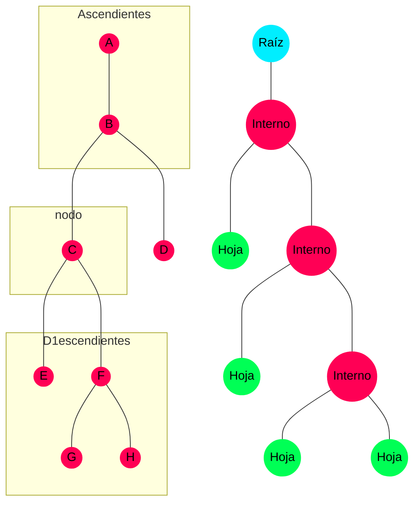
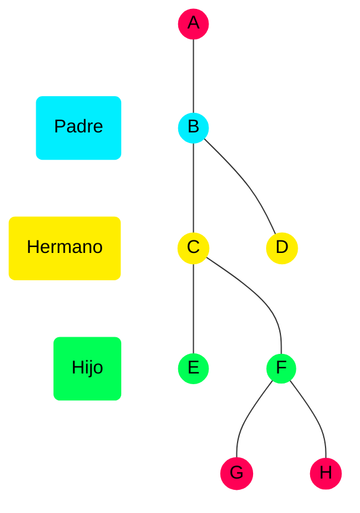
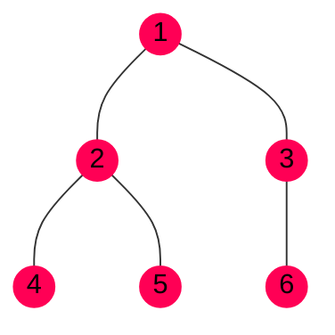
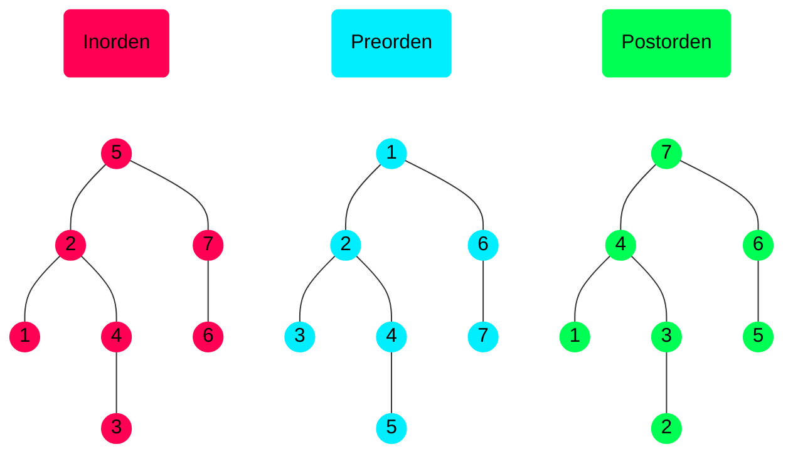
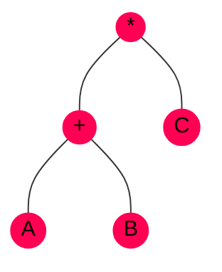
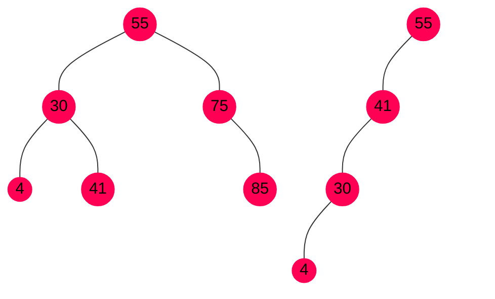
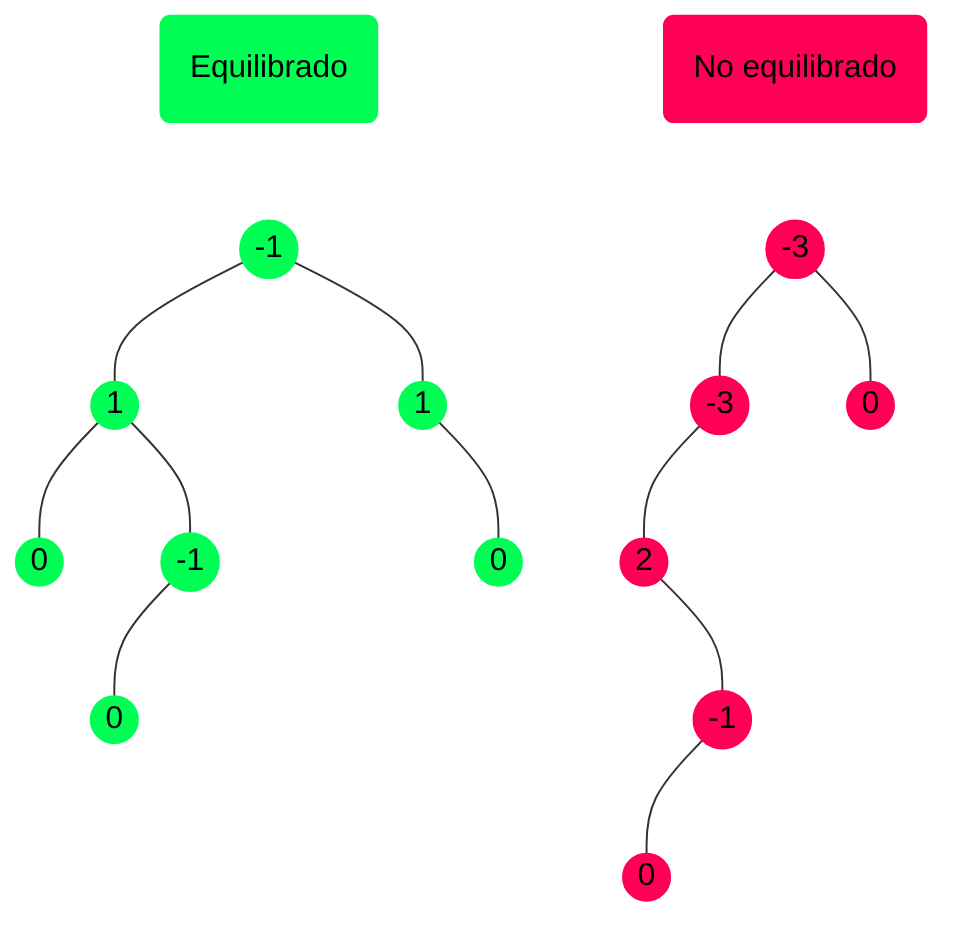

# Conceptos de árboles


Estructura de datos no lineal con una **organización jerárquica** y **elementos
homéneos**. Cada elemento tiene un **único antecesor** y puede tener **varios
sucesores**.





-% Nodo :% Cada componente/elemento del árbol
-% Nodo ascendiente / antecesor :% Nodo en un nivel superior de la jerarquía, accesible por ascenso
-% Nodo descendiente / sucesor :% Nodo en un nivel inferior de la jerarquía, accesible por descenso

-% Nodo raíz :% Nodo inicial de la jerarquía. No tiene antecesores.
-% Nodo hoja :% Nodo terminal de la jerarquía. No tiene sucesores, por tanto se
encuentran en el nivel más bajo, aunque no todos tienen porqué estar en el mismo
nivel.
-% Nodo interno :% Todo nodo que no es raíz ni hoja, es decir, tiene sucesores
y antecesores.






-% Subárbol :% Subconjunto de nodos de un árbol que a su vez tiene estructura de
árbol.
-% Nodo padre :% Es el nodo ascendente directo de todos los subárboles de un
nodo concreto.
-% Nodo hijo :% El el nodo descendente directo de otro nodo.
-% Nodos hermanos :% Dos nodos son hermanos si tienen el mismo padre.



-% Camino :% Secuencia de nodos donde cualquier par de nodos consecutivos son
padre e hijo.
-% Longitud del camino :% Número de nodos de un camino menos 1 (número de
enlaces).
-% Rama :% Cualquier camino desde la raíz hasta una hoja.
-% Nivel / Profundidad de un nodo :% Número de nodos que tiene el camino desde
la raíz hasta dicho nodo.
-% Grado :%
- **De un nodo**: número de descendientes directos de ese nodo.
- **De un árbol**: el máximo grado de sus nodos.
-% Peso :% Número de nodos hoja.
-% Altura :% Número de nodos que tiene la rama más larga del árbol.


# Definición de árbol binario


Árbol donde cada nodo tiene como **máximo grado 2**, es decir, no puede tener
más de 2 nodos descendientes.



Un árbol binario es una de estas dos cosas:

- Un árbol vacío
- Un nodo raíz con un subárbol binario a la derecha y un subárbol binario a la
  izquierda


```goat
         o            o
        / \          / \
       o   o        o   o
      / \          / \   \
     o   o        o   o   o
    /            / \
   o            o   o

No equilibrado  Equilibrado
```

- **Árbol binario equilibrado**: cuando la diferencia de altura entre los
  subárboles de cualquier nodo es como máximo una unidad.

```goat
                  o
    o            / \
   / \          /   \
  o   o        o     o
 / \   \      / \   / \
o   o   o    o   o o   o

 No lleno       Lleno
```

- **Árbol binario lleno**: un árbol binario de altura es lleno si todos sus
  nodos tienen dos hijos y todas sus hojas están al mismo nivel.  
   Todo árbol lleno **es equilibrado**.


```goat
       o
      / \
     /   \
    o     o
   / \   / \
  o   o o   o
 / \
o   o
```

- **Árbol binario completo**: un árbol binario de altura $h$ es completo si está
  lleno hasta $h-1$, con el nivel $h$ relleno de izquierda a derecha.  
   Un árbol binario completo **es equilibrado**.  
   Si un árbol es lleno, también es completo.

# TAD Árbol Binario

Los valores del TAD Árbol Binario (ABin) son árboles binarios donde cada nodo
contiene un dato del tipo `elem`. Es un TAD **mutable**, dado que
`insizq/insder`, `supizq/supder` y `modificar`; insertan, eliminan y modifican
respecticamente los elementos del árbol.

```c {linenos=false}
//// Lectura ////
*crear() -> abin           Crea un abin vacío
es_vacio(A: abin) -> bool  true si A está vacío
leer(A: abin) -> elem      Contenido del nodo raíz de A.
izq(A: abin) -> abin
der(A: abin) -> abin       Subárbol izquierdo/derecho de A.
                           Si no existe, NULL.

//// Modificación ////
insizq(A: abin, E: elem)
insder(A: abin, E: elem)
    Requisitos: es_vacio(A) = false
                es_vacio(izq/der(A)) = true
    Inserta un nodo con contenido E a la izquierda/derecha

supizq(A: abin)
supder(A: abin)
    Requisitos: es_vacio(A) = false
    Elimina el subárbol izquierdo/derecho, incluyendo descendientes

modificar(A: abin, E: elem)
    Sobreescribe el nodo raíz de A con E
```
# Recorridos
## Anchura

Se recorre el árbol por niveles, de izquierda a derecha:


Para realizarlo, se necesita una **cola** como estructura auxiliar:

1. Añadir la raíz a la cola.
2. Tomar el primer elemento de la cola, mostrarlo en la secuencia, y meter sus
   hijos izquierdo y derecho (en ese orden) en la cola.
3. Repetir el paso 2 hasta que la cola se vacíe.

## Profundidad

Se recorre el árbol según sus ramas, descendiendo o subiendo niveles. Hay varios
tipos dependiendo qué dato se muestra primero:




Orden simétrico / central:

```c
void inorden(abin A) {
    if (es_vacio(A))
        return;

    inorden(izq(A));         // I
    printf("%d\n", leer(A)); // R
    inorden(der(A));         // D
}
```



Para el recorrido de inorden no recursivo, se utiliza una **pila** como
estructura auxiliar.

1. Guardar en la pila punteros a los hijos izquierdo empezando desde la raíz.
2. Se la pila no está vacía: se desapila, leer y repetir 1 siendo la raíz del
   nodo desapilado.
3. Repetir pasos 1 y 2 hasta que se vacie la pila.



Notación polaca:

```c
void preorden(abin A) {
    if (es_vacio(A))
        return;

    printf("%d\n", leer(A)); // R
    preorden(izq(A));        // I
    preorden(der(A));        // D
}
```



Notación polaca inversa:

```c
void postorden(abin A) {
    if (es_vacio(A))
        return;

    postorden(izq(A));       // I
    postorden(der(A));       // D
    printf("%d\n", leer(A)); // R
}
```


# Árboles de expresión

- Se usan para almacenar expresiones como `(6+7)*4-1` en memoria, lo que resulta
  muy útil para **compiladores**.
- Los paréntesis no se almacenan, pero están en la forma del árbol.
- Todos los operandos están en las hojas.
- Toda raíz de cada subárbol es un operador

La expresión `(A+B)*C` genera el siguiente árbol de expresión:



Y se se realizan recorridos sobre dicho árbol:

- Inorden: `A+B*C`
- Preorden: `*+ABC`
- Postorden: `AB+C*` (A y B, suma. El resultado y C, multiplica)


Estructuras de datos auxiliares:

- **Pila** de `abin`: almacenar punteros a nodos del árbol
- **Pila** de `char`: para retener los operadores antes de ser incorporados

Algoritmo: Se lee la expresión hasta que se termina la entrada y la pila de
operandos.

- **Operando**: se crea un árbol de 1 nodo y se almacena en la pila
- **Operador**:

  Si **su prioridad es menor o igual que la cima**, se desapilan
  sucecesivamente los operadores de mayor prioridad.

  Al desapilar un operador, también se desapilan 2 operandos para formar
  un nuevo árbol, que se añade a la pila de operandos.

  En el caso del `(`, solo se saca cuando aparece un `)`.

El resultado es el único elemento que hay en la pila de operadores.


# Árboles para búsqueda

- **Motivación**: compatibilidad con algoritmos eficientes, si los datos están
  ordenados, se pueden tomar decisiones más inteligentes que hacer fuerza bruta.
- Ejemplo: búsqueda en una lista
  - Búsqueda lineal: $O(n)$
  - Búsqueda binaria: $O(\log{(n)})$


Ahora, cada nodo debe tener una clave que permita ordenar el tipo `elem`,
`clave`.


## Árbol binario de búsqueda (ABB)


Dado un nodo de un Árbol binario,

- todo subárbol  debe almacenar valores .
- todo subárbol  debe almacenar valores .


```c {linenos=false}
//// Lectura ////
*crear() -> abin
leer(A: abin) -> elem
izq(A: abin) -> abin
der(A: abin) -> abin
es_vacio(A: abin) -> bool
es_miembro(A: abin, E: elem) --> bool
buscar(A: abin, K: clave) --> elem

//// Modificación ////
insertar(A: abin, K: clave, E: elem) -> bool
    Inserta un nodo con contenido E
    Si el nodo ya existe, no hace nada
    true si se modificó A

suprimir(A: abin, K: elem) -> bool
    Requisitos: es_vacio(A) = false
    Elimina el nodo de clave K
    Si el nodo no existe, no hace nada
    true si se modificó A

modificar(A: abin, K: clave, E: elem) -> bool
    Sobreescribe el nodo de clave K con E
    Si el nodo no existe, no hace nada
    true si se modificó A
```


1. Crear el nuevo nodo
2. Insertar como hoja, por lo que cuando se llegue a un subárbol nulo, se
   inserta.
    - `K < clave(nodo)`: insertar por el subárbol izquierdo
    - `K > clave(nodo)`: insertar por el subárbol derecho
    - `K = clave(nodo)`: salir, el nodo que se intenta insertar ya está en el
       árbol
3. Enlazar el nuevo nodo con el árbol



Igual que el algoritmo de búsqueda binaria, se empieza por el nodo raíz, y luego
se va descendiendo por el árbol:

- Si `K = clave(raíz)`: terminé
- Si `K < clave(raíz)`: buscar en el subárbol izquierdo
- Si `K > clave(raíz)`: buscar en el subárbol derecho



Primero se busca el nodo a borrar. En función del tipo de nodo que sea, se deben
reajustar los punteros para realizar el cambio:

- **Hoja**: se elimina directamente
- **Tiene 1 hijo**: sustituir por el hijo y eliminar
- **Tiene 2 hijos**: sustituir por
    - el menor de los descencientes del hijo derecho
    - el mayor de los descencientes del hijo izquierdo

En esta última opción, se sustituye por un nodo hoja central.


La ventaja principal es que **el tiempo de ejecución promedio es
$O(\log{(n)})$**, siempre y cuando **el árbol esté balanceado**, de lo contrario,
será como una lista, $O(n)$.



El recorrido en inorden devuelve los datos ordenados: `4 30 41 55 75 85`.

## Montículo binario (_Heap_)


Árbol binario completo parcialmente ordenado:

- **Completo**: en el nivel más bajo pueden faltar nodos, pero deben estar a la
  derecha.
- **Condición de montículo**:
    - `minheap`: $\text{clave}(\text{nodo}) \le \text{clave}(\text{hijos})$
    - `maxheap`: $\text{clave}(\text{nodo}) \ge \text{clave}(\text{hijos})$

### Propiedades

- Orden parcial es más débil que el total  Más eficiente de mantener
- Orden parcial más eficiente que el aleatorio  Conocemos el
  mayor/menor (`maxheap`/`minheap`) elemento: la **raíz**.

### Aplicaciones

- Soporte eficiente a la **cola de prioridad**
- Algoritmos voraces


### Implementación mediante arrays

La implementación más natural de un montículo binario es el árbol binario, pero
se puede aprovechar su propiedad de completo:

- `A[0]`: nodo raíz
- `A[2*k + 1]`: hijo izquierdo de `k`
- `A[2*k + 2]`: hijo derecho de `k`
- `A[(k - 1) / 2]`: padre de `k`


-% Ventajas :%
- Se obtiene en tiempo constante cualquier nodo, incluyendo hijos y padre.
- Si el árbol es **completo**, ocupa **menos menoria que la implementación
  enlazada**, dado que no hay que almacenar punteros.

-% Desventajas :%
- Se requiere conocer a priori el número máximo de elementos.
- Si el árbol no es completo, se desperdicia memoria por tener huecos en el
  array.
- Tampoco es tan flexible a la hora de hacer modificaciones arbitrarias.


### Cola de prioridad con montículos binarios

```c {linenos=false}
void insertar(ColaPrio C, Elem E, Prio P)
void suprimir(ColaPrio C)
```

Estas operaciones se pueden completar en **$O(\log{(n)})$**, dado que la altura
de un árbol binario completo de $n$ nodos es $\log{(n + 1)}$.


Se inserta el elemento al final del montículo (último nivel a la izquierda)
y luego se hace <<flotar>> hasta que se cumpla la condición de montículo,
dependiendo si es `maxheap` o `minheap`.



Es el inverso al de inserción: se suprime la raíz y se pone en su lugar el
último elemento. Este se <<hunde>> hasta que se cumple la condición de
montículo.


### Monticulización / Heapify

Dado un array de datos, se construye un montículo:

1. Se crea un árbol a partir del array
2. Si el árbol tiene $L$ niveles, desde el nivel $L-1$ hasta 1 repetir:
    - Comprobar la condición de montículo, si no la cumple, intercambiar con el
      menor/mayor de sus hijos
    - Propagar ese cambio desde el nivel actual hasta $L-1$

## Árbol equilibrado (AVL)

Se ha comentado que la eficiencia de un Árbol Binario de Búsqueda depende de su
estructura, lo que viene dado por el orden de inserción de los datos.

- Datos en orden creciente: solo ramas derechas
- Datos en orden decreciente: solo ramas izquierdas


Es un Árbol Binario en el que las alturas de los dos subárboles de cada nodo
**no difieren en más de una unidad**.

A cada nodo se le asigna un **factor de equilibrio**, que indica la diferencia
entre alturas del subárbol izquierdo y derecho:

$$ F_e = H_{RD} - H_{RI} $$

Para que un árbol equilibrado sea válido debe tener un factor de equilibrio en
$\set{-1, 0, 1}$

### Rotaciones

Para mantener el árbol equilibrado tras una actualización (inserción
o eliminación), se realizan **rotaciones** que transforman la estructura del
árbol sin cambiar su significado.

- Rotaciones **simples**: II, DD
- Rotaciones **compuestas**: ID, DI

Dependiendo de la combinación del factor de equilibrio de cada nodo, se podrá
determinar la rotación adecuada para equilibrar el árbol.

### Eficiencia

Las operaciones siguen siendo **$O(\log{(n)})$**, pero cada paso necesita más
operaciones: se necesita una pasada desde la raíz para buscar el nodo sobre el
que operar, y luego **otra hacia la raíz para recalcular los factores de
equilibrio y realizar las rotaciones**.

Con este pequeño precio, se consigue un árbol equilibrado en todos los casos,
por lo que **nunca una operación será $O(n)$** como puede suceder en un árbol
binario convencional.





1. Bajar por el árbol como un ABB
2. El nuevo nodo se inserta como hoja, por lo que este tiene `fe=0`
3. Se regresa hacia la raíz recalculando los `fe`
4. Si el factor `fe` no es válido, se reestructura con una rotación
5. Se termina cuando todos los nodos cumplen la condición de árbol equilibrado

```py {linenos=false}
if Hrd == Hri:
    insertar en la rama izquierda o derecha
    no provocará desequilibrio

elif Hrd > Hri:
    insertar en izquierdo => Hrd == Hri (no hay desquilibrio)
    insertar en derecho   => Hay que reestructurar

elif Hrd < Hri:
    insertar en izquierdo => Hay que reestructurar
    insertar en derecho   => Hrd == Hri (no hay desquilibrio)
```



El proceso es análogo a la inserción: se elimina como un Árbol Binario de
Búsqueda convencional y luego se regresa por el camino hacia la raíz
**recalculando los factores de equilibrio** y **realizando rotaciones** en caso
de que fuese necesario.


<!-- TODO: rotaciones -->

## Árbol B


Un Árbol B es una generalización de un Árbol Equilibrado para almacenar
y recuperar información de **medios externos**, por lo que es necesario operar con
**_muchos_ más datos**.

Los Árboles B utilizan **páginas** como nodos, que contienen una secuencia de
datos **ordenados según sus respectivas claves** y ramas a otras páginas.
**Todas las páginas hoja deben estár al mismo nivel**, por tanto, es un árbol
equilibrado.

Entonces, para representar una página de un Árbol B se necesita:

- Vector de claves y datos
- Vector de ramas
- Número de elementos ocupados

### Aplicaciones

- **Bases de datos**: es una forma de crear un índice en una BD Relacional
- Gestión del sistema de archivos por el SO: aumenta la eficacia en la búsqueda
  de archivos por subdirectorios.
- Sistemas de compresión de datos
- **Búsquedas externas en discos**: se minimiza el número de accesos

 Si el **volumen de datos es grande** y se almacenan de forma externa,
se deben usar Árboles B.



-% Página única :%
$0 \ldots m-1$ claves  
$0$ ramas

-% Raíz :%
$1 \ldots m-1$ claves  
$2 \ldots m$ ramas

-% Página interna :%
$\lfloor m/2 \rfloor \ldots m-1$ claves  
$\lceil m/2 \rceil \ldots m$ ramas

-% Hoja :%
$\lfloor m/2 \rfloor \ldots m-1$ claves  
$0$ ramas


También se cumple que:

$$ \text{ramas} \not = 0 \implies \text{claves} = \text{ramas} - 1 $$


Los Árboles B **crecen hacia la raíz**: siempre es el elemento central el que
<<sube>>. No importa en qué orden lleguen los datos, siempre va a estar
balanceado.

1. Si la clave ya está en el árbol, termino con un error
2. Se intenta insertar en la página hoja correspondiente, que se busca como en
   un Árbol Binario de Búsqueda convencional.

Aquí se distinguen dos casos:

- La página hoja no está llena ($\text{claves} < m-1$), por lo que se inserta
directamente **respetando el orden**.
- La página hoja está llena ($\text{claves} = m-1$)

1. **Se divide la página a la mitad**, incluyendo el nuevo dato la posición que
   le tocaría.
2. **El elemento central sube a la página padre**, que en caso de estar llena,
   se realizaría este mismo procedimiento.
3. La página con elementos menores que el central forma una nueva página a la
   izquierda
4. Los elementos mayores formarán una nueva página a la
   derecha

El elemento que se sube no tiene porqué coincidir con el que se quiso insertar,
por tanto **no importa en el orden en que lleguen los datos**.

Otra observación es que **una subdivisión de una página es una operación
infrecuente**, dado que las siguientes serán inserciones directas porque hay
espacio.



<!-- TODO: diagrama explicando cada caso -->

Al igual que en un Árbol Binario, primero hay que localizar el elemento
a eliminar.

Si está en una página hoja:

1. Se intercambia por el elemento más a la derecha en el subárbol izquierdo o el
   de más a la izquierda en el subárbol derecho.
2. Si después de intercambiar quedan menos elementos de los mínimos: **se
   fusiona esa página con el elemento central de la página padre y la página
   adyancente.

Si está en una página hoja:

- $\text{claves} > \text{minimo}$: Simplemente se borra
- $\text{claves} = \text{minimo}$ y una página hermana tiene $\text{claves} > \text{minimo}$,
  1. Se borra el elemento deseado
  2. Se baja a su posición la clave adyacente de la página antecesora
  3. La nueva clave de la página padre se toma de la página hermana
  Básicamente hemos robado un elemento a la página hermana.
- $\text{claves} = \text{minimo}$ y todas las páginas hermanas tienen $\text{claves} = \text{minimo}$,
  1. Se borra el elemento deseado
  2. Se fusiona en una nueva página: la página original, el elemento central
     antecesor y la página hermana correspondiente.


## Árbol B+


Se trata de una mejora de los Árboles B.

- **Todas las claves están en hojas** y se duplican las necesarias en el resto
  de páginas para definir los caminos de búsqueda. **Las claves internas solo se
  usan como índices**.
- Aunque hay redundancia de claves, **se evita la operación de reorganización**.
- Se pueden vincular las hojas entre sí para **un recorrido secuencial más
  rápido**.
- Todos los caminos desde la raíz hasta cualquier hoja tienen la misma longitud.

### Características

Al igual que un Árbol B, un Árbol B+ de orden $m$ tiene:

- Cada página (salvo la raíz) tiene $n$ elementos, siendo $\lfloor m/2 \rfloor \le n \le m-1$
- Cada página (salvo la raíz) tiene $r$ ramas, siendo $\lceil m/2 \rceil \le r \le m$
- La raíz tiene $1 \ldots m-1$ elementos y 2 descendientes como mínimo
- Las páginas hoja están al mismo nivel
- Todos los índices indican donde está la información y se almacenan en la raíz
  y las páginas interiores.
- Los elementos se insertan en las hojas, y luego los índices crecen <<hacia
  arriba>>.

```c {linenos=false}
typedef struct {
    elem nodos[MAX];
    int cuenta;
} PaginaHoja;

typedef struct {
    clave claves[MAX];
    ArbolBmas ramas[MAX+1];
    int cuenta;
} PaginaInterna;
```



Muy similar al procedimiento de los Árboles B.

Si no está la página (hoja) llena, se inserta directamente.

En caso contrario, se divide la página en dos y se **copia** el elemento central
a la página superior. Como todos los tienen que estar en las páginas hojas, no
se puede mover, sino copiar.

Nótese que si es necesario dividir páginas internas, **no se copian las
claves**. Dado que esas solo se usan como guías, no se vuelven a duplicar, sino
que siguen el mismo procedimiento que en los Árboles B.



Procedimiento más simple que en los Árboles B.

1. Se elimina el elemento en su página hoja correspondiente.
2. Si al eliminar queda con elementos suficientes, **no es necesario modificar
   nada de los índices, dado que siguen siendo válidos**.
3. En caso de que falten elementos, se deben redistribuir como en los Árboles B.
   Cuando se cambia la estructura, **se quitan las claves de los nodos después
   de haber eliminado la información de sus nodos hoja**.


## Resumen


-% ABB :%
Árbol binario ordenado.  
En promedio opera en $O(\log(n))$, pero en el peor de los casos es $O(n)$ (según
el orden de inserción).

-% Heap :%
Árbol binario completo parcialmente ordenado.  
Se puede implementar mediante arrays y da un soporte eficiente a las colas de
prioridad.

-% AVL :%
Árbol binario ordenado equilibrado.  
Mejora ABB implementando un factor de equilibrio y rotaciones para garantizar
$O(\log(n))$.

-% Árbol B :%
Árbol ordenado equilibrado de páginas.  
Permite almacenar mucha más información con un acceso $O(\log(n))$. Se usa para
medios externos cuyo acceso suele ser costoso.

-% Árbol B+ :%
Modificación del árbol B.  
Evita la operación de reorganización a coste de almacenar claves duplicadas.
Permiten un recorrido secuencial rápido.


