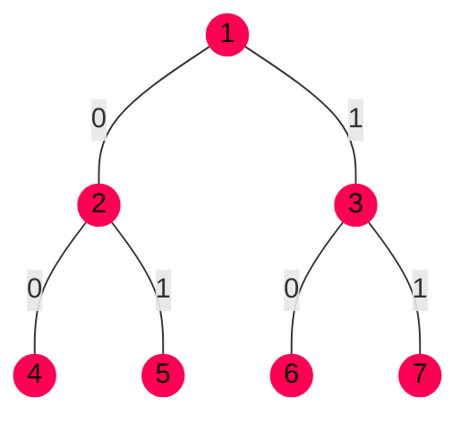
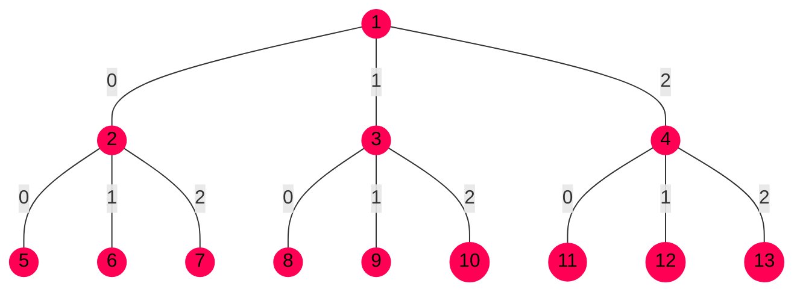
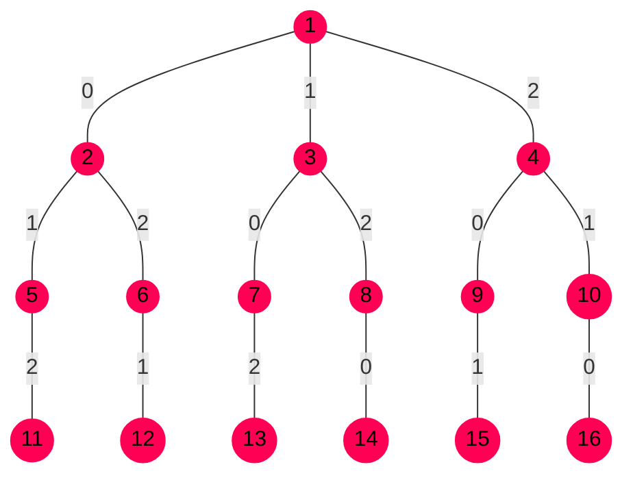
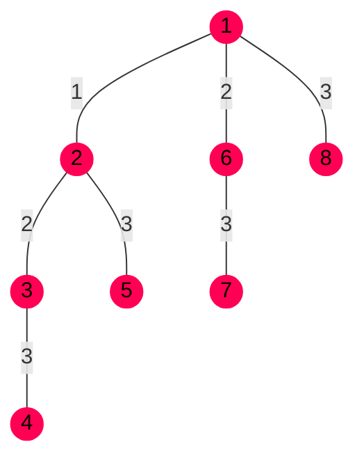


El artículo de [Algoritmos]() es una buena introducción.


# Problemas de optimización


Un problema de optimización es aquel que consiste en encontrar una solución que
tenga un coste mínimo o un valor máximo.


Algunos ejemplos pueden ser:

- [El problema del viajero]: un viajero debe recorrer $N$ ciudades sin repetirlas
  y volver a la ciudad de partida, pero siguiendo un camino que longitud mínima.
- [DeepBlue vs Kasparov]. Se calcula que en el ajedrez hay unas $10^{120}$
  partidas. El universo tiene unas $10^{81}$ partículas.
- [AlphaGo vs Sedol]. El juego Go tiene un factor de ramificación mucho más
  elevado, superior a $100$ (en el ajedrez son ~$30$-$40$), lo que supone un
  problema más complejo.
- [AlphaZero], la versión genérica de este programa que juega tanto ajedrez como
  Go, solo se entrenó **jugando contra sí mismo** y sin ningún tipo de acceso al
  libro de aperturas o de finales.

Hay algunos problemas que se pueden resolver matemáticamente, creando una
función y buscar sus mínimos. Pero en otros casos, se necesitan algoritmos
capaces de buscar y encontrar las mejores soluciones.

# Aproximación a la resolución de problemas

Para resolver estos problemas, el algoritmo tendrá que **tomar una serie
decisiones** para cambiar de estado y progresar hacia la solución.

En función de nuestra aproximación al problema, podremos obtener soluciones
exactas o aproximadas (no es la mejor, pero es razonable):

- **Preciso**  solución **exacta**: se trata de un **método
  específico** del problema y que aporta una solución óptima. P.e: invertir una
  matriz (algoritmo de Gauss), multiplicar matrices, etc.

- **Heurístico**  solución **aproximada**: se usa un método de
  resolución de problemas que aplica **conocimiento específico** para aproximar
  una solución o mejorar la eficiencia de la búsqueda. Se utiliza cuando el
  espacio de estados es demasiado grande como para analizar todas las
  posibilidades.

- **Metaheurístico**  solución **aproximada**: mejoran los
  procedimientos heurísticos generalizándolos y obteniendo mejoras en eficiencia.
  Utilizan estrategias que diversifican la búsqueda para evitar mínimos locales
  e intensificándola en zonas prometedoras. No veremos estas estrategias.

# Búsqueda en espacio de estados


El espacio de estados de un problema es el **conjunto de todos los estados
posibles** a los que se puede llegar desde el estado inicial mediante cualquier
secuencia de operadores (decisiones).

Se suele representar mediante un **árbol de decisión**.

- Cada nodo se corresponde con un estado en el problema.
- El nodo raíz del árbol es el estado inicial.
- Los hijos de un determinado nodo son los estados siguientes, y los ejes son
  las decisiones o operadores que se deben tomar para llegar a ellos.
- Cada uno de estos nodos tiene asociado un coste o un valor.



Acción que se lleva a cabo para pasar de un estado a otro.



El proceso de búsqueda consiste en encontrar una meta o nodo solución. A veces
hay más de una solución.




1. Tenemos un problema que creemos que se puede modelar en un espacio de estados
2. Hay un estado inicial
3. Queremos llegar a un estado final
4. Existen muchos operadores para evolucionar al final


Permite determinar si un estado es una solución al problema.



La condición de parada es una serie de criterios para detener la búsqueda.
Pueden ser totales o parciales.



Cantidad de decisiones posibles (número de posibles $x_i$) a tomar en
determinado estado.



Consiste en una matriz de tamaño $\sqrt{N+1} \times \sqrt{N+1}$ ($N$ es el
número de piezas, restando el hueco. Si el lado es $L$, entonces $N = L \times
L -1$). Cada elemento de la matriz es de piezas donde falta una. Cada pieza se
puede desplazar hacia donde está el hueco. El puzzle consiste en, partiendo del
tablero desordenado, recolocar las piezas para que estén en el orden correcto.

Los espacios de estados de este problema tienden a ser muy grandes.

- Estados: disposición de las piezas en un momento dado.
- Operadores: movimiento del espacio vacío $\land$, $\lor$, $>$, $<$
- Prueba de meta: ¿están las piezas en el orden correcto?
- Coste de ruta: número de movimientos realizados desde el estado inicial hasta
  el estado resuelto.


Por tanto, el objetivo de una búsqueda es **encontrar un nodo que verifique la
prueba de meta y la condición de parada**.

Cada estado se puede representar con una **tupla $(x_0, \ldots, x_n)$** donde
cada $x_i$ representa cada decisión tomada y $n$ es el nivel actual en el árbol.
Cuando se toma una decisión para llegar al nivel $n+1$, se añade el elemento
$x_{n+1}$. Además, puede tener un **puntero a su nodo padre** (excepto el
inicial, que es `null`) para poder reconstruir el camino realizado.

Según las características del problema, se pueden plantear diferentes tipos de
árbol y espacios de estados. Puede haber un número finito o infinito de estados
y normalmente, cuando se añaden más decisiones al problema, la complejidad
aumenta de forma exponencial. En las secciones siguientes, se detallan algunos
de los más habituales.

## Árbol binario

Se utiliza cuando el problema requiere **añadir ciertos elementos a un
conjunto**. Cada decisión consiste en tomar el elemento o no:

$$x_i \in \set{0, 1}$$



Ejemplos:

- [El problema de la mochila]: meter en una mochila los objetos de mayor valor
  que no superen $X$ peso.

## Árbol $k$-ario

Se utiliza en problemas donde cada estado tiene un número fijo de decisiones:

$$x_i \in \set{1, \ldots, k}$$



Ejemplos:

- [El problema de cambio de moneda]: con un número determinado de monedas de
  diferentes valores, representar $X$ precio con el mínimo número de monedas
  posibles.
- [El problema de las $N$ reinas]: colocar en un tablero de ajedrez de tamaño
  $N \times N$ de forma que ninguna ataque a otra.

## Árbol permutacional

Problemas donde hay varias elecciones para $x_i$ pero no se pueden repetir.

$$ x_i \in \set{1, \ldots, n} \quad \forall x_j, \\; x_i \ne x_j $$



Ejemplos:

- Asignar $n$ tareas a $n$ personas

## Árbol combinatorio

Representan los mismos problemas que los árboles binarios, solo que en un
formato distinto, por ejemplo: Binario $(0, 1, 0, 1, 0, 0, 1) \rightarrow$
Combinatorio $(2, 4, 7)$

$$
    s = (x_1, \ldots, x_m) \quad m \le n
    x_i \in \set{1, \ldots, n} \quad x_i < x_{i+1}
$$



# Cómo resolver estos problemas
## Búsqueda a ciegas

La primera opción que se nos podría ocurrir es **recorrer el espacio de estados
en su totalidad** y ejecutar la condición de meta en cada estado. Se llama
búsqueda _a ciegas_ porque **no utiliza información del problema**
o conocimiento del dominio.

Ya hemos visto que hay [varias formas de recorrer un árbol]:

- **Amplitud**: nivel a nivel, aplicando todos los operadores y obtener todos
  los hijos. Se utiliza una estructura FIFO (cola) auxiliar.


    ```py
    pendientes = [nodo_inicial]
    while not empty(pendientes):
        nodo = pendientes.consume_first()

        for hijo in expandir(nodo):
            if solucion(hijo):
                return hijo

            pendientes.push_end(hijo)
    ```

    `expandir()` aplica todos los operadores posibles para generar los estados
    hijo.

- **Profundidad**: se avanza por una rama hasta llegar a los nodos hoja. Se
  utiliza una estructura LIFO (pila) auxiliar.

    El siguiente algoritmo realiza una búsqueda en profundidad pero con un
    límite de niveles:

    ```py
    pendientes = [nodo_inicial]
    profundidad_max = ?

    while not empty(pendientes):
        nodo = pendientes.consume_first()

        if profundidad(nodo) >= profundidad_max:
            continue

        for hijo in expandir(nodo):
            if es_solucion(hijo):
                return hijo

            elif not es_hoja(hijo):
                pendientes.push_first(hijo)
    ```



Adicionalmente, se pueden idear otras estrategias:

- **Limitada en profundidad**: establecer un límite máximo de profundidad $l$ en
  la búsqueda.
- **Profundización iterativa**: el límite máximo es dinámico ($l$ cambia), en
  función de si he encontrado solución dentro del límite o no. También tiene la
  ventaja de que no se almacena el árbol completo en memoria.
- **Bidireccional**: se parte del estado inicial hacia abajo y también desde el
  estado final hacia arriba. El algoritmo termina cuando ambos se encuentran.
  Esta estrategia tiene el problema de que a veces no conocemos el estado final
  (como en el ajedrez).


Esta estrategia es particularmente **ineficiente** y es imposible explorar todas
las alternativas para problemas complejos.

Recorrer el árbol entero tiene la ventaja de que se puede encontrar la solución
óptima



Utilizando por ejemplo una búsqueda en amplitud y asumiendo que:

- Factor de ramificación $r=10$
- 1 M nodos/s
- 100 B/nodo (bytes)

| Profundidad | Nodos     | Tiempo     | Memoria |
|-------------|-----------|------------|---------|
| 0           | 1         | 0.001 ms   | 100 B   |
| 2           | 111       | 0.1 ms     | 11 KB   |
| 4           | 11 111    | 11 ms      | 1 MB    |
| 6           | $10^{6}$  | 1 s        | 111 MB  |
| 8           | $10^{8}$  | 100 s      | 11 GB   |
| 10          | $10^{10}$ | 0.128 días | 1 TB    |
| 12          | $10^{12}$ | 12.8 días  | 111 TB  |

El juego del ajedrez tiene un factor de ramificación $r=30$, que es mucho más
elevado. O el problema del viajero tiene complejidad $O(n!)$, por lo que para
100 ciudades, hay más posibilidades que partículas en el universo.

 Se necesita una técnica mejor.


## Búsqueda informada

Con el motivo de mejorar la ineficiencia de la búsqueda a ciegas, se puede
utilizar otra estrategia que **utiliza información sobre el problema** para
guiar la búsqueda.

De forma general, se puede analizar cada nodo a través de una **función de
evaluación**:

$$ f(n) = g(n) + h(n) $$

- $g(n)$ es el **coste del camino** desde el nodo inicial.
- $h(n)$ es una **función heurística** que asigna a cada nodo un valor de
  utilizad estimado en la búsqueda de la solución. En genera, una estimación de la
  **distancia al nodo solución**.

Nótese que:

- Si $f(n) = g(n)$ el coste es uniforme, por tanto la **búsqueda es a ciegas**.
- Si $f(n) = h(n)$, algoritmo del **primero el mejor** (algoritmo voraz)
- Si $f(n) = g(n) + h(n)$, se llama **algoritmo A\***. Si la heurística es
  admisible, se puede demostrar que encontrará una solución óptima.


Una heurística es un criterio para seleccionar el **operador más prometedor**
para llegar a la solución.

Tiene una alta dependencia con el problema, ya que se utiliza el **conocimiento
previo** y mediante **prueba y error**. Se trata de un criterio humano
(principalmente).



Una heurística admisible o optimista garantiza que **como mínimo una rama tiene
el coste estimado** y **nunca superará el valor real**. Es decir, proporciona un
límite inferior.

Si una heurística no es admisible, el algoritmo A* podría pasar por alto el
camino hacia la solución real, dado que **descartaría esa rama cuando el coste
en realidad era menor**.


Una posible técnica para encontrar heurísticas es **relajar el problema de
partida** a algo más sencillo y rápido de resolver. Otra idea es utilizar
información de patrones y almacenar subproblemas más sencillos ya resueltos.

También es posible combinar (tomando el valor más pesimista de cada) heurísticas
admisibles parecidas para matizar mejor cada nodo.

Puede encontrar [más información sobre heurísticas] en la wikipedia.


- Número de piezas fuera de sitio y que deben ser recolocadas. Esta es la
  estimación del mínimo número de movimientos necesarios restantes.
- **Distancia Manhattan**: contar la distancia entre cada pieza y su posición
  deseada. Relajamos el problema a poder mover cualquier pieza a cualquier lugar
  (no necesariamente el hueco).


### Algoritmo voraz

Se trata de una estrategia que en lugar de buscar una solución global, utilizan
una heurística para seleccionar el **nodo más prometedor en cada paso**. Su
ejecución es **muy eficiente** dado que **nunca reconsideran una elección**.

Sin embargo, **no garantiza que se encuentre una solución** o (si la encuentra)
que esta sea óptima: puede que en determinado paso lo mejor sea escoger una
opción mala, porque más adelante existe un mejor camino que lleve a la solución
óptima. En estos casos, el algoritmo voraz falla.

```py
nodo = nodo_inicial
while quedan_por_explorar_a_partir_de(nodo):
    # Seleccionar el hijo con mejor evaluación
    siguiente = seleccionar(max, [f(hijo) for hijo in expandir(nodo)])

    # Actualizar el nodo si me mejora la evaluación
    if f(siguiente) >= f(nodo):
        nodo = siguiente

    # Si no se mejora, no hay cambios y por tanto termino
    else return nodo
```
 

```py
def algoritmo_voraz(c: Candidatos) -> solucion: Solución:
    solucion = {}
    while solucion != {} and not solucion(solucion):
        siguiente = seleccionar(max, [f(hijo) for hijo in expandir(nodo)])
        c = c - {siguiente}

        if factible(solucion, siguiente):
            s.add(siguiente)

    if not solucion(solucion):
        return None
    else:
        return solucion
```



### Backtracking

<!-- TODO: hacer explicación + terminar algoritmo -->
<!-- TODO: revisar las prácticas -->

Pseudocódigo para el Algoritmo A*:

```py
s = nodo_inicial
Q = {}

assert f(s) == 0
assert f(i) == float('inf') # siendo i el resto de nodos
```

```py
def backtracking() -> s: Solución:
    nivel = 1
    s = (-1, ..., -1)
    # ... código de inicialización ...
    while nivel != 0:
        generar(nivel, s)
        if solucion(s):
            return s # almacenar o actualizar el óptimo
        if criterio(nivel, s) and nivel < n:
            nivel += 1
        while not MasHermanos(s, nivel):
            retroceder(nivel, s)
```



## Evaluación de algoritmos

Antes de ver algunas estrategias, veamos primero las posibles clasificaciones
y formas de evaluar los algoritmos y poder hacernos una idea de cuántos de
buenos son.

Clasificación en función del tipo de solución:

- Búsqueda **completa**: si existe una solución, la encontrará  son <<**infalibles**>>.
- Búsqueda **óptima**: si existe una mejor solución, la encontrará.

Clasificación según la complejidad...

- **Temporal**: número de nodos explorados
- **Espacial**: número de nodos almacenados en memoria de forma simultánea

Terminología:

- **Factor de ramificación** ($r$): número medio de nodos sucesores
- **Profundidad de la solución** ($p$)
- **Profundidad máxima** ($m$)
- **Límite de profundidad** ($l$)

| | Amplitud | Profundidad | Limitada en profundidad | Profundización iterativa | Bidireccional |
|-------------------|-------|--------|---------|-------|-----------|
| Búsqueda completa | Sí    | No (*) | No      | Sí    | Sí        |
| Búsqueda óptima   | Sí    | No (*) | $l > p$ | Sí    | Sí        |
| Coste temporal    | $r^p$ | $r^m$  | $r^l$   | $r^p$ | $r^{p/2}$ |
| Coste espacial    | $r^p$ | $rm$   | $rl$    | $rp$  | $r^{p/2}$ |
{.header}

(*): Excepto espacios finitos sin bucles

Se puede apreciar que la estrategia en profundidad **sólo almacena la rama
actual**. La limitada en profundidad, si el límite incluye la solución, tiene
incluso menos coste.

El método de profundización iterativa es equivalente a amplitud, solo que busca
en un orden distinto.

Bidireccional es el más eficiente dado que es completo, óptimo y tiene el menor
coste temporal y espacial.

|                  | Primero mejor | A*     |
|------------------|---------------|--------|
| Búqueda completa | No            | Sí     |
| Búsqueda óptima  | No            | Sí (*) |

(*): solo si $h(n)$ es admisible

[DeepBlue vs Kasparov]: https://en.wikipedia.org/wiki/Deep_Blue_versus_Garry_Kasparov
[AlphaGo vs Sedol]: https://en.wikipedia.org/wiki/AlphaGo_versus_Lee_Sedol
[AlphaZero]: https://es.wikipedia.org/wiki/AlphaZero
[El problema de la mochila]: https://en.wikipedia.org/wiki/Knapsack_problem
[El problema del viajero]: https://en.wikipedia.org/wiki/Travelling_salesman_problem
[El problema de cambio de moneda]: https://en.wikipedia.org/wiki/Change-making_problem
[El problema de las $N$ reinas]: https://en.wikipedia.org/wiki/Eight_queens_puzzle
[más información sobre heurísticas]: https://en.wikipedia.org/wiki/Heuristic_(computer_science)
[varias formas de recorrer un árbol]: 
