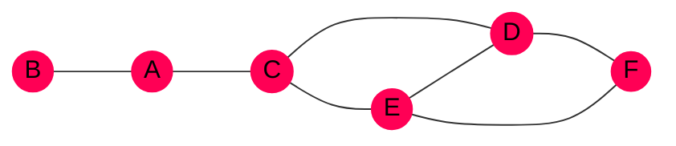

<!-- TODO: explicar mejor algunas cosas -->

# Definición y conceptos

> Puede encontrar más información sobre grafos en el artículo de [matemáticas
> discretas]().


$G = (V, E)$ donde $V$ es un conjunto de **vértices**/**nodos** y $E$ es un
conjunto de **arcos**/**ejes** que los unen.

Hay varios tipos de grafos:

- **Grado no dirigido**: las aristas funcionan para ambos lados, $u - v$.
- **Grafo dirigido** o **digrafo**: las aristas tienen orientación, $u \rightarrow v$.
- **Grado valorado**: cada arista tiene un valor.




-% Arista :% Es un par de nodos $(u, v)$.
-% Nodos adyacentes :% Un par de nodos $u$ y $v$ son adyacentes si existe la
arista $(u, v)$.
-% Grado de un vértice :%
Número de arcos que contienen ese vértice.  
En un grafo dirigido se diferencia el **grado de entrada** y el **grado de
salida**, dependiendo si las aristas son hacia el vértice o no.

-% Camino :% Secuencia de vértices adyacentes.
-% Longitud del camino :% Número de arcos del camino.
-% Bucle :% Camino $v - v$ de longitud 1, es decir, una arista de forma $(v, v)$
que conecta un vértice consigo mismo.

-% Camino simple :% Camino donde todos los vértices son distintos (salvo los
extremos).

-% Ciclo :% Camino simple cerrado donde todos los vértices son distintos, salvo
el inicial y final que son el mismo. Un ciclo de longitud $k$ se llama un
$k$-ciclo.



- Redes informáticas y telecomunicaciones
- Redes de transportes
- Análisis de redes sociales y ramas de las ciencias sociales
- Otras áreas como Inteligencia Artificial, Biología, Ciencia de Datos,
  Seguridad Informática, etc


## TAD Grafo

```c {linenos=false}
crear_vertice(v)
borrar_vertice(v)
crear_arco(v1, v2)
borrar_arco(v1, v2)
es_adyacente(v1, v2) -> bool
```

# Representación de grafos en memoria
## Matriz de adyacencia

> Más información y ejemplos [aquí]()

Sea $G = (V, E)$ un grafo simple (no tiene ejes paralelos ni bucles) y $V
= \set{v_1, v_2, \ldots, v_n}$ el conjunto ordenado de sus vértices y $A$ el
conjunto de sus aristas.

$$
a_{ij} =
\begin{cases}
    1 \quad\text{ si hay un arco } (v_i, v_j) \text{ en } A \\\\
    0 \quad\text{ si no hay un arco } (v_i, v_j) \text{ en } A
\end{cases}
$$

Entonces la matriz $A = (a_{ij}) \in \mathcal{M}_{|V|\times|V|}$ es la matriz de adyacencia.

Propiedades:

- Si el grafo es no dirigido, $A$ siempre es **simétrica**.
- Para grafo valorados, en lugar de 1 se puede almacenar en la posición $a_{ij}$
  el valor del arco $(v_i, v_j)$.

```c {linenos=false}
struct Grafo {
    // Nº de vértices
    int orden;
    // Nombres de los vértices
    char vertices[MAX_VERTICES][MAX_CADENA];
    // Matriz de adyacencia
    int A[MAX_VERTICES][MAX_VERTICES];
};
```

## Listas de adyacencia

Estructura multienlazada formada por:

- Una **lista directorio** que contiene todos los vértices del grafo
- Otra lista enlazada por cada nodo que representa sus arcos. Esta contiene los
  nodos con los que está enlazado.

<!-- TODO: diagrama de ejemplo mostrando una lista de adyacencia 19-10-2023 -->

## Comparativa

<table>
    <tr>
        <th></th>
        <th>Matriz</th>
        <th>Lista</th>
    </tr>
    <tr>
        <td class="header">Ventajas</td>
        <td>
            <ul>
                <li>Acceso aleatorio muy eficiente</li>
                <li>Rendimiento independiente del número de vértices</li>
            </ul>
        </td>
        <td>
            <ul>
                <li>Menos uso de memoria en grafos de menos arcos</li>
                <li>Más sencillo de quitar y añadir vértices</li>
            </ul>
        </td>
    </tr>
    <tr>
        <td class="header">Desventajas</td>
        <td>
            <ul>
                <li>Es necesario estimar de antemano el número de vértices</li>
                <li>Muchos 0s si hay pocos arcos (matriz <em>sparse</em>), por
                    lo que se desperdicia espacio</li>
                <li>Reservar memoria y copiar los datos si se quiere añadir
                    o quitar un vértice</li>
            </ul>
        </td>
        <td>
            <ul>
                <li>Representación más compleja</li>
                <li>Ineficiente para encontrar las aristas que llegan a un nodo</li>
            </ul>
        </td>
    </tr>
    <tr>
        <td class="header">Memoria usada</td>
        <td style="text-align: center">$O(|V|^2)$</td>
        <td style="text-align: center">$O(|V| + |E|)$</td>
    </tr>
    <tr>
        <td class="header">Comprobar adyacencia</td>
        <td style="text-align: center">$O(1)$</td>
        <td style="text-align: center">$O(|V| + |E|)$</td>
    </tr>
</table>


Usar listas de adyacencia cuando haya muchos más vértices que ejes:

$$ |E| \<\< |V|^2 $$

En el resto de casos, si no es necesario insertar y eliminar vértices
constantemente, será mejor usar una matriz adyacencia.


# Recorridos de un grafo


1. Se inicia en un vértice $v$ cualquiera. Se añade a una **cola**.
2. Mientras la cola no esté vacía:
    1. Tomar el primer elemento de la cola y marcarlo como visitado.
    2. Añadir los vértices adyacentes que no fuesen visitados a la cola.



1. Meter el vértice de partida en la **pila**
2. Mientras la pila no esté vacía:
    1. Quitar un nodo de la pila y marcarlo como visitado
    2. Meter en la pila los nodos adyacentes no visitados



```py {linenos=false}
for vi in V:
    if vi is not visitado:
        RecorridoRecursivo(vi)

def RecorridoRecursivo(u):
    marcar u como visitado
    for vi adyancente a u:
        if vi is not visitado:
            RecorridoRecursivo(vi)
```


# Conectividad de un grafo

Si un grafo es conexo, para todo par de nodos existe un camino. En caso de un
grafo dirigido, se dice **fuertemente conexo**. En caso contrario, se pueden
encontrar las [componentes conexas]().


1. Realizar un **recorrido** cualquiera del grafo a partir de un vértice $w$
   cualquiera.
2. Se guarda el recorrido en el conjunto $W$.
3. Si **$|W| = |V|$  El grafo es conexo** y él mismo es una componente
   conexa.
4. De lo contrario, **$W$ es una componente conexa**.
5. Se toma un vértice $v$ de $V-W$ y se hace otro recorrido.
6. Se guardan los vértices en el conjunto $Z$, que es otra componente conexa.
7. Se repiten estos pasos hasta recorrer todos los vértices.



1. **Obtener $D(v)$**: conjunto de descendientes incluyendo el de partida $v$.
   Se calcula haciendo un **recorrido** y almacenando los vértices visitados.
2. **Obtener $A(v)$**: conjunto de ascendientes, incluyendo el de partida $v$.
   Se calcula sobre un grafo $G'$ que es resultado de **invertir las direcciones
   de los arcos** (usar la matriz de adyacencia transpuesta) y luego calcular
   **$D(v')$**.
3. **$D(v) \cap A(v)$** es la componente fuertemente conexa a la que pertenece
   $v$. Si $G = D(v) \cap A(v)$ entonces el grafo es fuertemente conexo.
4. Si no es fuertemente conexo, se toma otro vértice no visitado como partida
   y se repite el proceso, hasta haber visitado todos los vértices.


# Matriz caminos y el Algoritmo de Warshall

> Más información en [caminos de un grafo]().

Sea $G=(V,E)$ un grafo simple, $A$ su matriz de adyacencia booleana y $n = |V|$
el número de vértices.

La expresión siguiente es verdadera cuando existe un camino de longitud 2 entre
$i$ y $j$:

```py {linenos=false}
(A[i][1] and A[1][j]) or (A[i][2] and A[2][j]) or ... or (A[i][n] and A[n][j])
```

Fíjese que si cambiamos la operación `and` por el producto y `or` por la suma,
la expresión representa el elemento $a_{ij}$ de la matriz $A^2$. Entonces, en
general:


El número de caminos de longitud $k$ que hay entre $v_i$ y $v_j$ es la entrada
**$a_{ij}$ de la matriz $A^k$**.


A partir de este teorema, se puede definir la **Matriz de Caminos**.


Sea $P_k \in \mathcal{M}_{n \times n}(\set{0, 1})$:

$$
P_k(i,j) =
\begin{cases}
    1 \quad\text{si hay un camino entre } v_i \text{ y } v_j \text{ que use como
mucho los vértices intermedios } v_1 \ldots v_k \\\\
    0 \quad\text{en otro caso} \\\\
\end{cases}
$$

**La Matriz de Caminos es $P_n$, a veces denotada $P$**.


La matriz $P_k$ se puede calcular de la siguiente forma:

$$
B_k = \sum^k_{i=1} A^i = A^1 + A^2 + \ldots + A^k \\\\
P_k(ij) =
\begin{cases}
    1 \iff B_k(i,j) \ge 1 \\\\
    0 \quad\text{En otro caso}
\end{cases}
$$

Pero no es demasiado eficiente por tener que calcular las sucesivas potencias de
la matriz de adyacencia. Nótese que a nosotros solo nos interesa saber si existe
o no un camino, así que no es necesario realizar el producto completo. [Steven
Warshall] encontró un algoritmo más rápido.


La relación para encontrar los elementos de $P_k$ es:

$$
    P_k(i,j) = \textcolor{#f05}{P_{k-1}(i,j)} \text{ or }
    [ \textcolor{#0f5}{P_{k-1}(i, k)} \text{ and } \textcolor{#0ef}{P_{k-1}(k, j)} ]
$$


Una aplicación útil de la matriz de caminos es comprobrar rápidametne si un
grafo es conexo.


Un grafo es **fuertemente conexo** si $P$ tiene **todo 1s salvo en la diagonal**:

$$
\left(\begin{matrix} \\\\
    0 & 1 & 1 & \ldots & 1 \\\\
    1 & 0 & 1 & \ldots & 1 \\\\
    1 & 1 & 0 & \ldots & 1 \\\\
    \vdots & \vdots & \vdots & \ddots & \vdots \\\\
    1 & 1 & 1 & \ldots & 0 \\\\
\end{matrix}\right)
$$


# Puntos de articulación


Vértice $v \in V$ que si se elimina junto con sus arcos, la componente conexa
que contenía a $v$, se divide en 2 o más componentes.




En el grafo anterior, `A` y `C` son puntos de articulación.


Se usa un **árbol de rubrimiento**: se construye a partir de un recorrido
en profundidad recursivo.

- La raíz del árbol es el vértice de partida.
- Cada arco del grafo estará como una arista en el árbol.
- Al pasar por los vértices adyacentes de $v$ usando el arco $(v, u)$:
    - Si $u$ no está visitado, entonces $(v, u)$ es una arista del árbol y se
      inserta $u$ en él.
    - Si $u$ ya fue visitado, entonces $(v, u)$ es una **arista hacia atrás**.

Una vez construido el árbol de recubrimiento, se calcula lo siguiente para cada
nodo:

- **$\text{Num}(v)$**: número en el que se visita en vértice $v$. Es la posición
  en la lista de nodos visitados.
- **$\text{Bajo}(v)$**: determina el número de vértice mínimo accesible desde $v$. Se calcula de la siguiente forma:

$$
    \begin{align*}
    \text{Bajo}(v) = \min ( & \text{Num}(v), \\\\
               & \min(\text{Num(vértices hacia atrás)}), \\\\
               & \min(\text{Bajo(hijos)})) \\\\
    \end{align*}
$$

Por lo que se debe empezar por los vértices hoja del árbol.

Finalmente, los puntos de articulación son:
- **La raíz si tiene 2 o más hijos**
- **Otro vértice $w$ si tiene algún hijo $u$ que $\text{Num}(w) \le \text{Bajo}(u)$**


<!-- TODO: ejemplo 25-10-2023 -->

# Ordenación topológica de un grafo dirigido acíclico

La **ordenación lineal** de un grafo dice que si existe un camino de $v_i$
a $v_j$, $v_i$ debe aparecer antes que $v_j$.


1. Se buscan vértices de grado de entrada 0 ($\delta_{\text{IN}}(v) = 0$).
2. Se meten esos vértices en una **cola**.
3. Se saca el primer elemento de la cola ($v$) y se añade al orden.
4. Se eliminan los arcos que salen del vértice sacado ($v$).
5. Ir al paso 1. Se repite hasta que la cola se vacíe.


# Algoritmo de Dijkstra

Se trata de un algoritmo voraz que calcula la ruta más corta desde un punto
a **todos los vértices** del grafo.

Variables utilizadas:

- $A$: matriz de pesos del grafo
- $C$: conjunto de vértices Candidatos
- $S$: conjunto de vértices Seleccionados
- $D$: vector de Distancias que mantiene la longitud del **camino especial** más
  corto desde el origen a cualquier otro vértice.
- $P$: vector que almacena los índices de los vértices Predecesores. En $P(j)$
  se almacena el índice del último vértice en el camino mínimo desde el origen
  hasta el vértice $j$.

Un **camino especial** es un camino que parte del origen y tiene todos los
vértices de `S` (sin tener en cuenta el último, puede estar o no).


Inicialmente, si el vértice origen es $w$, $C=V-\set{w}$ y $S=\set{w}$. También
se debe actualizar el vector $D$:

$$ D(j) = A(1, j) \qquad \forall j \in \set{2, \ldots, n} $$

En caso de no ser adyacentes, se coloca $\infty$.

1. Se selecciona el vértice inicial y el resto pasan a ser candidatos. El vector
   de distancias se actualiza con la distancia a cada vértice.
2. Se toma el vértice $v_i$ de $C$ con **$D(i)$ mínimo**.
3. Se actualiza el vector $D$:
   $$ D(j) = \min(\textcolor{#0f5}{D(j)}, \\; \textcolor{#0ef}{D(i) + A(i, j)})$$
   $\textcolor{#0f5}{D(j)}$ es el camino actual y $\textcolor{#0ef}{D(i) + A(i, j)}$
   es el camino que pasa por $v_i$.
4. Si el paso anterior, se actualizó $D$, también hay que actualizar $P$
5. Se repiten los pasos anteriores $|V|-1$ veces.

Para recuperar el camino de longitud mínima, se usa el vector $P$, recorriéndolo
desde el destino hacia el origen.


El tiempo de ejecución es $O(|V|^2)$, pero se puede hacer más eficiente al
utilizar colas de prioridad para sacar el elemento mínimo más rápido.

# Algoritmo de Floyd-Warshall

Calcula el camino más corto entre **todos los pares de vértices**.

Sea $G=(V,E)$ un grafo dirigido valorado.
- Supongamos que los vértices están numerados del $1$ al $n$.
- $A$ es la matriz de pesos. El arco $(i, j)$ tiene un peso $A_{ij}$.


Queremos encontrar una matriz $D \in \mathcal{M}\_{n \times n}$ de forma que
$D_{ij}$ sea el coste mínimo de los caminos desde $i$ hasta $j$.

1. Se calcula la matriz de caminos con el Algoritmo de Warshall
2. Se calcula la secuencia de matrices $D_0, \ldots, D_n$
3. **$D_n$ será la matriz de caminos mínimos del grafo**

Donde $D_k(i,j)$ es la longitud del camino mínimo entre $i$ y $j$ usando los
vértices $1 \ldots k$.

- Si se usa el vértice $k$: $D_k(i,j) = \textcolor{#0ef}{D_{k-1}(i, k) + D_{k-1}(k, j)}$
- Si no se usa el vértice $k$: $D_k(i,j) = \textcolor{#f05}{D_{k-1}(i, j)}$

$$
D_k(i, j) = \min(
    \textcolor{#0ef}{D_{k-1}(i, k) + D_{k-1}(k, j)},
    \textcolor{#f05}{D_{k-1}(i, j)})
$$

Tenga en cuenta que el caso base es la propia $A$:
$$
    D_0(i, j) =
    \begin{cases}
        \infty \quad &\text{si no existe arco} \\\\
        0      \quad & i = j \\\\
        A(i,j) \quad &\text{en otro caso} \\\\
    \end{cases}
$$


Al igual que en Dijkstra, por cada vértice se guarda el índice del último
vértice que ha conseguido el camino mínimo de $i$ a $j$. Se usa una **matriz $P$
de Predecesores**.

Se puede ver que el coste computacional del algoritmo es **$\Theta(|V|^3)$**.

# Problema del flujo de fluidos: Algoritmo de Ford-Fulkerson

El objetivo es transportar la máxima cantidad de flujo desde un punto de partida
$S$ llamado fuente hacia un punto final $T$ llamado sumidero. En un grafo
valorado y dirigido, el peso representa la capacidad del enlace.

Ejemplos de aplicaciones:
- Planificación de rutas alternativas para la circulación en horas punta
- Maximizar la cantidad de agua transportada por un sistema de tuberías


Forma de enviar objetos de un lugar a otro.



-% Siempre es **positivo** :% $F_{ij} \ge 0 \qquad \forall i, j \in A$
-% Flujo entrante = Flujo Saliente :% $\sum_i F_{ij} = \sum_j F_{ij} \qquad \forall i \in V, i \not = S, i \not = T$
-% Debe ser **menor que la capacidad** :% $F_{ij} \le A(i, j) \qquad \forall i, j \in A$



Es uno de los algoritmos más sencillo y eficientes para determinar el flujo
desde $S$ hasta $T$. La idea básica es que **se inicia con un flujo de 0 y se va
mejorando iterativamente**.

Se distinguen 3 tipos de arcos:

- **No modificable**: capacidad 0 o coste prohibitivo
- **Incrementable**: arco que se puede aumentar, dado que todavía tiene
  capacidad disponible
- **Reducible**: flujo que puede ser reducido

El procedimiento es el siguiente:

1. Flujo inicial en todo el grafo de 0: $F_{ij} = 0$
   Se terminan los arcos incrementables y reducibles.
2. Se toma una cadena de $S$ a $T$ suponiendo no dirigido (se puede recorrer un arco
   al revés).
    - Se aumenta el flujo al máximo de la cadena
    - Se actualizan los flujos de cada arco
3. Se repite el paso 2 hasta que no queden más cadenas

Los flujos se actualizan de la siguiente forma:

- **Incrementable**: sumar $\min(\set{A(i, j) - F_{ij}, \\; \forall i,j \in P})$
- **Reducible**: restar $\min(\set{F_{ij}, \\; \forall i,j \in P})$
- **Cadenas reducibles-incrementables**: se toma el mínimo de los dos anteriores


<!-- TODO: ejemplo -->

# Árbol de expansión mínimo

> Para más información, consultar el [artículo de grafos]()
> en matemáticas discretas.

El árbol de expansión mínimo de un grafo no dirigido conexo es el árbol que
contiene todos sus vértices. Si el grafo es valorado, entonces un árbol de
expansión mínimo es aquel cuyos arcos son de peso mínimo.

Aplicaciones:

- Red telefónica: buscar la red de menos coste
- Construir una red de transporte de forma que la distancia a los diferentes de
  pueblos sea mínima


Algoritmo voraz

Suponemos $V = \set{1 \ldots n}$ siendo $G=(V,E)$ un grafo conexo y no dirigido.

1. Se le asigna un vértice inicial a $W$: $W=\set{1}$
2. Se añaden vértices a $W$ en cada iteración mientras cumplan
   $$ v \in V-W, \\; u \in W, \\; \text{el arco } (v, u) \text{ es mínimo}$$
   Es decir, tomar aquellos vértices que tengan un arco mínimo con el subgrafo $W$
3. Termina cuando $V = W$



También un algoritmo voraz

Suponemos $V = \set{1 \ldots n}$ siendo $G=(V,E)$ un grafo conexo y no dirigido.

1. Partimos de un grafo $T$ de vértices $V$ pero ningún arco: $T = (V, \empty)$
2. Se van añadiendo arcos a $T$ de forma que:
    - Este tenga peso mínimo
    - No formen ciclos
3. Cuando $T$ sea conexo, se termina el algoritmo


# Resumen


-% Implementación :%
- Matriz de adyacencia
- Listas de adyacencia

Ver la [comparativa](#comparativa).

-% Recorridos :%
- Profundidad recursivo
- Profundidad no recursivo (uso de una pila)
- Anchura no recursivo (uso de una cola)
- **Ordenación topológica**

-% Conectividad :%
- Buscar las componentes conexas realizando recorridos
- Usar la Matriz de Caminos calculada con el **Algoritmo de Warshall**
- Cálculo de puntos de articulación

-% Búsqueda del camino más corto :%
- **Dijkstra** $O(|V|^2)$: camino más corto desde el origen a todos los demás vértices
- **Floyd-Warshall** $O(|V|^3)$: camino más corto entre todos los pares de vértices

-% Otros algoritmos :%
- Resolver el problema del flujo de fluidos con el **Algoritmo de
  Ford-Fulkerson**. Algoritmo sencillo y eficiente.
- **Algoritmo de Prim** para encontrar el Árbol de Expansión mínimo
- **Algoritmo de Kruskal** para encontrar el Árbol de Expansión mínimo


[Steven Warshall]: https://en.wikipedia.org/wiki/Stephen_Warshall
