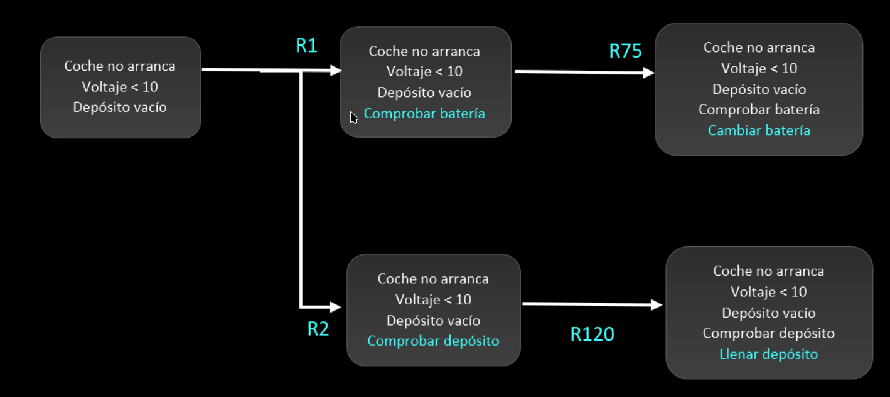
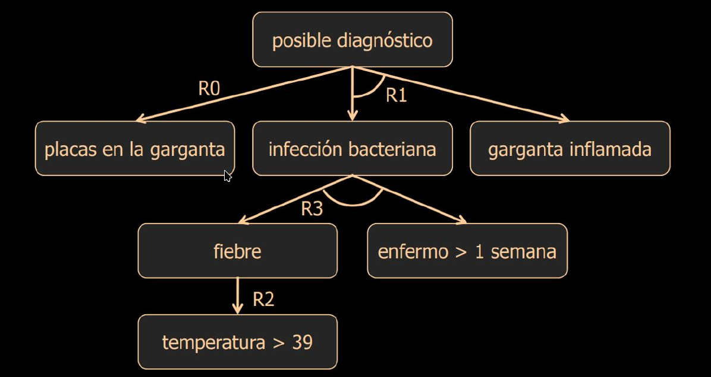

# Definición


Un Sistema Basado en Conocimiento, también llamados Sistemas Expertos, son unos
sistemas que **simulan el razonamiento y toma de decisiones de un humano experto**.


- Tiene un **nivel de competencia** equivalente o superior a un experto humano
  en un dominio concreto del saber.
- Hace uso y representa **conocimiento explícito**, como si **razonase**.


- Diagnóstico médico
- Análisis financiero
- Control y monitorización de procesos
- Educación
- Diagnóstico de fallos y mantenimiento de máquinas
- ...


Se utilizan:

- En problemas de **dominios complejos y especializados**
- Cuando **no existe aproximación algorítmica** o no hay formas de aprender a resolver el problema
- **Existe conocimiento** para su solución, tanto dado por expertos o documentado

De ahí nace la **ingeniería del conocimiento**: expertos que se encargan de
gestionar y ordenar el conocimiento.

A la hora de diseñar estos sistemas:

- Primero se debe recoger el conocimiento sobre el problema y su solución por
  parte de un ingeniero del conocimiento.
- Luego se representa el conocimiento de un modo computacionalmente tratable
  para su razonamiento en máquinas.

# Comparativas

| Sistemas basados en conocimiento | Búsqueda en espacio de estados                       |
|----------------------------------|------------------------------------------------------|
| Base de conocimiento             | Estados de representación del problema y heurísticas |
| Método de razonamiento           | Algoritmo de búqueda                                 |
| Hechos conocidos                 | Estado inicial                                       |
| Hechos inferidos                 | Estados explorados y el estado actual                |
| Respuesta a una consulta         | Estado solución                                      |

| Hechos                                               | Conocimiento                        |
|------------------------------------------------------|-------------------------------------|
| Específicos del problema                             | Generales del dominio               |
| Dinámicos                                            | Relativamente estáticos             |
| Aumenta durante la resolución                        | En general no varía                 |
| Necesidad de almacenamiento y recuperación eficiente | Necesidad de razonamiento eficiente |
| Precisos y ciertos                                   | Puede ser impreciso e incierto      |

| Programación convencional                | Sistemas expertos                                |
|------------------------------------------|--------------------------------------------------|
| Programación imperativa                  | Programación declarativa                         |
| Modificación por reprogramación          | Modificación de la Base de Conocimiento          |
| Solución algorítmica                     | Solución por razonamiento basado en conocimiento |
| Normalmente precisa y cierta (óptima)    | Imprecisa y con grados de certeza                |
| Ejecución guiada por el flujo del código | Ejecución guiada por el motor de inferencia      |


- La programación imperativa utiliza **instrucciones en orden** para describir las
  operaciones que se deben realizar. Tiene construcciones como bucles
  y condicionales.
- La programación declarativa es un **conjunto de reglas** quizás útiles, pero
  que se pueden ejecutar en cualquier orden y solo un subconjunto de ellas.


# Funcionamiento


**Conocimiento que sabe el sistema sobre el caso que está considerando**, dentro
de la tipología de problemas para el que está diseñado.


En la base de hechos se puede almacenar:

- Datos y hechos del problema
- Metas a alcanzar
- Hipótesis a probar
- Reglas a la espera
- Listas de subproblemas
- ...


**Conocimiento previo** y posiblemente útil para la resolución de problemas. Están
íntimamente ligados al domino específico.



**Aplica el conocimiento a los hechos** para obtener una solución. También se le
puede llamar **motor de inferencia**.




## Sistemas basados en reglas

La base de conocimiento está formada por **reglas de producción** que tienen la
siguiente forma:

>     SI situación ENTONCES acción

- _Situación_: condiciones a satisfacer para poder realizar la acción
- _Acción_: operación a realizar cuando la regla se cumple. Algunas acciones
típicas son:
    - Añadir hecho a la base de hechos.
    - Eliminar algún hecho de la base de hechos.
    - Ejecutar algún procedimiento.


- Base de hechos: `T = 39`
- Base de conocimiento (en forma de reglas): `SI T > 36.5 ==> fiebre`

El motor de inferencia analizará todas las reglas y verá si puede ejecutar
alguna. Como `T` es mayor que 36.5, esta se ejecutará y se añadirá a la base de
hechos `fiebre`.



Las reglas de producción son **autoexplicativas**, con conocer el camino que ha
llevado el sistema se puede explicar el proceso de toma de decisiones. Incluso
se puede resumir.

En redes neuronales, en cambio, es mucho más difícil. Actualmente, es un tema
abierto de investigación.

>     Conocimiento propio + Respuesta + Explicación  VS      Respuesta
>               (basado en conocimiento)                (redes neuronales)

Y aún así triunfan las redes neuronales...

Porque es muy difícil crear las reglas de conocimiento como para poder replicar
la capacidad de una red neuronal de millones de parámetros.


## Razonamiento

Aunque las reglas son:

- piezas de conocimiento independientes,
- están desacopladas,
- y se pueden aplicar siempre que su condición sea cierta en cualquier orden

**pueden existir relaciones entre ellas**. Por ejemplo, si una regla concluye
algo de la parte de condición de la otra, ambas estarán relacionadas. Estas
dependencias se pueden representar mediante un **grafo de razonamiento**.




Cada nodo representa una regla y los ejes son las dependencias entre ellas.


Se usa un arco entre varios ejes para indicar un $\land$ (_y lógico_). Si el arco
no aparece, quiere decir que se trata de un $\lor$ (_o lógico_).


Conjunto de todas las reglas que se pueden ejecutar en un determinado momento.



_<<De los síntomas obtener un diagnóstico>>_

1. Se parte de los hechos de la memoria de trabajo
2. Se emparejan los hechos con los antecedentes de las reglas
3. Se aplican las reglas hasta se llega al objetivo o no se puede seguir
4. Aplicación de criterios de selección de las reglas aplicables dentro del
   conjunto conflicto.

**Principio de refracción**: no se ejecuta reiteradamente una misma regla,
aunque se cumpla.




    R1. IF coche no arranca, THEN comprobar batería
    R2. IF coche no arranca THEN comprobar combustible
    ...
    R75. IF comprobar batería AND voltaje batería < 10V THEN cambiar batería
    ...
    R120. IF comprobar combustible AND depósito de combustible vacío THEN llenar depósito.





Base de conocimiento:

        Regla 0. IF hay placas (puntos blancos) en la garganta
                 THEN diagnóstico: posible infección de garganta
        Regla 1. IF garganta inflamada AND sospechamos infección bacteriana
                 THEN diagnóstico: posible infección de garganta
        Regla 2. IF temperatura paciente > 39
                 THEN paciente tiene fiebre
        Regla 3. IF paciente enfermo más de una semana
                 AND paciente tiene fiebre
                 THEN sospechamos infección bacteriana

Memoria de trabajo inicial:

- Temperatura 40ºC
- Enfermo desde hace 2 semanas
- Garganta inflamada

<table>
  <tr>
    <th>Memoria de Trabajo</th>
    <th>Conjunto Conflicto</th>
    <th>Regla ejecutada</th>
  </tr>
  <tr>
    <td>
      <ul>
        <li style="color: var(--magno-blue)">Temperatura 40ºC</li>
        <li>Enfermo desde hace 2 semanas</li>
        <li>Garganta inflamada</li>
      </ul>
    </td>
    <td style="text-align:center">R2</td>
    <td style="text-align:center">R2<br>Añade <i>fiebre</i></td>
  </tr>
  <tr>
    <td>
      <ul>
        <li>Temperatura 40ºC</li>
        <li style="color: var(--magno-blue)">Enfermo desde hace 2 semanas</li>
        <li>Garganta inflamada</li>
        <li style="color: var(--magno-blue)">Fiebre</li>
      </ul>
    </td>
    <td style="text-align:center">R3</td>
    <td style="text-align:center">R3<br>Añade <i>posible infección bacteriana</i></td>
  </tr>
  <tr>
    <td>
      <ul>
        <li>Temperatura 40ºC</li>
        <li>Enfermo desde hace 2 semanas</li>
        <li style="color: var(--magno-blue)">Garganta inflamada</li>
        <li>Fiebre</li>
        <li style="color: var(--magno-blue)">Posible infección bacteriana</li>
      </ul>
    </td>
    <td style="text-align:center">R1</td>
    <td style="text-align:center">R1<br>Añade <i>diagnóstico: posible infección de garganta</i></td>
  </tr>
</table>



_<<Del diagnóstico, obtener los síntomas>>_

Esta es más eficiente porque implica explorar menos ramas.



Usando el mismo conocimiento que en ejemplos previos:

        Regla 0. IF hay placas (puntos blancos) en la garganta
                 THEN diagnóstico: posible infección de garganta
        Regla 1. IF garganta inflamada AND sospechamos infección bacteriana
                 THEN diagnóstico: posible infección de garganta
        Regla 2. IF temperatura paciente > 39
                 THEN paciente tiene fiebre
        Regla 3. IF paciente enfermo más de una semana
                 AND paciente tiene fiebre
                 THEN sospechamos infección bacteriana



Nótese que **todos los nodos hoja son hechos**.

Todos los posibles diagnósticos en este sistema son:

- `placas en la garganta` (R0)
- `temperatura > 39`, `enfermo > 1 semana`, `garganta inflamada` (R2, R3, R1)

Recuerde que si hay un arco entre dos conexiones, significa que ambas reglas
o hechos deben ser ciertos.


Estas formas son los métodos usuales para sistematizar el razonamiento
automático sobre las reglas:

- El razonamiento hacia delante es dirigido por los datos.
- El razonamiento hacia atrás es dirigido por las preguntas de los usuarios
  o especulaciones.

## Pseudocódigo

Método básico de razonamiento:

```py
BH = hechos_iniciales
BC: BaseConocimiento
while not condFinal(BH) or not accionParada():
    conjunto_conflicto = equiparar(BC, BH)
    regla = resolver(conjunto_conflicto)
    nuevos_hechos = aplicar(regla, BH)
    BH += nuevos_hechos
```

Encadenamiento hacia delante:

```py
def raz_delante(hechos_iniciales: Hecho[], meta, BC: BaseConocimiento) -> éxito | fracaso:
    BH = hechos_iniciales
    conjunto_conflicto = extrae_cualquier_regla(BC)

    while meta not in BH and not empty(conjunto_conflicto):
        conjunto_conflicto = equiparar(antecedentes(BC), BH)
        if not empty(conjunto_conflicto):
            regla = resolver(conjunto_conflicto)
            nuevos_hechos = aplicar(regla, BH)
            BH += nuevos_hechos

    if meta in BH:
        return 'éxito'
    else:
        return 'fracaso'
```

Encadenamiento hacia atrás:

```py
def raz_atras(hechos_iniciales: Hecho[], BC: BaseConocimiento) -> éxito | fracaso:
    BH = hechos_iniciales

    if verificar(meta, BH, BC):
        return 'éxito'
    else:
        return 'fracaso'
```

Verificación de reglas:

```py
def verificar(meta: Hecho, BH: BaseHechos, BC: BaseConocimiento) -> bool:
    if meta in BH:
        return True

    verificado = False
    conjunto_conflicto = equiparar(consecuentes(BC), meta)
    while not empty(conjunto_conflicto) and not verificado:
        regla = resolver(conjunto_conflicto)
        conjunto_conflicto -= regla

        nuevas_metas = extraer_antecedentes(regla)
        verificado = True

        while not empty(nuevas_metas) and verificado:
            meta = seleccionar_meta(nuevas_metas)
            nuevas_metas -= meta

            verificado = verificar(meta, BH)
            if verificado:
                BH += meta

    return verificado
```

# Lógicas


Nuestro cerebro es una máquina capaz de interpretar conceptos abstractos
(símbolos) con un significado construido de forma colectiva a través de la
historia y la propia experiencia del individuo.


Los lenguajes naturales son una representación simbólica de información, una
herramienta no solo para la comunicación de ideas, sino también para el propio
pensamiento.

Y a partir de esta hipótesis, también podemos decir que las máquinas también
pueden hacer lo mismo: representar información mediante símbolos, manipularlos
para realizar razonamientos y así poder resolver problemas.

Si embargo, no sabemos como computar el lenguaje natural, por lo que se elaboran
lenguajes más sencillos que sí lo sean. Las reglas vistas antes son una forma de
hacerlo. Y las lógicas son otra.


En este contexto, podemos decir que una lógica es una matematización de los
procesos de representación de conocimiento y razonamiento.


Una lógica representa de manera formal las
**relaciones** existentes entre **conceptos**, **objetos**, **propiedades**,
**valores**... Las reglas, por otro lado, se manejan de un modo mucho más laxo.

Cuando los sistemas expertos empezaron a tener éxito, se propuso combinar ambos
métodos. Sin embargo la [lógica proposicional](#lógica-proposicional) tiene una
mala calidad de representación, y se procedió a idear otros tipos que la
ampliasen:

- **Lógica proposicional**: proposiciones con un valor de verdad y unos operadores lógicos.
- **Lógica de predicados**: crea conjuntos para representar categorías.
- **Lógica difusa** o _Fuzzy sets_: en un conjunto difuso se pueden definir grados
  de pertenencia. Por ejemplo, _muy alto_ puede estar en varios rangos de
  alturas, dependiendo de cada uno. En general se busca que la categorización
  sea gradual y no con una frontera fija.
- **Lógica temporal**: manipulación a nivel de representación y razonamiento con
  hechos temporales.
- **Lógicas no monótonas**: permiten negar hechos que antes se consideraban
  ciertos. No es tan sencillo como simplemente eliminarlo, sino que es posible
  que dicho hecho se usase para deducir otros.
- ...

## Lógica proposicional

- Las **proposiciones** son afirmaciones verdaderas o falsas
- Se unen con **operadores lógicos**: $\land$ (_y_), $\lor$ (_o_), $\neg$ (_no_) y $\to$ (_implica_)
- Se usan **mecanismos de razonamiento** o inferencia: _modus ponens_, _modus tollens_... ([lista completa])

$$
\begin{array}{l}
    p \to q \\
    p       \\
    \hline
    q       \\[0.5em]
    \text{Modus Ponens}
\end{array}
\mkern30mu
\begin{array}{l}
    p \to q \\
    \lnot q \\
    \hline
    \lnot p \\[0.5em]
    \text{Modus Tollens}
\end{array}
$$

Algunas formas de razonamiento:

- **Razonamiento deductivo**: A partir de una regla o características generales,
  deducir propiedades de ejemplos concretos.
- **Razonamiento inductivo** (**generalización**): A partir de unos ejemplos,
  concluyo que el resto de elementos también cumplen las mismas condiciones
  o características.
- **Razonamiento abductivo**: Busca la mejor explicación para un conjunto de hechos

## Lógica de predicados

- Añade la posibilidad de usar cuantificadores: $\forall$ (_para todo_)
  y $\exists$ (_existe_).
- Constantes como lista de objetos: $1, \text{Magno}, \text{Manzana}, 1.4142, \ldots$
- Predicados para relacionar lo objetos

$$
\forall x \forall y \forall z \quad
\text{esPadre}(x, y) \land \text{esPadre}(y, z) \to \text{esAbuelo}(x, z)
$$

El conocimiento se representa en forma de **reglas cuantificadas de forma
universal**.

# Redes semánticas

La información se relaciona entre sí, de forma que hay procesos de recuperación
más eficientes y razonamiento sobre las redes.

Permite la **herencia de propiedades** (creación de subcategorías), lo que es
útil para hacer generalizaciones. Ya no es necesario representar todo el
comportamiento; sino que conjuntos, sus subconjuntos y sus relaciones se
disponen de mecanismos de representación mucho más ricos.




<!-- TODO: revisar prácticas -->
# CLIPS



_C Language Integrated Production System_ (CLIPS) es un sistema experto creado
por la NASA en 1985.

https://en.wikipedia.org/wiki/CLIPS


[lista completa]: https://en.wikipedia.org/wiki/List_of_rules_of_inference
