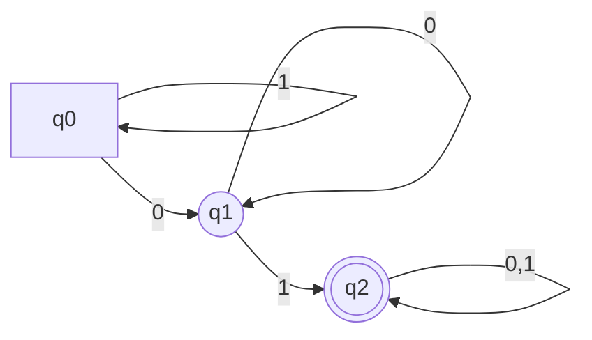
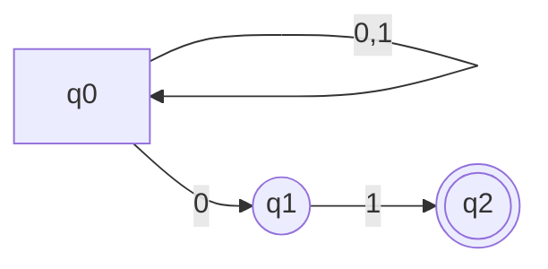
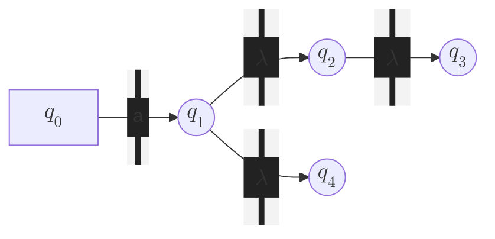
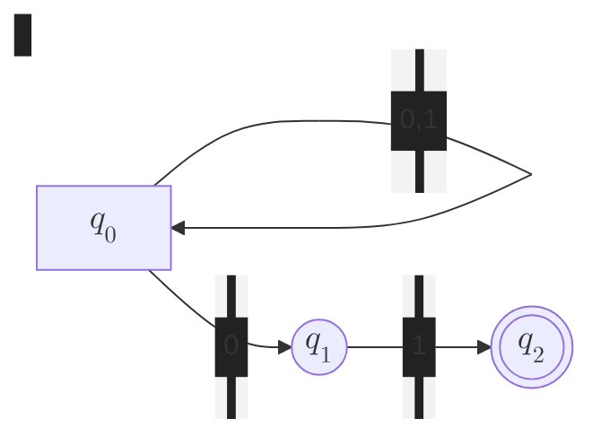
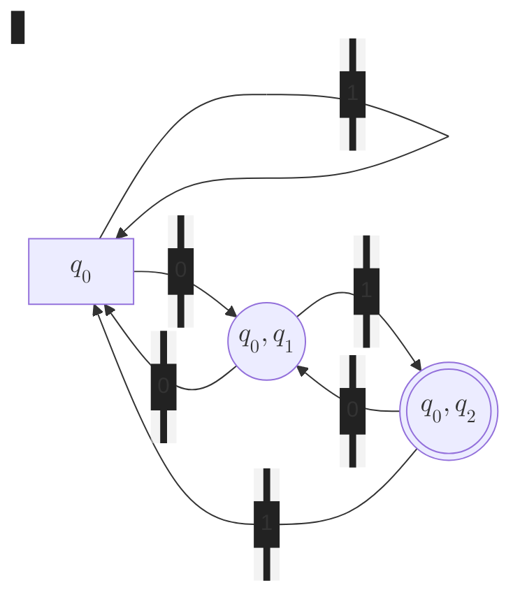

# Introducción


En el contexto de los sistemas digitales, una máquina secuencia es aquella que:

- Almacena un **estado** interno
- Para una entrada pueden darse **diferentes salidas, en función del estado**


Los autómatas de estados finitos **son máquinas secuenciales** que **reconocen
lenguajes regulares**. La memoria que almacena son sus estados, de lo contrario,
solo podría producir una única salida para una misma entrada (máquina
combinacional).


-% **Determinista** (AFD) :% El autómata no puede estar en más de un estado a la vez.
-% **No determinista** (AFN) :% El autómata puede estar en más de un estado a la vez.


El hecho de un autómata sea no determinista, **no añade un nuevo tipo de
lenguaje**, sino que permite ser más eficientes a la hora de describirlo.
Tampoco es más potente computacionalmente, dado que **no se considera que las
operaciones se realicen en paralelo**.

# Autómatas Finitos Deterministas (AFD)

Para cada entrada, existe **un único estado** al que al autómata puede llegar
partiendo del estado actual. Aceptan **lenguajes regulares**.


Un autómata determinista $A$ se define como:

$$ A = (Q, S, \delta, q_0, F)$$

-   $Q$ conjunto finito de **estados**
-   $S$ conjunto de **símbolos de entrada** aceptados
-   **Función de transición** $\delta$: dada una entrada y estado, devuelve el
    siguiente estado. $$ \delta: Q \times S \to Q \newline \delta(q_i, a) = q_j $$
-   **Estado inicial** $q_0$: $q_0 \in Q$
-   **Estados finales** $F$: $F \subseteq Q$



Es el conjunto de cadenas que al pasársela como entrada al autómata, termina en
un estado final (**acepta**).


Los autómatas se representan como grafos en **diagramas de transiciones**, donde
cada eje etiquetado se corresponde con la transición de un estado a otro al
recibir dicha entrada.

$$ A = (\set{q_0, q_1, q_2}, \set{0, 1}, \delta, q_0, \set{q_2})$$



-   Los nodos son estados
    -   $q_0$ es el estado inicial, denotado normalmente por un triángulo (por
        limitaciones de la herramienta que utilizo para hacer los diagramas debe
        ser un cuadrado).
    -   $q_2$ es el estado final, denotado por un círculo doble.
-   El arco anotado con $a$ de $q$ a $p$ se corresponde con la transición
    $\delta(q, a) = p$.

Este autómata reconoce las cadenas que contienen la subcadena $'01'$.

Una formato alternativa de mostrar el autómata es la **representación tabular de
la función de transición**:


|           | 0     | 1     |
|:---------:|:-----:|:-----:|
| $\to q_0$ | $q_1$ | $q_0$ |
| $q_1$     | $q_1$ | $q_2$ |
| $*q_2$    | $q_2$ | $q_2$ |
{.header}

%%%%%%%%%%%%%%%%%%%%%

- Filas: estados
- Columnas: entradas
- Estado inicial: indicado por una flecha
- Estados finales: indicado por `*`


## Extensión a cadenas

Veamos ahora cómo extender la definición de la función de transición para que
también pueda aceptar **cadenas como entrada**.

-   Función de transición: $\delta: Q \times S \to Q$ \
    Dado un estado $q$ y un símbolo $a$, devuelve un estado $p$.
-   Función de transición extendida: $\hat\delta: Q \times \Sigma^* \to Q$. \
    Dado un estado $q$ y una cadena $w$, devuelve un estado $p$.

Definición por inducción de transición extendida:

$$
\text{Paso base}: \hat\delta(q, \lambda) = q
\hspace{1cm}
\text{Paso inductivo}: \begin{cases}
    \hat\delta(q, w) = \delta(\hat\delta(q, x), a) \\
    w = xa
\end{cases}
$$

Entonces el lenguaje de un AFD (**lenguaje regular**) se define como todas las
cadenas que devuelven un estado final en la función de transición extendida.

$$ L(A) = \set{w | \hat\delta(q_0, w) \in F } $$

# Autómatas Finitos No Determinista (AFN)

Para cada entrada, existen varios estados en el que el autómata puede ir desde
el estado actual.

Nótese que cuando no está definido para un estado la siguiente evolución para
una o más entradas, quiere decir que no existe y el autómata muere por esa rama.
Con esto se simplifica el diseño y no se están añadiendo constantemente cada vez
más estados.

- Aceptan lenguajes regulares, igual que los AFD.
- Más compactos y fáciles de diseñar que los AFD.
- Siempre es posible convertir un AFN a un AFD.


Un autómata no determinista $A$ se define como un AFD, pero **la función de
transición $\delta$ devuelve un conjunto de estados**.
$$ \delta: Q \times \Sigma \cup \set{\lambda} \to P(Q) $$



El siguiente autómata acepta las cadenas que terminan en $'01'$.

$$ A = (\set{q_0, q_1, q_2}, \set{0, 1}, \delta, q_0, \set{q_2})$$



%%%%%
|             | 0                | 1             |
|:-----------:|:----------------:|:-------------:|
| $\to q_0$   | $\set{q_0, q_1}$ | $\set{q_0}$   |
| $q_1$       | $\varnothing$    | $\set{q_2}$   |
| $*q_2$      | $\varnothing$    | $\varnothing$ |
{.header}


## Función de transición extendida

$$
\text{Paso base}: \hat\delta(q, \lambda) = \set{q}
\hspace{1cm}
\text{Paso inductivo}: \begin{cases}
    w = xa \\
    \hat\delta(q, x) = \set{p_1, \ldots, p_k} \\
    \bigcup^k_{i=1} \delta(p_i, a) = \set{r_1, \ldots, r_m} \\
\end{cases}
\newline
\implies \hat\delta(q, w) = \set{r_1, \dots, r_m}
$$

Partiendo de un estado $q$, si no se recibe ninguna entrada, el autómata seguirá
en $q$. Para el paso inductivo consideramos una cadena $w$, que se puede dividir
en la subcadena $x$ y el símbolo $a$. Por tanto, al introducirse $x$ pasa a los
estados $\set{p_1, \ldots, p_k}$; y al introducirse el símbolo $a$, se
transiciona desde cada uno de esos estados $p_i$ a otro conjunto de estados
$\set{r_1, \ldots, r_m}$. En conjunto, la transición para la cadena $w$ será
$\set{r_1, \ldots, r_m}$.

Y por tanto, el lenguaje de un AFN:

$$ L(A) = \set{w | \hat\delta(q_0, w) \cap F \ne \varnothing} $$

El autómata reconoce las cadenas donde la función de transición extendida
devuelve algún estado final.

## AFN-$\lambda$


En los AFN, es posible realizar **transiciones para la cadena vacía** $\lambda$,
lo que proporciona <<facilidades de programación>>.


Nótese que **la cadena vacía no es un símbolo de entrada**, dado que no
pertenece al alfabeto, tan solo es la representación de una _no-entrada_.

-   Por ejemplo, un AFN-$\lambda$ que acepta las palabras $'\text{blog}'$
    y $'\text{magno}'$ (**búsqueda de texto**):

    ```mermaid
    flowchart LR
        q0[$$q_0$$] -- $$\Sigma$$ --> q0
        q0 -- b --> q1(($$q_1$$))
        q1 -- l --> q2(($$q_2$$))
        q2 -- o --> q3(($$q_3$$))
        q3 -- g --> q4((($$q_4$$)))
        q0 -- m --> q5(($$q_5$$))
        q5 -- a --> q6(($$q_6$$))
        q6 -- g --> q7(($$q_7$$))
        q7 -- n --> q8(($$q_8$$))
        q8 -- o --> q9((($$q_9$$)))
        classDef edgeLabel background-color:#222,padding:5px;
    ```

    El patrón general es tomar una secuencia de estados $q_1 \ldots q_n$ (donde
    $q_n$ es final) que se corresponden con haber recibido los símbolos $a_1
    \ldots a_n$ respectivamente. Además, siempre se está en el estado inicial
    (recibiendo todo el alfabeto) para contemplar otras palabras.

    Diseñar este autómata de forma determinista habría sido muy complicado,
    porque en cada estado hay que considerar todas las posibilidades.

    
    ```mermaid
    flowchart LR
        q0[$$q_0$$] -- $$\lambda$$ --> a1(Subautómata)
        q0 -- $$\lambda$$ --> a2(Subautómata)
        classDef edgeLabel background-color:#222,padding:5px;
    ```
    %%%%
    Con este esquema, esencialmente se ha implementado un **_or_ lógico**.
    

-   O otro que acepta números decimales:


    ```mermaid
    flowchart LR
        q0[$$q_0$$] -- $$\lambda, +, -$$--> q1(($$q_1$$))
        q1 -- 0...9 --> q1
        q1 -- . --> q2(($$q_2$$))
        q1 -- 0...9 --> q4(($$q_4$$))
        q2 -- 0...9 --> q3(($$q_3$$))
        q4 -- . --> q3
        q3 -- 0...9 --> q3
        q3 -- $$\lambda$$ --> q5((($$q_5$$)))
        classDef edgeLabel background-color:#222,padding:5px;
    ```

    En la representación tabular, hay que añadir una nueva columna para la
    cadena vacía. Nótese también que cada celda contiene ahora un conjunto.

    |           | $\lambda$     | +,-           | .             | 0...9            |
    |:---------:|:-------------:|:-------------:|:-------------:|:----------------:|
    | $\to q_0$ | $\set{q_1}$   | $\set{q_1}$   | $\varnothing$ | $\varnothing$    |
    | $q_1$     | $\varnothing$ | $\varnothing$ | $\set{q_2}$   | $\set{q_1, q_4}$ |
    | $q_2$     | $\varnothing$ | $\varnothing$ | $\varnothing$ | $\set{q_3}$      |
    | $q_3$     | $\set{q_5}$   | $\varnothing$ | $\varnothing$ | $\set{q_3}$      |
    | $q_4$     | $\varnothing$ | $\varnothing$ | $\set{q_3}$   | $\varnothing$    |
    | $*q_5$    | $\varnothing$ | $\varnothing$ | $\varnothing$ | $\varnothing$    |
    {.header}

    El estado $q_5$ es redundante: el estado $q_3$ podría ser final, y si llega
    cualquier otra entrada no contemplada, el autómata _muere_ y directamente
    rechaza la entrada.

## Cláusula respecto de $\lambda$


$\operatorname{CLAUS}_{\lambda}(q)$ devuelve el conjunto de estados a los que el
autómata cambia cuando se transiciona a $q$, incluyendo él mismo.


Esto se debe a que para ir a $q$, **no necesita más entradas para seguir las
transiciones de $\lambda$**, por tanto cuando se transiciona a $q$ también se
transiciona al resto de estados, representados por la cláusula.



En el caso anterior, tan pronto el autómata reciba $'a'$, se transicionará
a $q_1$, $q_2$, $q_3$ y $q_4$, y por tanto la cláusula de $q_0$ es $\set{q_1,
q_2, q_3, q_4}$.

La definición por inducción es la siguiente:

-   **Paso base**: $\operatorname{CLAUS}_{\lambda}(q)$ contiene a $q$
-   **Paso inductivo**: si el estado $p$ está en
    $\operatorname{CLAUS}_{\lambda}(q)$, entonces, también contiene todos los
    estados de $\delta(p, \lambda)$.

Sin embargo, esto nos fuerza a **redefinir la función de transición extendida**
para tener en cuenta la cláusula.

$$
\text{Paso base}: \hat\delta(q, \lambda) = \operatorname{CLAUS}_\lambda(q)
\hspace{1cm}
\text{Paso inductivo}: \begin{cases}
    w = xa \\
    \hat\delta(q, x) = \set{p_1, \ldots, p_k} \\
    \bigcup^k_{i=1} \delta(p_i, a) = \set{r_1, \ldots, r_m} \\
\end{cases}
\newline
\implies \hat\delta(q, w) = \bigcup^k_{i=1} \operatorname{CLAUS}_\lambda(r_i)
$$

# Equivalencia entre AFD y AFN


Dos autómatas son equivalentes si y solo si **aceptan el mismo lenguaje**.



Un autómata mínimo es aquel que **no tiene otro equivalente con menos estados**.



Si $D = (Q_D, \Sigma, \delta_D, q_0, F_D)$ es el AFD construido a partir del AFN
$N = (Q_N, \Sigma, \delta_N, q_0, F_N)$ mediante la **construcción de
subconjuntos**, entonces $L(D) = L(N)$ y por tanto **$D$ y $N$ son
equivalentes**.



Para todo AFN de $n$ estados, existirá un AFD equivalente que como máximo tendrá
$2^n$ estados.



Un lenguaje $L$ es aceptado por algún AFN si y solo si $L$ es aceptado por algún
AFD.


Dado el AFN $N = (Q_N, \Sigma, \delta_N, q_0, F_N)$, se quiere obtener el AFD $D
= (Q_D, \Sigma, \delta_D, q_0, F_D)$ tal que $L(D) = L(N)$.

-   Alfabetos iguales
-   Estado inicial: conjunto con el estado inicial de $N$
-   $Q_D$: conjunto de subconjuntos de $Q_N$. Si $Q_N$ tiene $n$ estados, $Q_D$
    tendrá $2^n$. Luego se eliminarán estados no accesibles.

Entonces, para cada $S \subseteq Q_N$ y cada símbolo de entrada $a$:
$$\delta_D(S, a) = \bigcup_{p \in S} \delta_N(p, a)$$

<!-- TODO: ejemplo de transformación completo -->

## Evaluación perezosa

-   **Paso base**: el conjunto de un elemento que contiene el estado inicial de
    $N$ es accesible.
-   **Paso inductivo**: hemos determinado que el subconjunto $S$ de estados es
    accesible. Entonces, para cada símbolo de entrada $a$, se calcula el
    conjunto de estados $(S, a)$ que también serán accesibles.

----

Sobre el siguiente ejemplo:



1.  El AFD tendrá como estado inicial la clausura del estado inicial del AFN.
    En este ejemplo no tenemos transiciones con la cadena vacía, así que llega
    con $q_0$.

2.  Desde el estado inicial:
    - Si introducimos un 0, nos lleva a $q_0$ y $q_1$  Creamos el estado
    - Si introducimos un 1, nos lleva a $q_0$  Vuelve al estado inicial

    Si uno de los estados es final, **el equivalente generado para el AFD
    también debe ser final**.

3.  A partir del nuevo estado $\set{q_0, q_1}$, se repite el proceso hasta que
    no quede nada por analizar.

Este sería el resultado:



## Eliminación de transiciones $\lambda$

Dado un AFN-$\lambda$ $E = (Q_E, \Sigma, \delta_E, q_0, F_E)$, encontrar un AFD
$D = (Q_D, \Sigma, \delta_D, q_D, F_D)$ que acepte el mismo lenguaje.

-
    $Q_D$ es el conjunto de subconjuntos de $Q_E$: $Q_D = P(Q_E)$
-
    El nuevo estado inicial es el cláusula del de AFN: $q_D$
    = $\operatorname{CLAUS}_\lambda(q_0)$
-
    Los nuevos estados finales son aquellos subconjuntos que contienen estados
    finales del autómata original: $F_D = \set{S | S \in Q_D \land S \cap F_E
    \ne \varnothing}$
-
    La función de transición, para cada conjunto de estados activados $S
    = \set{p_1 \ldots p_k}$ se calcula:

    $$ \bigcup^{k}_{i=1} \delta(p_i, a) = \set{r_1, \ldots, r_m}$$
    $$ \delta_D (S, a) = \bigcup^m_{j=1} \operatorname{CLAUS}_\lambda(r_j) $$

Básicamente es el mismo proceso que antes, pero para las transiciones **también
se debe tener en cuenta la cláusula** de cada estado.


Un lenguaje $L$ es aceptado por algún AFN-$\lambda$ si y solo si es aceptado por
algún AFD.


## Equivalencia de estados


Dos estados $p$ y $q$ son equivalentes si para toda cadena de entrada $w$,
$\hat\delta(p, w)$ y $\hat\delta(q, w)$ ambos devuelven estados de aceptación.



La equivalencia de estados es transitiva:
$$
\begin{rcases}
    p = q \\
    q = r \\
\end{rcases} \implies p = r
$$



Si para cada estado $q$ de un AFD se crea un bloque que contiene a $q$
y a todos sus estados equivalentes, dichos bloques formarán una partición del
conjunto de estados:

- Cada estado estará en un único bloque
- Todos los miembros del bloque son equivalentes
- Dos estados de bloques diferentes no pueden ser equivalentes



Partición del conjunto de estados en clases, donde **cada clase contiene estados
equivalentes entre sí**.



Pseudocódigo para el cálculo del conjunto cociente:

```py
class AF:
    alfabet: {Symbol}
    states: {State}
    f: Function[State, Symbol] -> State
    q0: State
    final: {State}

def conjunto_cociente(automaton: AF) -> {Estados}:
    cc[-1] = None # Para poder empezar
    cc[0] = automaton.states

    i = -1
    while cc[i+1] != cc[i]:
        i += 1

        pE[i]q
        for symbol in automaton.alfabet:
            automaton.f(p, a) in c_k
            automaton.f(q, a) in c_k
            c_k in 

    return
```


Para dos lenguajes $L$ y $M$:

- Se convierten en las representaciones en AFD
- Se comprueba si los estados iniciales de ambos son equivalentes
- Si son equivalentes, entonces $L=M$

# Minimización de un autómata



Para todo AFD es posible encontrar otro AFD **equivalente con igual o menor
número de estados** que acepte el mismo lenguaje. Dicho AFD es **único**.


1.  Se eliminan los estados no accesibles.

2.  Se divide el conjunto de estados $Q$ en bloques mutuamente equivalentes
    (cálculo del conjunto cociente).

3.  Se construye el AFD mínimo $B$ equivalente a $A$ usando los bloques de
    estados resultantes.

    1.  La función de transición de $B$ es $\gamma(S, a) = T$ donde $S$ y $T$
        son bloques de estados.

        **Cualquier estado del bloque $S$ debe llevar con entrada $a$ a un
        estado del bloque $T$**.

        De no ser así, los estados serían diferentes, lo que no es posible por
        la construcción de $B$.

    2.  El estado inicial de $B$ es el bloque único que contiene al estado
        inicial de $A$.

    3.  Los estados finales de $B$ es el conjunto de bloques que contienen los
        estados de aceptación de $A$.

<!-- TODO: ejemplo -->
