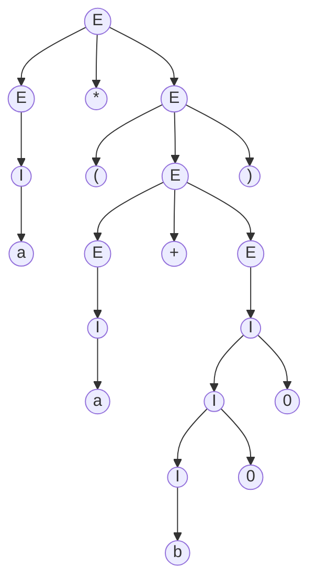

# Definición de gramática

Las gramáticas están formadas por 4 componentes:

$$ G = (V, T, P, S) $$

-   Conjunto finito de **símbolos no terminales** $V$ o **variables**, que
    permiten representar subconjuntos del lenguaje o estados intermedios en la
    generación de palabras.
-   El alfabeto de **símbolos terminales** $T$, que son los símbolos finales del
    lenguaje.
-   El **símbolo inicial** o **axioma** $S$ de la gramática es una de las
    variables a partir del cual se obtiene cualquier palabra del lenguaje.
-   Un conjunto finito de **producciones** o **reglas** $P$ que indican las
    transformaciones posibles desde los símbolos no terminales a las palabras
    del lenguaje.
    -   Una variable o **cabeza de producción**
    -   El **símbolo de producción $\to$.
    -   Una cadena de 0 o más símbolos terminales y no terminales, que son el
        **cuerpo de la producción**.

Las letras mayúsculas normalmente denotan variables y las minúsculas símbolos
terminales.

# Tipos de gramáticas

Ya que tenemos el contexto de lo que es una gramática, y expandiendo lo que se
vio en la [introducción], diferenciamos varios tipos de gramáticas en función de
las restricciones que tenemos a la hora de crear las reglas de producción.

-   G0 o Tipo 0: gramáticas **sin restricciones** (GSR)
    $$
    \alpha \to \beta \\
    \alpha \in (V + T)^+ \\
    \beta \in (V + T)^*
    $$
-   G1 o Tipo 1: gramáticas **sensibles al contexto** (GSC)
    $$
    \begin{align*}
        \alpha \to& \; \beta \\
        |\alpha| \le& \; |\beta| \\
        \alpha = z_1 A z_2 &\quad A \in V \\
        \beta = z_1 \gamma z_2 &\quad \gamma \in (V + T)^+ \\
        z_1, z_2 \in T^* &\\
    \end{align*}
    $$
-   G2 o Tipo 2: gramáticas **independientes del contexto** (GIC)
    $$
    A \to \beta \\
    A \in V \\
    \beta \in (V + T)^*
    $$
-   G3 o Tipo 3: gramáticas **regulares**
    $$
    A \to \beta \\
    A \in V \\
    \beta \in \begin{cases}
        aB & a \in T^+ \\
        Ba & B \in V \\
        b  & b \in T^* \\
    \end{cases} \\
    $$

Por tanto:

$$ G3 \subseteq G2 \subseteq G1 \subseteq G0 $$

## Gramáticas Regulares (GR)

Los [lenguajes regulares] pueden asociarse a una gramática de **tipo 3**
o **regular**. Por la definición del apartado anterior, tenemos que son:

- **Lineales por la derecha** (solo variables por la derecha)
- **Lineales por la izquierda** (solo variables por la izquierda)


Una gramática $ G = (V, T, P, S) $ es lineal por la derecha si _todas_ sus
producciones son de la siguiente forma:

$$ A \to xB \\ A \to x$$

Donde $A, B \in V$ (son variables) y $x \in T^\*$ (es cualquier cadena de
símbolos terminales).



Para que sea lineal por la izquierda, _todas_ sus producciones son de la
siguiente forma:

$$ A \to Bx \\ A \to x$$


## Gramáticas independientes de contexto (GIC)

En cambio, las reglas de las Gramáticas Independientes de Contexto tienen la
siguiente forma:

$$ A \to \beta \\ A \in V \\ \beta \in (V + T)^* $$

Es decir,

- La cabeza de producción siempre es una variable
- El cuerpo de producción pueden ser variables o símbolos terminales (incluyendo $\lambda$)


La siguiente gramática para el alfabeto $\Sigma = \set{0, 1}$ que acepta las
cadenas palíndromas (iguales por la derecha que por la izquierda) se define
como:

$$ G_{\text{palindromo}} = (\set{S}, \set{0, 1}, P, S)$$
$$ S \to \lambda \; | \; 0 \; | \; 1 \; | \; 0S0 \; | \; 1S1 $$

Cuando varias reglas tienen la misma cabeza, se pueden representar en una sola,
separando los distintos cuerpos por `|`.



$$G = (\set{E, I}, \set{+, *, (, ), a, b, 0, 1}, P, E)$$
$$
\begin{align*}
    E \to& \; I \; | \; E+E \; | \; E*E \; | \; (E) \\
    I \to& \; a | \; b \; | \; Ia \; | \; Ib \; | \; I0 \; | \; I1 \\
\end{align*}
$$


## Gramáticas sensibles al contexto (GSC)

$$ G = (V, T, S, P) $$

Un lenguaje $L$ es sensible al contexto (LSC) si existe una GSC tal que $L
= L(G)$ o $L = L(G) \cup \set{\lambda}$.

Los LSC que no contengan $\lambda$ son reconocidos por los Autómatas Linealmente
Acotados (ALA).

$$ \text{LSC} \subset \text{LREC} $$

## Gramáticas sin restricciones (GSR)

Las GSR generan los LRE.

# Análisis de una gramática
## Derivaciones de una gramática

Sea $G = (V, T, P, S)$ y $\alpha A \beta$ una cadena de terminales y variables,
donde $A$ es variable ($A \in V$) y el resto son variables y terminales
($\alpha, \beta \in (V + T)^\*$).

Si existe la producción $A \to \gamma$, entonces:

$$ \alpha A \beta \underset{G}{\implies} \alpha \gamma \beta $$

La implicación sobre la gramática $G$ indica que se utilizan sus reglas de
producción para derivar la nueva expresión. Alternativamente,
$\overset{\*}{\underset{G}{\implies}}$ denota un conjunto de derivaciones (no
solo una).


Una derivación de una sentencia $w$ es la **secuencia de sustituciones de
símbolos no terminales** según las reglas de producción de la gramática que,
partiendo del símbolo inicial $S$, producen como resultado $w$.


Básicamente consisten en expandir las reglas de la gramáticas para llegar a una
cadena del lenguaje que define.


Derivación más a la izquierda (se expande el lado de la izquierda primero):

$$
\begin{align*}
    E \implies& E * E \implies I * E \implies a * E \implies a * (E) \implies \\
    \implies& a * (E + E) \implies a * (I + E) \implies a * (a + E) \implies \\
    \implies& a * (a + I) \implies a * (a + I0) \implies a * (a + I00) \implies a * (a + b00)
\end{align*}
$$

Derivación más a la derecha (se expande el lado de la derecha primero):

$$
\begin{align*}
    E \implies& E * E \implies E * (E) \implies E * (E + E) \implies E * (E + I) \implies \\
    \implies& E * (E + I0) \implies E * (E + I00) \implies E * (E + b00) \implies \\
    \implies& E * (I + b00) \implies E * (a + b00) \implies I * (a + b00) \implies a * (a + b00)\\
\end{align*}
$$


## Lenguaje de una gramática


Cualquier cadena $\alpha$ de variables y símbolos terminales **que se derive de su
gramática** $G$, es una forma sentencial.

Formalmente:

$$ \alpha \in (V + T)^* \enspace / \enspace S \overset{*}{\underset{G}{\implies}} \alpha $$


Es decir, cualquier cadena formada por la gramática desde el axioma es una forma
sentencial.


El lenguaje de una gramática $G$, denotado por $L(G)$, está formado por las
formas sentenciales de solo símbolos terminales (las que están en $T^\*$).

Formalmente:

$$ L(G) = \set{w \in T^* | S \overset{*}{\underset{G}{\implies}} w } $$

A cada $w$ del lenguaje $L(G)$ se le llaman **sentencias**.


Es decir, cualquier cadena de símbolos terminales derivada del axioma es una
sentencia. El lenguaje de la gramática es el conjunto de todas estas sentencias.

## Árbol de derivación

Se pueden representar las derivaciones de la gramática en forma de árbol.

-   El nodo raíz es el símbolo axioma.
-   Cada nodo interior está etiquetado como una variable.
-   Cada nodo hoja está etiquetada con una variable, un
    símbolo terminal o $\lambda$. Si es $\lambda$, no debe tener hermanos.
-   Si un nodo interior etiquetado como $A$ tiene los hijos por este orden
    $X_1, \ldots, X_k$, entonces $A \to X_1, \ldots, X_k$ es una producción de
    la gramática.

Concatenando todas las hojas del árbol de izquierda a derecha, se obtiene la
cadena resultado, que se deriva desde la raíz.

Para el ejemplo antes visto: $E \overset{\*}{\implies} 'a * (a + b00)'$

## Ambigüedad


Una gramática $G$ es ambigua si existe al menos una cadena $w$ en $T^\*$ para
que podemos encontrar dos árboles de derivación diferentes.


La existencia de derivaciones diferentes no supone un problema para la
gramática, pero la **existencia de varios árboles de derivación diferentes sí**.

Estas ambigüedades no están permitidas en los lenguajes formales. No entraremos
en mucho detalle, pero es importante tenerla en cuenta.

# Formas normales para GIC


Las Gramáticas Independientes de Contexto (GIC) en formas normales pueden generar
todos los Lenguajes Independientes de Contexto (LIC).


Veremos las siguientes formas normales:

- Forma normal de Chomsky
- Forma normal de Greibach

El principal motivo para usar las formas normales es que no cambian la gramática
y **reducen la complejidad para la obtención de sus derivaciones**, es más fácil
de aplicar. Para comprobar determinada GIC en un computador, se tendrán que
comprobar todas las reglas para cada símbolo, lo que es un alto coste
computacional. Las formas normales son alternativas que intentan arreglar eso.

En general, antes de obtener una gramática en forma normal, es necesario
realizar unas transformaciones previas que no modifican el lenguaje generado:

1.  Eliminación de **producciones con $\lambda$**
2.  Eliminación de **producciones unitarias** (reglas de encadenamiento de la
    forma $A \to B, \enspace A,B \in V$)
3.  Eliminación de **símbolos inútiles**
    1.  Eliminar símbolos **no generadores**
    1.  Eliminar símbolos **no alcanzables**

## Eliminación de producciones con $\lambda$


La variable $A$ es anulable si $A \overset{\*}{\implies} \lambda $, es decir, si
$A$ se puede derivar en la cadena vacía.


Algoritmo para encontrar todos los símbolos anulables:

-   **Paso base**: si existe una producción $A \to \lambda$, $A$ es anulable.
-   **Paso inductivo**: si existe una producción $A \to C_1 \ldots C_k$, en las
    que todas las $C_i$ son anulables, entonces $A$ es anulable.


Sea $G = (V, T, P, S)$ una GIC.

1.  Se determinan todos los símbolos anulables de $G$ con al algoritmo anterior.
2.  Se construye la gramática $G_1 = (V, T, P_1, S)$, donde $P_1$:
    1.  Para cada producción $A \to X_1 \ldots X_k$ donde $k \ge 1$, supongamos
        que $m$ de ellos son anulables.
    2.  La nueva gramática tendrá $2^m$ versiones de esta producción: \
        Las $X_i$ anulables están presentes o ausentes en todas las
        combinaciones posibles
    3.  Si $m = k$, no se incluye en caso de que todo $X_i$ esté ausente, sino
        que aplicará sobre aquellas producciones que hagan uso de $A$ (dado que
        $A$ es anulable).
    4.  Se eliminan las producciones de la forma $A \to \lambda$.
    5.  Si $\lambda$ forma parte del lenguaje, se añade la producción $S \to
        \lambda$. Este es el único lugar donde $\lambda$ está admitido.



Dada una gramática con las producciones:

$$
\begin{align*}
    S \to&\; ABC \\
    A \to&\; aAA \;|\; \lambda \\
    B \to&\; bBC \;|\; \lambda \\
    C \to&\; bc \;|\; \lambda \\
\end{align*}
$$

Los símbolos anulables son $A, B, C, S$.

- Reescribimos $A$ como $A \to aAA \\;|\\; aA \\;|\\; a $
- Reescribimos $B$ como $B \to bBC \\;|\\; bC \\;|\\; bB \\;|\\; b$
- Reescribimos $C$ como $C \to bc$
- Reescribimos $S$ como $S \to ABC \\;|\\; BC \\;|\\; AC \\;|\\; AB \\;|\\; C \\;|\\; B \\;|\\; A $

Y como el axioma es anulable (el lenguaje acepta $\lambda$) también es necesario
añadir la producción $S \to \lambda$.


## Eliminación de producciones unitarias


Una producción unitaria es aquella de la forma: $$ A \to B $$ donde $A$ y $B$
son variables ($A, B \in V$).



Dos variables $A$ y $B$ forman un par unitario si y solo si $A
\overset{\*}{\implies} B$ mediante solo producciones unitarias.


Son importantes eliminarlas porque no cambian nada (solo renombran variables)
y añaden pasos extra en las derivaciones.

Obtención de los pares unitarios:

-   **Paso base**: $(A, A)$ es un par unitario para toda variable $A$.
-   **Paso inductivo**: sea $(A, B)$ un par unitario y $B \to C$ una producción
    donde $C$ es una variables. Entonces $(A, C)$ es un par unitario.


Dada una gramática GIC $G = (V, T, P, S)$, se construye la gramática
$G_1 = (V, T, P_1, S)$, donde $P_1$:

1.  Se encuentran todos los pares unitarios con el algoritmo anterior.
2.  Para cada par unitario $(A, B)$, añadimos a $P_1$ todas las producciones
    $A \to \alpha$ donde $B \to \alpha$ es una producción no unitaria.



$$
\begin{align*}
    I \to& \; a \; | \; b \; | \; Ia \; | \; Ib \; | \; I0 \; | \; I1 \\
    F \to& \; I \; | \; (E) \\
    T \to& \; F \; | \; T * F \\
    E \to& \; T \; | \; E+T \\
\end{align*}
$$

Las producciones unitarias son: $F \to I$, $T \to F$ y $E \to T$.

- Reescribir $F$ como $F \to a \\;|\\; b \\;|\\; Ia \\;|\\; Ib \\;|\\; I0 \\;|\\; I1 \\;|\\; (E)$
- Reescribir $T$ como $T \to a \\;|\\; b \\;|\\; Ia \\;|\\; Ib \\;|\\; I0 \\;|\\; I1 \\;|\\; (E) \\;|\\; T*F$
- Reescribir $E$ como $E \to a \\;|\\; b \\;|\\; Ia \\;|\\; Ib \\;|\\; I0 \\;|\\; I1 \\;|\\; (E) \\;|\\; T*F \\;|\\; E+T$

Se ha sustituido la variable por su definición.


## Eliminación de símbolos inútiles


Un símbolo $X$ es útil para una gramática $G$ si existe alguna derivación de la
forma:
$$ S \overset{*}{\implies} \alpha X \beta \overset{*}{\implies} w $$
donde $w$ sea una sentencia (está en $T^\*$).


Es decir, un símbolo es útil si la gramática lo utiliza para generar sentencias.


Un símbolo $X$ es generador si $X \overset{\*}{\implies} w$ y $w$ es una
sentencia (está en $T^\*$). \
Nótese que todo símbolo terminal es generador.



Un símbolo $X$ es generador si existe una derivación $S \overset{\*}{\implies}
\alpha X \beta$ para algún símbolo $\alpha$ y $\beta$.



Todo símbolo útil es **generador** y **alcanzable**.


Es decir, un símbolo es generador cuando a partir de él puedo derivar
sentencias; mientras que un símbolo alcanzables es aquel al que se puede llegar
desde el axioma.

Algoritmo para calcular símbolos generadores:

-   **Paso base**: todo símbolo terminal es generador.
-   **Paso inductivo**: dada una producción $A \to \alpha$, donde $A$ es
    variable y $\alpha$ es generador; entonces $A$ también es generador. Se
    incluye el caso donde $\alpha = \lambda$.

Algoritmo para calcular símbolos alcanzables:

-   **Paso base**: $S$ es alcanzable.
-   **Paso inductivo**: para todas las producciones $A \to \alpha$, donde $A$
    es alcanzable; entonces $\alpha$ también será alcanzable.

Una vez determinados los símbolos útiles, se eliminan los que no lo son.

## Forma Normal de Chomsky (FNC)

Se dice que una gramática $G$ está en la Forma Normal de Chomsky (FNC) si todas
sus producciones tienen la forma:


$$
\begin{align*}
    A \to& \; BC \\
    A \to& \; a \\
    S \to& \; \lambda \\
\end{align*}
$$

Donde $A, B, C \in V$ (variables), $a \in T$ (terminal) y $S$ es el axioma.


Características:

- Un cadena de longitud $n$ se analiza en **$2n - 1$ pasos**.
- El árbol de derivación es **binario** y su profundidad máxima es $n$.
- Se usa como algoritmo el método [CYK].

Para convertir una gramática a FNC:

1.  Eliminar las producciones con $\lambda$, las producciones unitarias
    y símbolos inútiles.
2.  Luego, conseguir que en los cuerpos de longitud 2 o más solo aparezcan 2
    variables.

    1.  Para cada símbolo terminal $a$ que aparece en un cuerpo de longitud
        2 o más, se crea una nueva variable $A$.
    2.  $A$ solo tiene la producción $A \to a$.
    3.  Se sustituyen las apariciones de $a$ por $A$

3.  Descomponer los cuerpos de longitud 3 o más en una _cascada_ de producciones
    en cuyos cuerpos sólo aparezcan 2 variables.
    1.  Se descomponen las producciones de forma $A \to B_1 \ldots B_k$ para
        $k \ge 3$, con un grupo de variables en cada cuerpo.
    2.  Se introducen $k - 2$ variables nuevas: $C_1, \ldots C_{k-2}$.
    3.  Se reemplaza la producción original por las $k - 1$ producciones:
        - $A \to B_1 C_1$
        - $C_1 = B_2 C_2$
        - ...
        - $C_{k-3} \to B_{k-2} C_{k-2}$
        - $C_{k-2} \to B_{k-1} B_{k}$

## Forma Normal de Greibach

Todo LIC no vacío es $L(G)$ para alguna gramática $G$ cuyas producciones tienen
la forma:
$$ A \to a \alpha $$
donde $a$ es un símbolo terminal y $\alpha$ es una cadena de 0 o más variables.

El uso de una producción introduce un símbolo terminal en una forma sentencial.

- Una cadena de longitud $n$ tiene una derivación de $n$.
- Una analizador sintáctico descendente parará a profundidad $n$.
- Nunca habrá recursividad por la izquierda.

 Es más eficiente que Chomsky, pero tiene la misma complejidad
(lineal).

[cyk]: https://en.wikipedia.org/wiki/CYK_algorithm
[introducción]:        
[lenguajes regulares]: 
