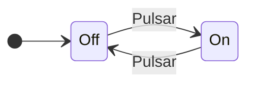
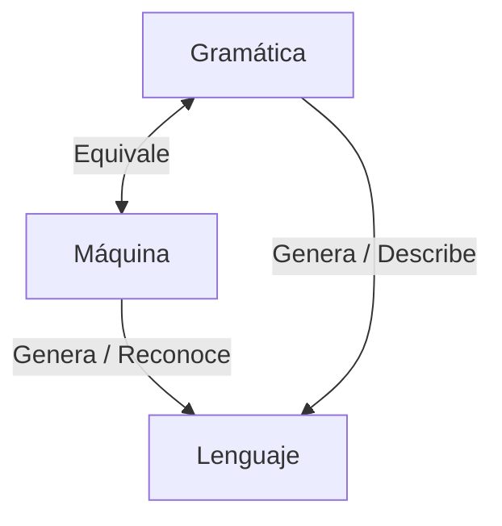


# Tipos de problemas

En 1936, Alan Turing realiza un estudio de qué problemas **no se pueden
resolver**.

También diseña y estudia la [Máquina de Turing]: una máquina abstracta que
manipula símbolos sobre una cinta de acuerdo a una tabla de reglas. Es capaz de
implementar cualquier problema matemático expresado en un algoritmo.

Tipos de problemas

En 1936, Alan Turing realiza un estudio de qué problemas no se pueden resolver.

Tenemos varios tipos de problemas:

    Problemas que conocemos su solución y podemos escribir algoritmos
        Problemas tratables: se pueden resolver de forma eficiente en la práctica implementando algoritmos.
        Problemas intratables: no se pueden resolver de forma práctica dado que lleva mucho tiempo calcularlos. Determina la frontera entre lo que puede y no puede hacer un computador (halting problem).

    Problemas de los que desconocemos su solución
        Problemas muy complejos pero que sí se pueden resolver
        Problemas que NO se pueden resolver

De los autómatas y de la complejidad:

- ¿Qué es lo que puede hacer una computadora? Decibilidad y computabilidad.
- ¿Qué puede hacer eficientemente? Complejidad.

[Máquina de Turing]: TODO



Estudio de máquinas o dispositivos abstractos con capacidad de computación.


# Aplicaciones

De los autómatas finitos:

-   Software para el diseño y verificación de **circuitos digitales**
-   **Analizador léxico** de un compilador
-   Software para **explorar textos**
-   Software para comprobar el funcionamiento de un sistema con **varios estados
    diferentes**.

De las gramáticas:

- Descripciones de analizadores sintácticos (_parsers_)

De las expresiones regulares:

- Especificación de patrones de cadenas
- Diseño de software de verificación de un formulario web

# Definiciones
## Alfabetos y palabras


Un alfabeto $\Sigma$ es **conjunto finito no vacío de símbolos**.


Ejemplo: $\Sigma = \set{0, 1}$


Una cadena es una **secuencia finita de símbolos** pertenecientes a un alfabeto. \
La **cadena vacía** ($\lambda$, $\epsilon$) es la que no contiene ningún
símbolo. \
Recordar que $|w|$ es el número de símbolos de la cadena $w$.


Ejemplo: $a = '0110101'$


La potencia de un alfabeto, $\Sigma^{k}$, es el conjunto de **todas las cadenas
de longitud $k$** que se pueden formar.


Ejemplo: $\Sigma^{2} = \set{'00', '01', '10', '11'}$


El cierre de un alfabeto contiene **todas las posibles cadenas** que se pueden
formar con él, **salvo la cadena vacía**.
$$ \Sigma^{+} = \Sigma^1 \cup \Sigma^2 \ldots $$



El cierre de un alfabeto contiene **todas las posibles cadenas** que se pueden
formar con él, incluyendo la cadena vacía.
$$ \Sigma^{*} = \set{\lambda} \cup \Sigma^1 \cup \Sigma^2 \ldots = \set{\lambda} \cup \Sigma^{+}$$



Si la secuencia de símbolos $A_1 \ldots A_n$ es la cadena $a$, y $B_1 \ldots
B_m$ es la cadena $b$, entonces la concatenación se define como:
$$ ab = A_1 \ldots A_n B_1 \ldots B_m $$


Ejemplo: $a = '00', b = '11' \implies ab = '0011'$


La $i$-ésima potencia de la cadena $x$, $x^i$, es la **concatenación sucesiva**
de $x$ $i$ veces.


Ejemplo: $a = '01' \implies a^3 = '010101'$


Si la secuencia de símbolos $A_1 \ldots A_n$ es la cadena $a$, entonces la
cadena inversa $a^{-1}$ se forma **invirtiendo el orden** de los símbolos:
$$ a^{-1} = A_n \ldots A_1 $$


Ejemplo: $a = '01' \implies a^{-1} = '10'$

## Lenguajes


**Cualquier conjunto de cadenas** del alfabeto $\Sigma$ será un lenguaje de
$\Sigma$.
$$ L \subseteq \Sigma^{*}$$


El alfabeto sobre el que se define debe ser finito, pero **los lenguajes pueden
tener un infinito número de cadenas**.

Ejemplos:

- Lenguaje vacío: $L = \varnothing$
- Lenguaje con solo la cadena vacía: $L = \set{\lambda}$
- El número de `0` es igual al de `1`: $L = \set{ w | |w|_0 = |w|_1 }$ \
     Ejemplos de cadenas: $'0011', '10', '1010'$
- $L = \set{0^n 1^n | n \ge 1}$ \
     Ejemplos de cadenas: $'01', '0011', '000111'$
- $L = \set{a^i b^j c^k | j = i+k \quad \forall i,j,k > 0}$ \
     Ejemplos de cadenas: $'aabbbc', 'abc', 'aaabbbbbcc'$


-% $L_1 \cup L_2$ :% Contiene todas las palabras que pertenecen a **cualquiera** de ellos.
-% $L_1 \cap L_2$ :% Contiene todas las palabras que pertenecen a **ambos**.
-% $L_1 - L_2$ :% Contiene todas las palabras que **pertenecen a $L_1$ pero no a $L_2$**.
-% $L_1 . L_2$ :% Contiene todas las palabras que se pueden formar por la
**concatenación de una palabra de $L_1$ y otra de $L_2$**.
-% $L^i$ :% La potencia $i$-ésima es la concatenación $i$ veces consigo mismo.
-% $L^-$ :% La reflexión se forma por la aplicación de la reflexión a todas las
cadenas.


## Gramáticas


Una gramática establece la estructura de un lenguaje.


Es decir, define las sentencias que lo forman, proporcionando formas válidas en
que se pueden combinar los símbolos del alfabeto.

[Chomsky] hizo una clasificación de las gramáticas:

- G0 o Tipo 0: gramáticas **sin restricciones** (GSR)
- G1 o Tipo 1: gramáticas **sensibles al contexto** (GSC)
- G2 o Tipo 2: gramáticas **independientes del contexto** (GIC)
- G3 o Tipo 3: gramáticas regulares

$$ G3 \subseteq G2 \subseteq G1 \subseteq G0 $$

## Autómata


Dispositivo teórico capaz de recibir, transformar y transmitir información.


Dada una cadena de símbolos presentados a su entrada, produce una cadena de
símbolos a su salida, en función de dichas entradas y los estados internos por
los que transita la máquina.


Por ejemplo, el autómata de un interruptor de luz:

Tiene dos posibles entradas: **presionar** el botón o **no presionar** el botón;
y produce dos posibles respuestas: **encender** la luz o **apagar** la luz.


# Relación entre máquina, lenguaje y gramática

- Una máquina es una representación de la gramática
- Una gramática describe un lenguaje, determina sus características
- Una máquina reconoce un lenguaje

Y la correspondencia entre los diferentes tipos de gramáticas y las máquinas es
la siguiente:

| Gramática                         | Lenguaje                   | Máquina                      | Complejidad |
|-----------------------------------|----------------------------|------------------------------|-------------|
| Tipo 0: Sin restricciones         | Recursivamente enumerable  | Máquina de Turing            | Indecibible |
| Tipo 1: Sensible al contexto      | Sensible al contexto       | Autómata linealmente acotado | Exponencial |
| Tipo 2: Independiente de contexto | Independiente del contexto | Autómata con pila            | Polinómica  |
| Tipo 3: Regular                   | Regular                    | [Autómata finito]            | Lineal      |

[Chomsky]: https://en.wikipedia.org/wiki/Noam_Chomsky
[Autómata finito]: 

