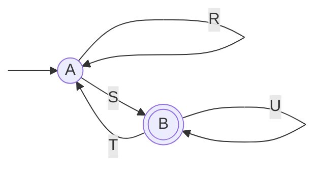
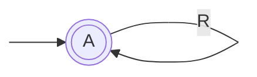
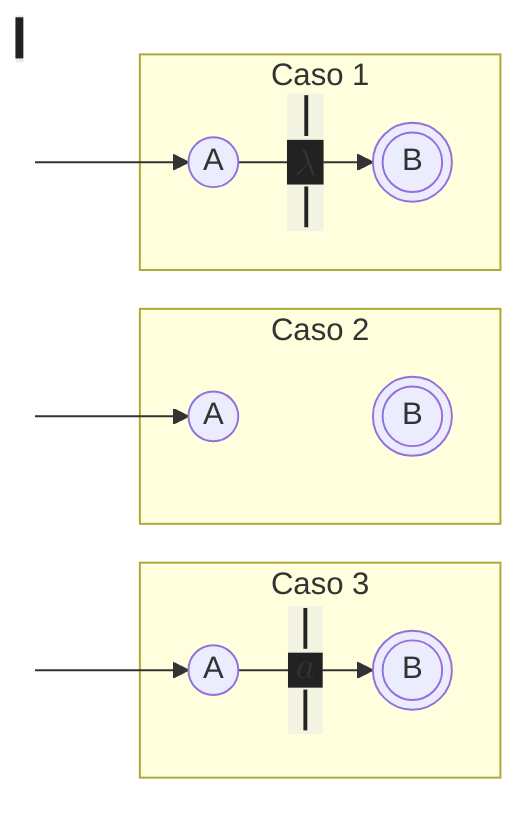
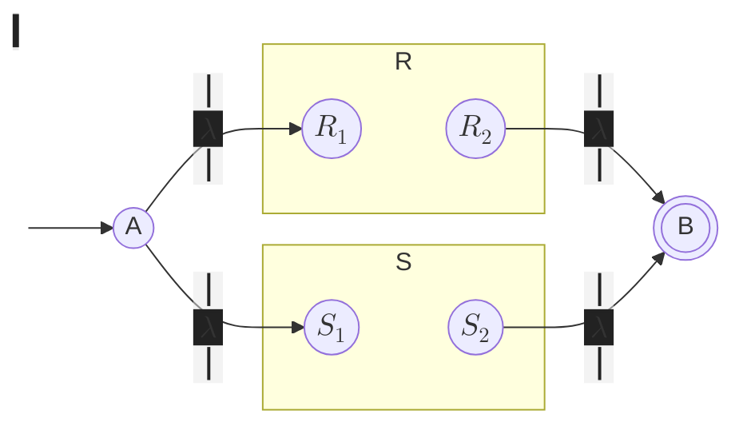
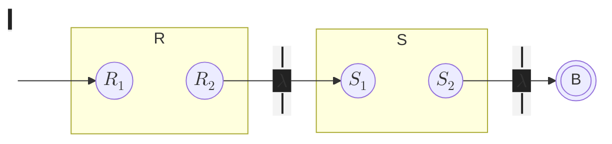
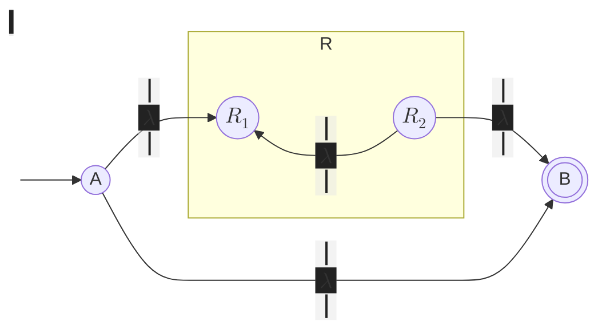
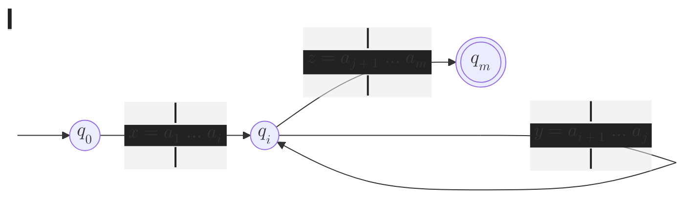


Las expresiones regulares denotan lenguajes:

- Descripción en forma algebraica de lenguajes regulares
- Forma declarativa de expresar las cadenas que queremos aceptar


# Aplicaciones

Búsqueda de patrones mediante ER que dan una imagen del patrón que se quiere
reconocer. Además se usan como lenguajes de entrada en muchos sistemas de
proceso de cadenas:

-   Herramientas de **búsqueda de patrones en textos** como `grep`.
    -   Búsqueda eficiente de palabras en un gran repositorio de texto
        (internet).
    -   La notación usada es valiosa para describir patrones de búsqueda.
    -   Posibilidad de pasar de ER a una implementación eficiente (AF).
    -   Descripción de patrones de texto vagamente definidos: resulta útil usar
        ER, ya que es posible modificarlas con por esfuerzo.
-   Diseño de **analizadores léxicos** mediante _Lex_ o _Flex_. Acepta
    expresiones regulares y produce un AFD para que la reconozca.
-   Diseño de verificadores de entrada del formato de texto en formularios web.

# Propiedades

Descripción de los lenguajes regulares:

- Autómatas finitos deterministas (AFD)
- Autómatas finitos no deterministas (AFN)
- Autómatas finitos no deterministas con transiciones con $\lambda$ (AFN-$\lambda$)
- Expresiones Regulares


No todos los lenguajes son regulares: $$L_{01} = \set{0^n 1^n | n \ge 1}$$
Este lenguaje, de ser regular, existiría un AF con $k$ estados que lo
reconocería, pero es imposible porque debe contar cualquier $n$ (potencialmente
infinitos valores) con solo $k$ estados.


# Operadores


-% $L_1 \cup L_2$   $L_1 + L_2$ :% Contiene todas las palabras que pertenecen a **cualquiera** de ellos.
-% $L_1 \cap L_2$ :% Contiene todas las palabras que pertenecen a **ambos**.
-% $L_1 - L_2$ :% Contiene todas las palabras que **pertenecen a $L_1$ pero no a $L_2$**.
-% $L_1 . L_2$    $L_1 L_2$ :% Contiene todas las palabras que se pueden formar por la
**concatenación de una palabra de $L_1$ y otra de $L_2$**.
-% $L^i$ :% La potencia $i$-ésima es la concatenación $i$ veces consigo mismo.
-% $L^-$ :% La reflexión se forma por la aplicación de la reflexión a todas las cadenas.
-% $L^*$ :% La clausura, estrella o clausura de Kleene es el conjunto de cadenas
formado por **la concatenación de cualquier número de cadenas de $L$** (se admiten
repeticiones). $$ L^* = \bigcup^{\infty}_{i=0} L^i $$


Solo existen dos lenguajes con clausura no infinita:

-   $L = \set{\varnothing} \implies L^* = \set{\lambda}$ ya que $\varnothing^0
    = \set{\lambda}$ y $\forall i > 0, \varnothing^i = \varnothing $.
-   $L = \set{\lambda} \implies L^* = \set{\lambda}$.


-   **Clausura 1 o más**: $r^+ = r r^\ast$
-   **Número exacto** $r\set{n}$ o dentro de un rango $r\set{n,m}$
-   **Opcional**: $r? = r | \lambda$
-   **Grupos**: $[abc] = a | b | c$.
    -   También se permiten rangos de caracteres, ambos inclusive (según su
        codificación ASCII): $$[a{-}z] = a | b | c | \ldots | z$$

        Algunos sistemas incluyen conjuntos predefinidos
        - $[[\text{:alpha:}]] = [a{-}zA{-}Z]$
        - $[[\text{:digit:}]] = \text{\textbackslash}d = [0{-}9]$
        - $[[\text{:alnum:}]] = [[\text{:digit:}][\text{:alpha:}]] = [0{-}9a{-}zA{-}Z]$
        - $[[\text{:space:}]] = \text{\textbackslash}s = [~\text{\textbackslash}t\text{\textbackslash}n]$ (espacios, tabulaciones y saltos de línea)
<!---->
-   **Inicio y fin de cadena**: `^r` hace _match_ con $r$ al inicio de la línea
    y `r$` al final.


## Precedencia de los operadores

    *    Clausura       <--- Mayor precedencia
    .    Concatenación
    +    Unión          <--- Menor precedencia

Con los paréntesis se modifican las reglas de precedencia.

# Álgebra de Expresiones Regulares


-% Conmutatividad :% $L + M = M + L$
-% Asociatividad :% $(L + M) + N = L + (M + N)$
-% Identidad :% $L + \varnothing = L$
-% Idempotente :% $L + L = L$


-% **No conmutatividad** :% $LM \ne ML$
-% Asociatividad :% $(LM)N = M(LN)$
-% Identidad :% $L \lambda = \lambda L = L$
-% Nulo :% $L \varnothing = \varnothing L = \varnothing$


-% Distributiva por la izquierda :% $L (M + N) = LM + LN$
-% Distributiva por la derecha :% $ (M + N) L = ML + NL$


Propiedades de las clausuras:

- $(L^\*)^\* = L^\*$
- $\varnothing^* = \lambda$
- $\lambda^* = \lambda$
- $L^+ = L L^* = L^* L$
- $L^* = L^+ + \lambda = \lambda + L^+$
- $L? = L + \lambda$

# Construcción

- **Paso Base**:
    -   Las constantes $\lambda$ y $\varnothing$ son ER. \
        $L(\lambda) = \set{\lambda}$ y $L(\varnothing) = \set{\varnothing}$.
    -   Si $a$ es un símbolo, $a$ es la ER del lenguaje $L(a) = \set{a}$.

- **Paso Inductivo**:
    -   Si $E$ y $F$ son ER, $E+F$ es una ER  $L(E + F) = L(E) \cap L(F)$
    -   Si $E$ y $F$ son ER, $EF$ es una ER  $L(EF) = L(E) L(F)$
    -   Si $E$ son ER, $E^\*$ es una ER  $L(E^\*) = L(E)^\*$
    -   Si $E$ son ER, $(E)$ es una ER  $L((E)) = L(E)$

# Autómatas finitos y expresiones regulares

Las Expresiones Regulares definen los lenguajes regulares exactamente igual que
los autómatas finitos.

-
    Todo lenguaje definido por un AF también puede definirse mediante una ER (ya
    sea AFD, AFN o AFN-$\lambda$; ya se ha demostrado que se puede convertir de
    unos a otros).
-
    Todo lenguaje definido por una ER puede definirse mediante un AF.

## Autómatas finitos a ER

Para convertir de un AF a un ER, se van eliminando progresivamente estados
y sustituyendo las diferentes transiciones con las ER equivalentes (en los arcos
aparecen ER, no símbolos). Nótese que solo es una representación para la
conversión, estos no son realmente autómatas.

1.  Para cada estado final $q$ se aplica el proceso de reducción.
    Se **eliminan todos los estados** excepto $q$ y el inicial $q_0$.
2.  Si $q \ne q_0$ $ L = (R^\* + SU^\*T)^\* SU^\* $
3.  Si $q = q_0$ (solo queda un estado)  $L = R^\*$
4.  La ER deseada es la **unión de las cadenas obtenidas para cada estado
    final**.



$$ L = (R + SU^*T)^* SU^* $$

Desde el estado inicial $A$ se puede recibir cualquier número de veces $R$.
También es posible transicionar al estado $B$ mediante $S$, recibir $U$
cualquier número de veces y regresar a $A$ recibiendo $T$. Esto se puede repetir
cualquier número de veces, dado que se empieza en $A$ y se regresa a $A$. Sin
embargo, para terminar, es necesario quedar en un estado final, por lo que se
transiciona a $B$ mediante $S$ y luego puede llegar cualquier número de $U$.

%%%%%%%%%%

$$ L = R^* $$


## Conversión de ER a autómata finito


Todo lenguaje definido por una ER puede definirse mediante un AF.


**Demostración**: sea $L = L(R)$ para la ER $R$. Se demostrará que $L = L(E)$
para algún AFN-$\lambda$. Este método se llama la [construcción de Thompson].


#### Paso base:

%%%%%%%

#### Paso inductivo:

$$ R + S \implies L(R) \cup L(S) $$

$$ RS \implies L(R) L(S) $$

$$ R^* \implies L(R^*) $$


# Lema del Bombeo

Para un lenguaje regular **infinito**, el cumplimiento del lema del bombeo es
una **condición necesaria, pero no suficiente**.


Sea $L$ un lenguaje regular. Entonces, existe una constante $n$ dependiente de
$L$, tal que, para toda cadena $w$ de $L$ con más igual o más símbolos que $n$,
podemos dividir $w$ en tres de forma que

- $y$ no es vacía
- $xy$ es menor o igual que $n$
- y para todo $k$ positivo, la cadena $xy^kz$ también es del lenguaje $L$

O de forma más precisa:

$$ \exists n / \quad \forall w \in L, |w| \ge n \quad w = xyz \begin{cases}
    y \ne \lambda \\
    |xy| \le n \\
    \forall k \ge 0, xy^kz \in L \\
\end{cases}
$$


Es decir, para que un autómata genere lenguajes infinitos a partir de un
conjunto finitos de estados, debe tener un ciclo en su grafo. Por tanto, siempre
podemos encontrar una cadena no vacía $y$ no demasiado lejos del comienzo de $w$
que se puede <<bombear>>.

Si ser repite $y$ cualquier número de veces o se borra ($k = 0$), la cadena
sigue siendo del lenguaje.

## Aplicación del lema del bombeo

1.  Elegimos un lenguaje $L$ para el que tratamos de demostrar que no es
    regular.
2.  El valor de $n$ es desconocido, por lo que debemos considerar cualquier
    valor.
3.  Elegimos $w$, usando $n$ como parámetro. \
    Si para un $n$ suficientemente grande no podemos escoger $w$, $L$ será
    regular.
4.  Repetir para todas las descomposiciones de $w$.
    1.  Escoger una descomposición de $w$ en $xyz$ sujeta a las restricciones
        vistas: $y \ne \lambda$, $|xy| \le n$
    2.  Si $x y^k z$ pertenece a $L$ para todo valor de $k$:
        - Se verifica el lema del bombeo
        - No se puede afirmar que el lenguaje sea regular
        - No es necesario probar con otras descomposiciones. Termina el algoritmo.
5.  Si en el paso anterior no se ha cumplido para ninguna descomposición, no se
    verifica el lema del bombeo y por tanto el lenguaje no es regular.

[construcción de Thompson]: https://en.wikipedia.org/wiki/Thompson%27s_construction
