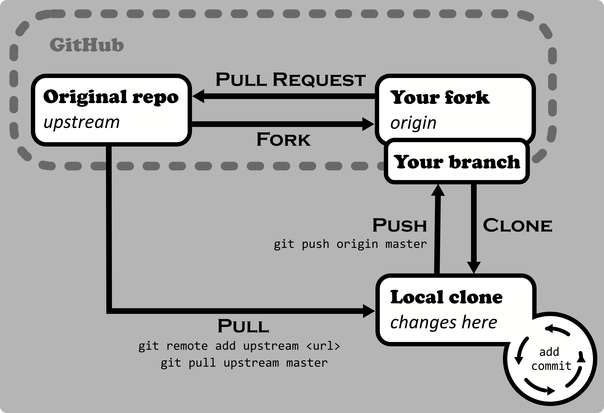

> Puedes encontrar un libro gratuito en PDF muy completo sobre Git en
> [GoalKicker]. Además el propio GitHub tiene sus propias guias sobre git en
> [Git Guides].

[GoalKicker]: https://goalkicker.com/GitBook/
[Git Guides]: https://github.com/git-guides/


# Git

Software por excelencia para el control de versiones, guarda un registro de
todos los cambios a unos archivos y permite trabajar más fácilmente en equipos.
Creado por Linux Torballs (creador del Kernel de GNU/Linux), y es software
libre.


## La ayuda

```sh
git help
git help <comando>
git <comando> --help
```


## Creación del repositorio

En primer lugar lo que se debe hacer es crear un repositorio de git para
iniciar el control de versiones de tu proyecto. Un repositorio es simplemente
un lugar donde almacenar el código o los archivos en cuestión. Desde el
directorio de dicho proyecto, ejecuta:

```sh
git init
```

Esto creará una carpeta oculta `.git`, que contiene una rama sin ningún commit.

> Puedes usar `-b <nombre-rama>` para escoger un nombre de rama inicial
> (configuración `init.defaultBranch`).

Si en lugar de eso, quieres descargar otros proyectos de internet, debes
**clonar** el repositorio. Esto depende de cada plataforma, en GitHub se hace
de la siguiente forma:

```sh
git clone https://github.com/<username>/<repositorio>.git
```

Esto obtiene los archivos necesarios (incluyendo `.git`) y los mete en una
carpeta con el nombre del repositorio. Puedes cambiar ese nombre con un
parámetro adicional o seleccionando la carpeta actual con `.`.


## Configuración del usuario

Antes de añadir cambios, el sistema debe saber cómo reconocerte.

> Nota: esto no tiene nada que ver con la cuenta de GitHub. Es el nombre que se
> relacionará con los cambios que realices.

Para ello ejecuta:

```sh
git config --global user.username "<usuario>"
git config --global user.email "<email>"
```

Esto añadirá al archivo de configuración `~/.gitconfig` los datos dados, por lo
que se aplicarán para todos los repositorios.

También hay formas para hacer esta configuración local al repositorio, véase la [seccion 1.4]
de las notas de Git.

[seccion 1.4]: https://goalkicker.com/GitBook/GitNotesForProfessionals.pdf#%5B%7B%22num%22%3A843%2C%22gen%22%3A0%7D%2C%7B%22name%22%3A%22XYZ%22%7D%2C0%2C658.623%2Cnull%5D


## Realizando cambios


<svg height="800" width="500">
    <rect>
</svg>


Inicialmente se deben añadir los cambios a una sala preli

` proyecto - git add > staging area - git commit > repositorio local `

- `git init`: inicia un seguimiento de un proyecto
- `git commit -m "descripción"`: guarda los cambios con una descripción dada
- `git commit -am "descripción"`: git add + git commit
- `git commit --amend`: abre `$EDITOR` para editar las descripciones de los commit


## Remotos

Git es un sistema distribuido, donde generalmente los cambios se hacen en
local. Para comunicarse con el resto, Git usa **remotes**. Estos son otros
repositorios a los que puedes acceder para añadir cambios (_push_) para que los
demás lo vean y recibir actualizaciones (_pull_) del resto de desarolladores.

Puedes pensarlo básicamente como un marcador a un repositorio distinto al que
le envias y recibes cambios.

Para añadir uno usa:

```sh
git remote add <nombre> <URL>
```

<!-- TODO: origin y upstream -->

Resumen de comandos:

```sh
git remote -v                 # Listar los remotos del repo
git remote add <nombre> <URL> # Añadir remoto
git remote set-url <nombre> <nueva-URL> # Cambia la dirección
git remote rename <nombre> <nuevo-nombre> # Cambia el nombre del remoto
git remote remote <nombre>    # Eliminar remoto
```

Comunicación con el remoto:

```sh
git push
git clone
git pull
git fetch
```

Fuente: [StackOverflow](https://stackoverflow.com/questions/20889346/what-does-git-remote-mean)


--------------------------------------------------------------------------------

Se puede editar el código desde GitHub (botón del lápiz, y guardar cambios)

Para conectarte a GitHub y hacer un `git push`, debes añadir tu usuario y
contraseña. Sin embargo, con la actualización de GitHub de Julio de 2020 , no
debes introducir tu contraseña real, sino un _Personal Access Token_ (PAT) que
puedes generar desde tu cuenta en `Settings > Developer settings > Personal
access tokens > Generate new token`.

Debes introducir un nombre descriptivo, su fecha máxima de validez y los
permisos que le quieras aportar. Finalmente pulsa en `Generate token.` y úsalo
en lugar de tu contraseña. De esta forma resulta mucho más seguro y puedes
controlar mejor los permisos.

- `git pull` : actualiza el repositorio
- `git clone <url>` : copiar repositorio
- `git push --tags` : subir las tags a repositorio remoto

- _tag_: especifica versiones de un proyecto
- `git tag <nametag> -m "descripción"` : crea una tag


## Reset

- `git reset --reset [--hard] <code>` : vuelve a un estado anterior borrando los commits posteriores
- `git revert <code> && git add .` && `git revert --continue` : Crea un nuevo commit que cambia el repositorio a un estado anterior por medio de un merge


## Ramas

- `git branch <nombre>` : crear una rama
- `git branch` : muestra las ramas creadas y en cuál estás
- `git branch -a`: muestra todas las ramas
- `git checkout <nombrerama>` : cambia a la rama dada
- `git merche <nombrerama>` : desde la rama master/main se une con la rama dada
- `git branch -d <nombrerama>` : borra la rama

- _Fork_: clona el repositorio (repositorio publico) en GitHub a otra cuenta
- _Pull request_: petición para juntar el fork con el proyecto inicial


## Sub módulos (repositorio dentro de otro)

- `git submodule add <url>` : añade un submódulo
- `git submodule init` : inicia el submódulo tras clonar el repositorio original
- `git submodule update` : actualiza (clona) los submódulos iniciados


## Info

- `git status -s` : muestra el estado de los archivos en la carpeta del proyecto
- `git diff [archivo]` : muestra todos los cambios en relación al master remoto
- `git log [archivo]` : muestra info de los commits (usuario, fecha, código, descripción)
- `git log --oneline` : muestra info de los commits
- `git log --decorate --oneline --graph`: muestra info de los commits más mejor
- `git shortlog`
- `git blame <archivo>` : muestra info de los cambios de un archivo con su código de commit, usuario, fecha, etc.
- `git reflog` : historial del repositorio local


# Contribuir a Open Source en GitHub

La página principal donde aparecen todos estos proyectos Open Source es en
[GitHub](https://github.com), para ello, es necesario tener una cuenta.

El siguiente paso es encontrar un proyecto al que queramos contribuir. Dentro
de la pestaña [`Explore`](https://github.com/explore) podrás encontrar
diferentes repositorios basados en tus intereses, populares, por categorías, etc.


## Issues

Dentro de un repositorio, tenemos varias pestañas disponibles. Aparte de la
pestaña del código (`code`), existen otras como `Issues`, `Pull requests`,
`Actions`... La pestaña `Issues` se usa para reportar bugs o pedir nuevas
funcionalidades, por lo que siempre es buena idea pasarse por ahí para intentar
solucionar algún problema. También puedes buscar [`Issues`](https://github.com/issues)
en todo GitHub directamente.

Estos `Issues` tienen diferentes etiquetas indicando el tipo de problema. Al
estar empezando, puede que sea buena idea buscar por `good first issue`, ya que
suelen ser problemas más sencillos. Pero si estamos empezando, puede que sea
mejor arreglar algo de la documentación para coger la mecánica.


## Pull requests

La pestaña de `Pull requests` contiene posibles soluciones a estos `Issues` que
algunos contribuyentes han propuesto. Para que esta solución se acepte, uno de
los dueños del repositorio deberá revisar tus cambios comprobando que todo sea
correcto antes de juntarlo con el proyecto.


## Cómo contribuir

Las acciones disponibles en un repositorio es observar (`watch`, se te notificará
de los recientes cambios del repositorio), indicar que te gusta (`start`) y
hacer un `Fork`, que sería editar tu propia versión del proyecto. Esto último es
exactamente lo que queremos.

Antes de meterse de lleno a editar cosas, es importante entender bien el
proyecto: en el archivo `README.md` podrás encontrar más información sobre el
mismo. Además de este archivo, algunos incluyen una guía de contribución o
código de conducta (`CONTRIBUTING.md`/`CODE_OF_CONDUCT.md`).

Al hacer click en este botón de `Fork`, se creará una copia del proyecto en tu
propia cuenta, por lo que lo podrás editar con total libertad, pero deberías
crear tu propia rama para no modificar el proyecto directamente y afectar el
trabajo de otros, además de que puede que haya nuevos cambios y acabes añadiendo
código desactualizado.

El siguiente esquema muestra los pasos a seguir para enviar los cambios al
proyecto.



```sh
# Obtener copia local
git clone <fork_del_proyecto>

# Crear rama
git branch <tu_rama>
git checkout <tu_rama>

# Añadir el repositorio original
git remote add upstream <link_del_projecto>

# Cambios en los archivos
git diff # Muestra los cambios
git add .
git commit -m "<descripción>"

# Comprobar si hay actualizaciones
git pull upstream <rama_principal>
git pull upstream <tu_rama>

# Enviar los cambios al fork
git push origin <tu_rama>

# Si el último comando te dio problemas, prueba con a especificar el upstream
git branch --set-upstream-to=origin/<rama_principal> <tu_rama>
```

Ahora en GitHub debería aparecer una notificación de `Pull request`, pulsa en el
botón de _Comparar & Pull Request_ y añade una descripción según aparezca en
la guía de contribución. Una vez cubierto y enviado, esta debería junto a otras
del repositorio original. Ahí puedes esperar a que acepten tus cambios o bien te
pueden proponer sugerencias, etc. En ese caso, deberías hacer otra rama nueva.

¡Listo! Acabas de hacer tu primera contribución a Open Source.
