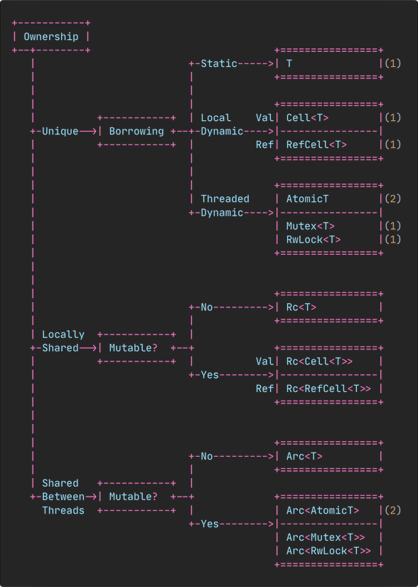

# Tipos de memoria
## Stack
Aquí se guardan datos de la forma `último en entrar, primero en salir` (LIFO).
Para guardar datos, se debe saber con antelación cuanto vamos a guardar y no
podrá cambiar de tamaño durante la ejecución del programa.

```rs
fn foo() {
  let var = 10; // push to the stack
  // operations with `var`
} // var goes out of scope, popped from de stack (data deleted)
```

## Heap
Este tipo de memoria es completamente desorganizada. Se guardan los datos en
medida que se vayan necesitando, de modo que podemos cambiar su tamaño.

Su funcionamiento es el siguiente:

1. Se busca un sitio libre del tamaño requerido en memoria y se guardan los
datos allí.
2. Para poder acceder a esos datos, devuelve un puntero a esta memoria. Y como
este es de tamaño fijo, podemos guardarlo en la stack, de forma que usamos ese
puntero para leer/escribir los datos.

```cpp
int * var; // push to the stack a pointer to an int

int main() {
  var = new int; // allocate in the heap a int
  // operations with var
  delete var; // manually delete the memory on the heap
} // var goes out of scope, popped from de stack (data deleted)
```

## Stack vs Heap
Por lo general, la heap es mucho más lenta que la stack, porque para guardar
datos primero tiene que buscar un sitio; y para leer tiene que seguir un
puntero; pero sigue siendo necesaria por el hecho de almacenar datos de tamaño
variable, pero en caso contrario, se debería evitar su uso.

# Ownership and borrowing
Hay varias formas de manejar la memoria:

+ Garbage collector:
  * **Pros**:
    - (Casi) sin errores.
    - Se escriben los programas más rápido.
  * **Cons**:
    - No se tiene control sobre la memoria.
    - Rendimiento lento y impredecible.
    - El tamaño del ejecutable es más grande.

+ Manual:
  * **Pros**:
    - Control total sobre la memoria.
    - Mejor rendimiento.
    - El tamaño del ejecutable es más pequeño.
  * **Cons**:
    - Da lugar a errores.
    - Se escriben los programas muy despacio.

+ Ownership:
  * **Pros**:
    - Control sobre la memoria.
    - (Casi) sin errores.
    - Mejor rendimiento.
    - El tamaño del ejecutable es más pequeño.
  * **Cons**:
    - Se escriben los programas muy lento y tiene una curva de aprendizaje
    difícil: luchando con el borrow checker.

## Ownership
Esto es la asociación de un valor con un nombre (variable). Las reglas son las
siguientes:

1. Cada valor tiene una variable y se le llama su _dueño_.
2. Solamente puede haber un dueño a la vez.
3. Cuando el dueño se va `out of scope`, los datos son borrados.

### Variable scope
```rs
{ // s is not valid here, it's not yet declared
  let s = "hello"; // s is valid from this point forward
  // do stuff with s
} // this scope is now over, and s is no longer valid
```

`"hello"` se guarda en la stack porque es de tamaño fijo, pero no se puede
cambiar su valor. En cambio, si usamos `String`, guardamos los datos en la heap
y entonces ya podremos modificarla.

```rs
{ // s is not valid here, it's not yet declared
  let s = String::from("hello"); // s is valid from this point forward
  // do stuff with s
} // this scope is now over, and s is no longer valid (popped from the stack
  // and the data doesn't have an owner, so it gets freed automatically)
```

### Interactivity
```rs
let x = 5; // push to the stack
let y = x; // copy (it is a value on the stack)
```

```rs
let s1 = String::from("hello"); // allocate on the heap
let s2 = s1; // move (all the data is moved from s1 to the variable s2. Now the
             // owner of "hello" is s2)
// cannot use s1 anymore, because it doesn't have any data.

// SOLUTION
let s2 = s1.clone(); // clone all the data (get a copy of each value and store
                     // it on new memory -very expensive-)
```

```rs
fn main() {
  let s = String::from("hello"); // allocate on the heap
  foo(s); // -> some_string = s // move the ownership to some_string
  // cannot use s anymore, because it doesn't have any data
}
fn foo(s1: String) {
  // some operations
} // some_string gets dropped ("hello" is removed)

// SOLUTION (not recommended)
fn main() {
  let mut s = String::from("hello"); // allocate on the heap
  s = foo(s);
  // now we can use s here
}
fn foo(s1: String) -> String { // some_string = s // takes ownership
  // some operations
  some_string // s = some_string // gives back ownership
}

// SOLUTION (borrowing)
fn main() {
  let s = String::from("hello"); // allocate on the heap
  foo(&s); // create a pointer to s
  // now we can use s here
}
fn foo(s1: &String) { // gets ownership of the pointer, but not actual memory
  // some operations
} // the pointer gets dropped, but not the memory
```
Esto no ocurre con valores del stack, simplemente se hace una copia.

## Borrowing
Este es un diagrama de la solución del último ejemplo.


Como ya vimos, podemos crear una referencia añadiendo `&` delante.

> **Nota**: Lo contrario a crear una referencia (al usar `&`) es desreferenciar,
> que se consigue usando `*`.

Hay que tener en cuenta, que la sintaxis puede ser un poco diferente a otros
lenguajes: para indicar que el valor es una referencia, añadimos `&` delante del
tipo de dato; y para crear la referencia, añadimos el `&` delante del valor.

El uso de estas referencias es muy útil en casos donde no queramos tomar
_ownership_ de una variable, pero igualmente necesitamos su valor.

En casos donde es necesario modificar ese valor, debemos crear una referencia
mutable: `&mut`.


Las reglas de las referencias son las siguientes:

+ La referencia se borra una vez que se usó por última vez.
+ Puedes tener, o una referencia mutable, o cualquier número de referencias
inmutables; pero no una referencia mutable y varias inmutables a la vez.
+ Las referencias deben ser siempre válidas.

[video](https://www.youtube.com/watch?v=VFIOSWy93H0)

# Lifetimes
Algunos links de ayuda:

+ [1](https://blog.logrocket.com/understanding-lifetimes-in-rust/)
+ [2](https://blog.thoughtram.io/lifetimes-in-rust/)
+ [3](http://web.mit.edu/rust-lang_v1.25/arch/amd64_ubuntu1404/share/doc/rust/html/book/first-edition/lifetimes.html)

Todas las referencias en Rust tienen un lifetime, que es el scope por la cual la
referencia es válida. Pero la mayoría del tiempo son implícitas por el
compilador.

Las referencias deben de ser siempre válidas, si tenemos una referencia a un
valor borrado el compilador lo sabrá y dará un error. Esto se comprueba con el
`borrow checker`.

Las normas que usa el compilador para asignar las lifetimes:
+ Si hay exactamente un input lifetime como parámetro, esta se asignará a todas
las output lifetimes parameters
+ Si hay varias input lifetime parameters, pero una de ellas es `&self` o
`&mut self`, la lifetime de self se asigna a todas las output lifetime parameters

+ `'static`: es una lifetime para todo el programa (como string literals)

```rs
let reference;
{
  let value = 10;
  reference = &value;
}
// reference no es válida aquí (dangeling reference)
```

[dangling references](https://doc.rust-lang.org/book/ch04-02-references-and-borrowing.html#dangling-references)

```rs
let s1 = String::from("a");
let s2 = String::from("abcdef");

let result = longest(s1.as_str(), s2.as_str());
println!(result);

// &i32: referencia
// &'a i32: referencia con lifetime
// &'a mut i32: mut ref con lifetime
fn longest<'a>(a: &'a str, b: &'a str) -> &'a str{ // sin la generic da error
  if a.len() > b.len() {
    a
  } else {
    b
  }
}
```

```rs
struct Name<'a>{
  someting: &'a str;
}
```

# Smart Pointer
> [una mejor explicación](https://manishearth.github.io/blog/2015/05/27/wrapper-types-in-rust-choosing-your-guarantees/)

Se trata de un puntero, una variable que guarda una dirección de memoria, por lo
que es una variable que contiene otra variable (y sus datos). Lo más común es la
referencia.

Smart Pointers hacen un seguimiento de los punteros a una memoria en concreto, y
cuando no hay más punteros, los datos se borran.

A diferencia de las referencias, los Smart Pointers son dueños de los datos de
alguna forma. Los vectores y los strings son Smart Pointers: tienen metadatos,
son dueños de los datos.

Smart Pointers implementan los traits `Deref` y `Drop`.

## Deref
Este trait nos permite implementar el operador para desreferenciar un valor (`*`)
en una estructura de datos creada por nosotros. Sin ella, el compilador solo
sabrá como desreferenciar una referencia, no un objecto creado por nosotros.

Para las referencia mutables, en cambio, debemos usar el trait `DerefMut`

```rs
struct MyBox<T>(T); // Tuple Struct

impl<T> MyBox<T> {
  fn new(x: T) -> MyBox {
    MyBox(x) // Para este ejemplo no es necesario guardar el valor en heap
  }
}

impl<T> Deref for MyBox<T> {
  type Target = T;

  fn deref(&self) -> &T {
    &self.0 // Devuelve una referencia al valor guardado.
            // Se debe devolver una referencia, por el sistema de ownership que
            // ya vimos. Y esta referencia podrá ser desreferenciada por el
            // compilador como siempre.
  }
}

fn main() {
  let x = 5;
  let y = MyBox::new(x);

  assert_eq!(5, x);
  assert_eq!(x, *y); // Equivalente a: *(y.deref())
}
```

`Dered Coercion`: En algunos casos, la desreferencia ya se llama automáticamente,
ya que ayuda a crear un código más legible:

```rs
fn main() {
  let m = MyBox::new(String::from("Rust"));
  hello(&m); // La función toma un `&str`, pero le estamos pasando un `MyBox`
             // Aquí se ha desreferenciado automaticametente.
  // &MyBox<String> -> &String -> &str (String también implementa Deref)
}

fn hello(name: &str) {
  println!("Hello, {}!", name);
}
```

Estas son las reglas donde se usa Deref Coercion:

+ **desde `&T` a `&U`** donde `T: Deref<Target=U>`
+ **desde `&mut T` a `&mut U`** donde `T: DerefMut<Target=U>`
+ **desde `&mut T` a `&U`** donde `T: Deref<Target=U>`

El caso donde no hay Deref Coercion es desde `&T` a `&mut U`, ya que esto va en
contra de las reglas de borrowing.

## Drop
Este trait permite personalizar qué es lo que ocurre cuando un valor sale de
scope y debe ser eliminado. Funciona algo así como un destructor. En el caso de
`Box`, el comportamiento que queremos es que se eliminen los datos guardados en
la heap.

Este método también se llama automáticamente, pero podemos llamarlo para
eliminar el valor prematuramente: `drop(T)` (no se permite llamar directamente
`.drop()`)

```rs
struct Entity(i32);

impl Drop for Entity {
  fn drop(&mut self) {
    // Aquí manejamos qué ocurre cuando se va a eliminar este objeto
    println!("Borrando Entity con valor {}...", self.0);
  }
}

fn main() {
  let my_entity = Entity(10);
  // ...
} // Aquí se debe eliminar `my_entity`, por lo que se llama a `drop` y imprimirá
  // "Borrando Entity con valor 10...".
```

## Box
`Box<T>` es un Smart Pointer que guarda datos en la heap, mientras que el propio
`Box<>` se guarda en la stack. Esta es una dirección de memoria a los datos que
en tiene guardados en la heap.

```rs
// Guarda un i32 con valor 5 en heap
let b: Box<i32> = Box::new(5);
```

```rs
enum List<T> {
  // Rust necesita saber cuanto espacio ocupa List, debemos hacer Box<List<T>>
  Cons(T, Box<List<T>>),
  Nul
}

use List::{Cons, Nul};
let list = Cons(1, Box::new(Cons(2, Box::new(Cons(3, Box::new(Nul))))));
```

## Contando referencias - Shared Smart Pointer
En la mayoría de los casos, los valores tienen siempre un solo dueño, pero en
otros, es necesario que sea un valor compartido.

Piensa en este ejemplo: una persona enciende una televisión y se pone a verla.
A medida que más personas vienen a ver la televisión, esta se mantiene
encendida. Cuando las personas se van marchando, la última es la encargada de
apagar la tele. Si se hubiese apagado mientras todavía hay personas viendo, el
resultado será `panic`.

Puedes intercambiar a las personas por variables y la televisión por los datos:
si la primera persona al irse (fuera del `scope`), apagase la tele (borrase los
datos); el resto no podría usarla.

> **Nota**: Esto solo se puede usar en programas de un solo `thread`.

```rs
use std::rc::Rc;

fn main() {
  let value = "ejemplo".to_string();

  {
    // Se crea `a`. Hay 1 referencia a `value`.
    let a = Rc::new(value);

    {
      // Se clona `a` a `b`. Ahora hay dos referencias a `value`
      let b = Rc::clone(&a);

      // Los dos son iguales
      assert_eq!(a, b);

      // Podemos usar los valores normalmente
      println!("{}", a);
    } // Se borra `b`. Hay una referencia a `value`
  } // Se borra `a`. No hay ninguna referencia a `value`, también se borra.

  // No se puede usar `value`, porque se ha movido dentro del `Rc` y porque se
  // ha eliminado al salir este de scope.
}
```

El método `Rc::clone(Rc<T>)` no creará una copia tal cual del valor (ya que es
no es eficiente ni necesario), si no que simplemente aumentará el número de
referencias al valor. Cuando se eliminen todas las referencias, el valor se
eliminará.

Podemos saber cuantas referencias tiene usando el método
`Rc::strong_count(&Rc<T>)`.

## Interior Mutability
`Interior Mutability` nos permite mutar datos incluso cuando tenemos referencias
inmutables a esos datos. Esto se consigue usando código no seguro en una
estructura de datos, llamada `RefCell`.

Se trata de código que no está comprobado por el compilador siguiendo las reglas
convencionales de ownership, borrowing, etc. Esto se hace para incrementar la
flexibilidad. Y, en lugar de comprobar las reglas en el momento de compilación,
se hace en el momento de ejecución. En caso de error, `panic!`.

Por norma general, es mejor comprobar estas reglas al compilar, además de que no
afectan al rendimiento. Sin embargo, en algunos casos, comprobar las reglas en
el momento de ejecución pueden permitir acciones que el compilador no. El
ejemplo más famoso es el [Problema de la Parada](https://es.wikipedia.org/wiki/Problema_de_la_parada),
que no se puede determinar haciendo un análisis estático.

> **Nota**: Esto solo se puede usar en programas de un solo `thread`.

### Cell
`std::cell::Cell` nos permite tener varias referencias mutables al mismo valor,
siempre y cuando este sea un valor de la Stack (que implemente Copy), entonces
no habrá problema el tener dos referencias mutables.

```rs
let x = Cell::new(0);
let y = &x;
let z = &x;

x.set(1); // x = 1, y = 1, z = 1
x.set(1); // x = 2, y = 2, z = 2
x.set(1); // x = 3, y = 3, z = 3
```

Esto es equivalente a (pero no compila)

```rs
let x = 0;
let y = &mut x;
let z = &mut x;

x = 1   // x = 1, y = 1, z = 1
*y = 2; // x = 2, y = 2, z = 2
*z = 3; // x = 3, y = 3, z = 3
```

Técnicamente, no hay coste en tiempo de ejecución, pero deberíamos considerar, a
la hora de copiar un gran struct solo por un solo campo, hacer ese campo un
`Cell` en lugar de todo el struct.

### RefCell
Funciona de forma similar a `Cell`, pero también se puede usar con datos en la
Heap, sin embargo, sí que tiene coste en tiempo de ejecución.

```rs
let a = 5;
let b = &mut a; // Error: `a` no es mutable

let mut c = 5;
let d = &c;
*d = 2; // Error: `d` no es mutable
```

<!-- TODO: Smart Pointers 5 - 2:58 -->
[Guardar en Heap](https://nnethercote.github.io/perf-book/heap-allocations.html)

## Recapitulación
|           | Memoria | Varios dueños | Inmutable | Mutable | Comprobación |
| :-------: | :-----: | :-----------: | :-------: | :-----: | :----------: |
| `Box`     | Heap    | No            | Sí        | Sí      | Compilar     |
| `Rc`      | Heap    | Sí            | Sí        | No      | Compilar     |
| `Cell`    | Stack   | No            | Sí        | Sí      | Compilar     |
| `RefCell` | ?       | No            | Sí        | Sí      | Ejecución    |



