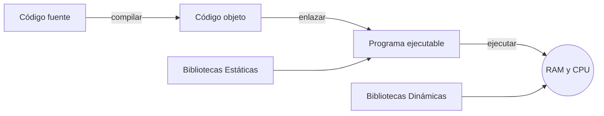
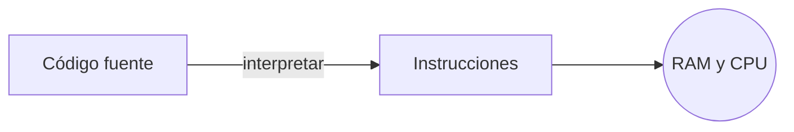


Un **programa** es una expresión de un [algoritmo] en una lengua artificial
formalizada (lenguaje de programación).

[algoritmo]: 



El **Código Fuente** es un conjunto de instrucciones escritas en un lenguaje de
programación.


# Lenguajes de programación

De forma similar a las lenguas humanas, que nos permiten comunicarnos entre
nosotros; los lenguajes de programación son herramientas que nos permiten
comunicarnos con los ordenadores, generalmente para describir instrucciones.

Existe una jerarquía por niveles de estos lenguajes:



Abajo de todo en la pirámide se encuentra el **Lenguaje Máquina**:

- Intrucciones que puede ejecutar el hardware directamente.
- Consiste en dígitos binarios que se cargan en memoria principal y que la CPU
  lee, descompone y ejecuta.
- Cada arquitectura de CPU usa códigos distintos, por tanto, no es portable.

A continuación aparecen los **Lenguajes de Programación**. Se trata de un
lenguaje intermedio entre el lenguaje máquina y el lenguaje natural (inglés,
español...) para facilitar la creación de programas.


-% Ensamblador :%
- Sustituye las instrucciones del Lenguaje Máquina por nombres fáciles de
  recordar (**mnemónicos**).
- Permite comentarios.
- Sigue dependiendo de la arquitectura de la CPU (no es portable).

-% Lenguajes de alto nivel :%
- Usa **palabras del inglés** y **notación matemática**.
- Más fácil de entender, programar y encontrar errores.
- Independiente de la arquitectura (portables).


Y arriba de todo se encuentra el **Lenguaje Natural**, que son las lenguas
humanas.

# Traducción

Como ya se ha comentado, los ordenadores solo pueden ejecutar instrucciones
máquina. Por tanto, ¿cómo es posible que pueden entender otros lenguajes de
programación?

La traducción es el proceso en el que se transforma el código fuente de un
lenguaje de programación a código máquina para que pueda ser ejecutado.

A modo de curiosidad, en este vídeo se expande un poco más sobre el proceso de
traducción (e incluso cómo el Sistema Operativo carga el binario para
ejecutarlo).



## Compilación

Un programa llamado **compilador** lee el código fuente, lo traduce
a instrucciones máquina y **las almacena en un archivo ejecutable**. Dicho
archivo se podrá ejecutar múltiples veces sin que sea necesario usar el
compilador.

El compilador conoce la totalidad del código fuente, por lo que puede analizarlo
para añadir optimizaciones y detectar errores.

## Interpretación

Un programa llamado **intérprete** lee el código fuente y va ejecutando al mismo
tiempo. Por tanto, cada vez que se ejecute el programa, se tendrá que usar el
intérprete.

## Bytecode

Algunos lenguajes, como por ejemplo Java, compilan el código fuente pero no
a instrucciones máquina nativas, sino a **bytecode**: sus propias instrucciones
máquina. Estas deben ser interpretadas por otro programa. Por tanto, esta
solución incorpora a la vez un compilador y un intérprete.

Para poder ejecutar un programa Java, primero se debe compilar a bytecode
y luego este debe ser ejecutado por la Máquina Virtual de Java (JVM). Por eso
mismo, se require de tener Java instalado para poder ejecutar programas Java,
pero no es necesario <<tener C instalado>> para ejecutar programas escritos en
C.

## Comparativa


-% Compilar :%
- Produce ejecutables rápidos y eficientes.
- El ejecutable resultante no necesita software adicional.

-% Interpretar :%
- Permite que el mismo código fuente se ejecute en varias plataformas sin
  recompilar.
- <<Es fácil depurar lenguajes interpretados>>


# Elementos básicos de un lenguaje de programación


-% Comentarios :% Permiten documentar programas
-% Identificadores :% Nombres simbólicos para ciertos elementos (variables,
   funciones, tipos de datos, etc)
-% Constantes y Literales :% Datos cuyo valor no cambian durante la ejecución
   del programa
-% Operadores :% Representan operaciones entre variables y constantes.
-% Instrucciones :% Símbolos que representan acciones de procesamiento.


# Errores en la programación

Existen 3 tipos de errores en la programación:


-% Sintácticos :% El traductor no puede entender el código fuente
-% Ejecución :% Finalización del proceso tras intentar hacer una operación imposible
-% Lógicos :% El programa no se detiene, pero no produce el resultado deseado.


Nótese que están por orden de dificultad.

- Los errores sintácticos son muy sencillos de arreglar dado que el propio
  compilador o intérprete indica dónde se encuentra y porqué está mal.

- Los errores de ejecución pueden no darse en todas las veces que se ejecuta, lo
  que complica encontrar el error.

- Los errores lógicos con los más complejos, dado que son difíciles de detectar.

