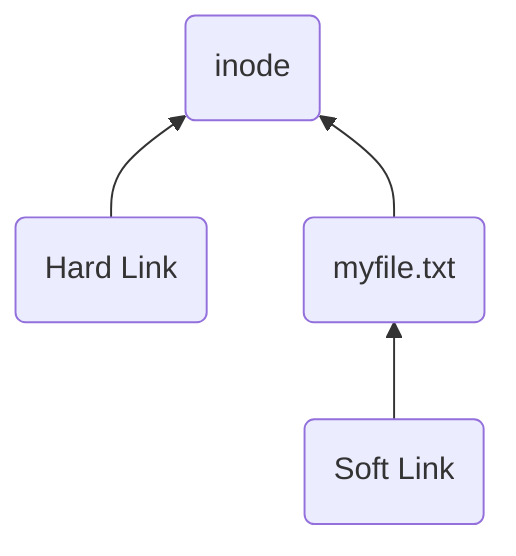
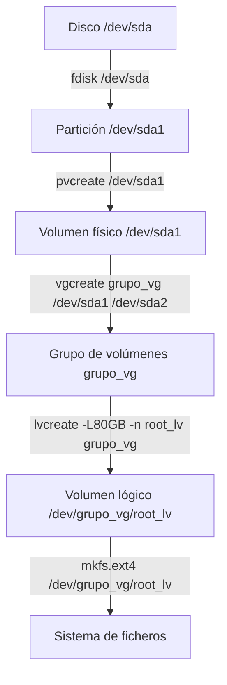

# Automatización de tareas

En esta sección veremos comandos que permiten automatizar tareas repetitivas.

- `at` y `batch`: tareas a una hora específica o bajo ciertas condiciones
- `cron`: tareas a intervalos regulares



1. Ejecutar `at [opciones] TIME`
2. Introducir los comandos a ejecutar en el momento `TIME`
3. Salir y guardar con `Ctrl-D`
4. El trabajo se ejecutará mientras el sistema esté encendido a la hora
   indicada.
5. La salida estándar se le enviará como mail al usuario.

Otros comandos:

- `atq`: lista los trabajos pendientes (todos si eres root)
- `atrm`: borra trabajos indicándolos por su número



Ejecuta comandos cuando el uso de CPU sea baja.

- La tarea se iniciará cuando la carga sea menor a 1.5
- La carga se obtiene del archivo `/proc/loadavg`



El demonio `cron` ejecutará los trabajos configurados con el comando `crontab`
de forma periódica.

    crontab file  Añadir un trabajo
    crontab -e    Edita un trabajo
    crontab -l    Lista los trabajos
    crontab -r    Borra los trabajos
    crontab -u    Para operar como otro usuario (solo root)

Los trabajos se especifican en un archivo. Este puede tener 3 tipos de líneas:

-   Comentarios. Empiezan por `#`
-   Definición de variables: `clave=valor` \
    Ejemplos de variables: `SHELL`, `MAILTO` (quien recibe la salida del
    comando).
-   Especificación del trabajo y hora:

    ```
    minuto hora día mes día_semana comando
    ```

    - Día de la semana del 0 al 7 (0 y 7 son domingo)
    - `*` indica cualquier valor
    - Se pueden indicar rangos:
        - `1-5`: lunes a viernes
        - `0,15,30,45`: cada 15 minutos
        - `0-12/2`: en el rango de las 0 a las 12, ejecutar cada 2 horas

Estos trabajos también se pueden colocar en los directorios:

- `/etc/cron.hourly/`
- `/etc/cron.daily/`
- `/etc/cron.weekly/`
- `/etc/cron.monthly/`



Elimina el contenido de `/tmp` todos los días laborables a las 04:30.

```
30 4 * * 1-5 rm -rf /tmp/*
```

Escribe la hora en `/tmp/horas` cada 15 minutos.

```
0,15,30,45 0-8,20-23 * * * echo Hora: $(date) >> /tmp/horas
```



# Copias de seguridad

Realizar copias de seguridad es una de las tareas más importantes de un
administrador de sistemas. Es casi inevitable la **pérdida de información**
debido a:

- Deterioro o borrado accidental por parte de un usuario autorizado
- Ataque intencionado de personas no autorizadas
- Fallo software o hardware
- Incencio, robos, desastres naturales, etc

Y es imprescindible poder **recuperar la información perdida**.


## Componentes de las copias de seguridad

Un sistema robusto contra las pérdidas de información tiene 3 componentes:

-   **Medios de almacenamiento**: discos duros, discos óptimos, cintas o en la
    nube. Lo mejor para las empresas son las **cintas**: más resistentes, duraderas,
    se pueden reescribir y tienen una alta capacidad. El único inveniente es que son
    muy lentas.

-   El **programa de copia**: encargado de mover los datos del disco a los medios.
    -   **Basado en imagen** (`dd`, `dump`): accede al disco a bajo nivel. Permite
        realizar copias más rápidas pero la recuperación de archivos
        individuales es más lenta.
    -   **Fichero a fichero** (`tar`): acceden a los archivos a través de
        llamadas al SO, lo que hace que las copias sean más lentas pero la
        recuperación más sencilla.

-   El **planificador** (`cron`): decide cuándo hacer las copias y cuánta
    información copiar.

## Tipos de backups

-   **Completo**: almacena toda la información. Se le asigna el nivel 0.
-   **Diferencial**: almacena los archivos modificados desde el **último backup
    completo**. Se le asignan niveles mayores que 0 (`0 5 5 5`).
    - Para restaurar solo se necesita el backup completo y el último diferencial.
    - Se necesita más espacio que incremental
-   **Incremental**: almacena archivos modificados desde el **último backup
    completo o diferencial**. Ejemplo de secuencia: `0 2 6 8`
    - Para restaurar se necesita el completo y todos los incrementales
    - La copia necesita menos tiempo y espacio

En general, una secuencia de nivel j contiene solo modificaciones con respecto
al previo más cercano i que sea menor.

## Planificación de los backups

Hay muchas estrategias a seguir a la hora de planificar las copias de seguridad.
A modo de ejemplo, supongamos que:


-   Los backups se hacen de lunes a viernes. Supondremos meses de 4 semanas (28
    días)
-   Queremos poder recuperar cualquier versión diaria de la última semana
    (últimos 5 días laborables) y cualquier versión semanal del último mes.

Por tanto, habrá que hacer copias de seguridad en 3 niveles:

- Diario
- Semanal
- Mensual


- Backup mensual nivel 0
- Backup semanal nivel 5 (diferencial con respecto al mensual)
- Backup diario  nivel 9 (diferencial con respecto al semanal)

\[Valen otros números\]

     V  L  M  X  J    V  L  M  X  J
    (0) 9  9  9  9   (0) 9  9  9  9
     5  9  9  9  9   (5) 9  9  9 (9)
     5  9  9  9  9   (5)(9)(9)(9) -
    (5) 9  9  9  9    -  -  -  -  -

Los que tienen los paréntesis con las cintas que tengo que mantener, un total de
9:

-   2 para las mensuales, uno para este mes y otro para el anterior. Para tener
    28 días hacia atrás, la semana que me quede del mes anterior sigue
    dependiendo del completo de su mes.
-   3 para las semanales
-   4 para las diarias

Para restaurar solo es necesario las últimas cintas 0, 5 y 9.



-   Backup mensual nivel 0
-   Backup semanal nivel 2 (diferencial con respecto al mensual)
-   Backup diario  niveles 3, 4, 5 y 6 (incremental con respecto al diario
    anterior y al semanal)

\[Valen otros números\]

     V  L  M  X  J    V  L  M  X  J
    (0) 3  4  5  6   (0) 3  4  5  6
     2  3  4  5  6   (2)(3)(4)(5)(6)
     2  3  4  5  6   (2)(3)(4)(5) -
    (2) 3  4  5  6    -  -  -  -  -

Los que tienen los paréntesis con las cintas que tengo que mantener, un total de
12:

-   2 para las mensuales, igual que antes.
-   3 para las semanales, igual que antes.
-   7 para las diarias. Se necesitan las de la semana actual y los de la semana
    anterior, porque dependen de las anteriores para poder recuperarse. Por
    tanto, hay que mantener 4 de la semana anterior y como máximo 3 se la semana
    actual.


## Comandos básicos


Hace copias de un sistema de archivos con las siguientes características:

- Todo tipo de archivos (inclusive dispositivos)
- Se preservan permisos, propietarios y fechas de modificación.
- Se pueden realizar copias incrementales y multivolumen (varias cintas)

```sh
dump [-nivel] [opciones] [archivos]
```

El campo `nivel` es un entero entre 0 y 9. Si es mayor que 0, implica copiar
solo los archivos cambiados desde la última copia de valor menor.

La información sobre los backups realizados se guarda en `/var/lib/dumpdates`.



Comando para restaurar ficheros salvados por `dump`.



```sh
dump -0u /home -f /root/cinta0.dump
echo Esto es una prueba > /home/magno/newfile.txt
dump -5u /home -f /root/cinta5.dump

rm /home/marcos/*  # Oh no!

restore -rf /root/cinta0.dump
restore -rf /root/cinta5.dump
```



Comando de copia y conversión basado en imagen.

```sh
dd if=/path/input of=/path/output [opciones]
```

- `bs=<num>` indica el tamaño del bloque
- `count=<num>` indica el número de bloques


También se puede usar el comando [`tar`] (_Tape Archiver_).

<!-- TODO: mover a un post nuevo -->
# Gestión de procesos


Para más información sobre qué es un proceso, consulta el artículo sobre
[procesos]().


Veremos:

- Listar procesos en ejecución
- Detener y matar procesos
- Controlar la prioridad de ejecución

## Listar procesos


El comando `ps` permite ver los procesos en ejecución. Tiene una gran variadad
de opciones, pero las más habituales son:

- `-e`: muestra todos los procesos
- `-u user`: muestra todos los procesos de un usuario
- `-o formato`: especifica las columnas de información a mostrar

En la columna de estado (`state`) se muestra una letra que describe el estado
del proceso:

- `R`: _Running_, ejecutándose o en la cola de ejecución.
- `S`: _interruptible Sleep_, dormido esperando un evento como datos de teclado.
- `D`: _uninterruptible sleep_, detenido esperando normalmente IO.
- `T`: _stopped_, detenido por una señal de control.
- `Z`: _zombie_, terminado pero a la espera de que su padre lo libere.



Muestra el árbol de procesos



Permite buscar procesos por nombre. Equivalente a `ps | grep <nombre>`.



Muestran una lista de procesos en una TUI (_Terminal User Interface_) que se
actualiza periódicamente. Dentro del programa se pueden cambiar las opciones de
visualización, filtrado, etc.


<!-- TODO: esto está duplicado -->
## Ejecución en segundo plano


Ver [Bash]()


-   **Primer plano** o **foreground**: el shell espera a que termine el comando
    antes de aceptar otro. Comportamiento por defecto.
-   **Segundo plano** o **background**: el shell acepta más comandos antes de
    que terminen los anteriores.

Lógicamente, solo sepuede ejecutar un único comando en primer plano, pero
cualquier número en segundo plano.

    comando &  Lanza un comando en segundo plano
    CTRL-C     Detiene un comando en primer plano
    CTRL-Z     Pausa un proceso en primer plano
    bg         Continua ejecutándolo en segundo plano
    fg         Lo retoma en el primer plano
    jobs       Lista procesos en segundo plano

<!-- TODO: expandir y poner mejor -->
## Señales


Ver [señales]()


    kill -l           Lista las señales posibles
    kill -N PID       Envía una señal con su código numérico al proceso
    kill -nombre PID  Envía una señal al proceso
    -----------------------------------------------------------------------
    pkill -N PID      Envía señales al proceso por el nombre del ejecutable
    pkill -nombre PID Envía señales al proceso por el nombre del ejecutable


-% `SIGTERM` :% Mata el proceso, permitiéndole terminar correctamente.
-% `SIGKILL` :% Mata el proceso inmediatamente (no se puede ignorar).
-% `SIGINT` :% Interrupción de teclado (`Ctrl-C`).
-% `SIGSTOP` :% Pausa temporlamente el proceso (no se puede ignorar).
-% `SIGTSTP` :% Stop de teclado (`Ctrl-Z`).
-% `SIGCONT` :% Continua un proceso detenido.
-% `SIGHUP` :% Se recibe cuando el proceso controlador (o terminal) termina.


<!-- TODO: expandir y poner mejor -->
## Prioridad

La prioridad de un proceso puede ir de -20 (más alta) a 19 (más baja). Por
defecto, la prioridad es 0 y los usuarios normales solo se la pueden bajar
(**solo root la puede subir**).


`NI` o `NICE` es el valor de prioridad asignada al iniciar el proceso, mientras
que `PRI` es la prioridad actual que va ajustando el planificador del kernel.


    nice -n NUM proceso  Resta NUM a la priodidad del proceso antes de lanzarlo
    renice NUM -p PID    Resta NUM a la priodidad de un proceso en ejecución

<!-- TODO: expandir y poner mejor -->
## Control de recursos de un proceso

El comando `ulimit` permite limitar los recursos que puede utilizar un proceso.

- `-a`: muestra los límites actuales.
- `-t`: tiempo máximo de CPU.
- `-s`: tamaño máximo de la pila.
- `-n`: máximo de archivos abiertos.

<!-- TODO: expandir y poner mejor -->
## Análisis básico de rendimiento

    uptime  Tiempo encendido, número de usuarios y carga media
    w       Igual que uptime, pero más información sobre usuarios y sus procesos
    free    Muestra la cantidad de memoria libre y usada, tanto RAM como swap


```
22:18:28 up  2:51,  2 users,  load average: 0.59, 0.62, 0.78
```

-   `22:18:28`: hora actual
-   `up 2:51`: tiempo encendido
-   `2 users`: número de usuarios conectados
-   `load average: 0.59, 0.62, 0.78`: carga media en el último minuto, últimos
    5 minutos y últimos 15 minutos.


## Otros


Muestra las llamadas al sistema que realiza un proceso en ejecución.



Cuando la shell termina (_logout_), envía la señal `SIGHUP` a todos los trabajos
que todavía se ejecutaban, para que ellos también terminen.

Al ejecutar `nohup firefox`, cuando se cierre la shell, firefox no recibirá
dicha señal y seguirá abierto.



Ejecuta un comando reemplazando el shell desde el que se lanza.



<!-- TODO: mover a un nuevo post -->
# Gestión de archivos

<!-- TODO: mover a SO -->
## Tipos de archivos y sus operaciones

En Linux y Unix, se consideran ficheros todo tipo de objetos que pueden ser
operados de forma similar a un fichero: dispositivos de lectura de datos, se
transforma en la lectura de un archivo; mientras que el envío de instrucciones
puede considerarse escrituras.

Teniendo en cuenta esto, en Linux se diferencian 7 tipos de archivos
diferentes:


-% Archivos normales :%
Los normales que se almacenan en disco, se crean con distintos programas (por
ejemplo `touch`) y se eliminan con `rm`.

-% Directorios :%
Se utilizan para agrupar archivos y crear estructuras lógicas: contiene
referencias otros archivos y directorios. Se crean con `mkdir` y se borran con
`rmdir` o `rm -r`.

-% Archivos de dispositivos de bloque :%
Estos permiten la comunicación con el hardware y periféricos que utilicen
bloques de datos para realizar operaciones de entrada/salida, por ejemplo discos
duros. Se crean con `mknod` y se borran con `rm`.

-% Archivos de dispositivos de carácter :%
Similares a los dispositivos de bloque, estos realizan operaciones de
entrada/salida byte a byte. También se crean con `mknod` y se borran con `rm`.


-% Tuberías con nombre <br> _Named pipes_ :%
También llamados **archivos FIFO**, permiten la comunicación entre procesos. Se
crean con `mknod` y se borran con `rm`.

-% Sockets :%
Comunican procesos en la red. Se crean con `socket()` y se borran con `rm`
o `unlink()`.

Más información en el post del [API de sockets]().

-% Enlaces simbólicos :%
También llamados **enlaces blandos**. Son básicamente punteros a otros archivos.
Se crean con `ln -s` y se borran con `rm`.


El comando `file` nos permite determinar qué tipo de archivo es cada uno.

<!-- TODO: mover a SO -->
## Atributos de un archivo

<!-- TODO: diagrama página 161 (real) 115 (pdf) de ASR/teoría.pdf -->

Se pueden ver los atributos de un fichero con `ls -l`.

-   **Indicador de tipo**
    - `-`: archivo normal
    - `d`: directorio
    - `l`: enlace simbólico
    - `c`: dispositivo de caracteres
    - `b`: dispositivo de bloques
    - `p`: tubería
    - `s`: socket

-  **Permisos**

    Permisos de usuario, permisos de grupo y permisos de otros; codificados con
    `rwx` (_read_, _write_, _execute_). Más información sobre [permisos].

-   **Número de enlaces**

    Indica el número de nombres o enlaces duros del archivo. En el caso de un
    directorio se corresponde con el número de subdirectorios (incluyendo `.`
    y `..`).

-  **Propietarios**: Usuario y grupo propietarios.

-   **Tamaño** en bytes

    Con la opción `-h` se muestra en múltiplos del byte. El valor que aparezca
    dependerá del sistema de archivos utilizado.

-   **Fecha**: se almacenan tres varias fechas.
    -   `mtime` (_modification time_): última modificación. Opción por defecto
        (`ls`).
    -   `atime` (_last access_): último acceso. Se muestra con `ls -l
        --time=atime`.
    -   `ctime` (_status change_): último cambio de estado. Se muestra
        con `ls -l --time=ctime`.

-   **Nombre**. Su longitud máxima es de 255 chars.

### Permisos


-% `chmod [-R] [+-=]permisos file` :%
Añade (`+`), quita (`-`) o establece (`=`) _permisos_ en formato simbólico.

-% `chmod [-R] u[+-=]permisos file` :%
Igual que el anterior, pero solo para el usuario propietario.

-% `chmod [-R] g[+-=]permisos file` :%
Igual que el anterior, pero solo para el grupo propietario.

-% `chmod [-R] o[+-=]permisos file` :%
Igual que el anterior, pero solo para otros usuarios.


La opción `-R` es **recursivo**, para aplicar el permiso a los archivos de
dentro del directorio especificado

También es posible especificar el valor de los 3 (o 4) octetos de los permisos.

```sh
chmod 770 file # ==> -rwxrwx---
```

Los permisos por defecto los define la máscara. Se pueden cambiar con el comando
`umask`.

### Propietarios

Con los comandos `chown` y `chgrp` se pueden cambiar el usuario y grupo dueño
del archivo.

```sh
chown usuario archivos
chgrp grupo archivos
chown usuario:grupo archivos
```

La opción `-R` hace que recorra recursivamente los directorios.

## Links

Los archivos de link son una manera de crear un atajo a otro archivo, de tal
forma que estamos creando un _pseudo-archivo_ que refiere al original.

Imaginemos que tenemos una carpeta cualquiera en un USB (`/media/usb/music`)
y creamos un archivo de link a este USB en nuestro usuario (`~/music`). Si abres
el link, estarás en `~/music`, no te redirigirá a `/media/usb/music`. Pero si
haces algunos cambios ahí, estos se reflejarán automáticamente en el original.

Se pueden usar en los siguientes ámbitos:

-   Crear una dirección alternativa a un archivo que se encuentre muy escondido
    en la jerarquía.
-   Enlazar librerías.
-   Tener como una copia del mismo archivo en diferentes lugares.

### Tipos de links

-   **Hard links**: crean una entrada en el directorio apuntando al mismo
    [inodo] que el archivo original. El enlace no se borrará incluso si se borra
    el archivo, dado que el inodo aún existe. Este solo se borrará cuando nadie
    haga referencia a él.

    -   **No se pueden crear enlaces duros a directorios**, porque su
        implementación es compleja y causan problemas cíclicos en búsquedas
        recursivas por el sistema de archivos.
    -   **No se pueden crear enlaces duros a archivos de otras particiones**,
        dado que es imposible hacer que el enlace apunte a su inodo.

-   **Symbolic links**: funcionan al nivel de rutas, el enlace apunta al archivo
    original. Por este motivo, se puede enlazar a través de varias particiones.
    Si el archivo original se borra, el enlace quedará como **roto**, no apunta
    a nada. A diferencia de los enlaces duros, **un enlace simbólico tiene su
    propio inodo**.


Se puede ver el número de archivos que apuntan al mismo inodo usando `ls -l`,
el número después de los permisos. Nótese que en los directorios ese número será
igual al número de subdirectorios que contenga (contando `.` -- él mismo--, y
`..` -- directorio padre).





### Creación de links

Para crear un _hard link_ se usa simplemente el siguiente comando:

```sh
ln ORIGINAL LINK
```

Un _enlace simbólico_ también se crea con el comando `ln`, pero con una _flag_
adicional:

```sh
ln -s ORIGINAL LINK
```

-   `ORIGINAL`: dirección del archivo (**relativa a `LINK`**) que se quiere
    enlazar
-   `LINK`: dirección dónde colocar el enlace

Para no liar los enlaces simbólicos, lo mejor es usar direcciones absolutas.


### ¿Cómo diferenciar los dos tipos?

En realidad, solamente podrás diferenciar los _soft links_, porque aparecerá
(tras un comando `ls -l`) una `l` indicando que es un enlace. Además de eso,
después del nombre del archivo, se mostrará a que otro archivo hace referencia:

```
lrwxrwxrwx 1 magno magno   26 Jan 27 17:50 soft -> originals/example-soft.txt
```

Por otro lado, un _hard link_, no podrá diferenciarse de ningún archivo normal,
ya que se mostrará `-` indicando que es un archivo, y no aparecerá ningún
indicador de donde esta el otro archivo al que hace referencia.

Puede que si que exista una forma de comprobarlo, pero yo todavía no lo he
descubierto.

> **Más?**: Usa `$ man ln`

## Localización de archivos

El comando básico para localizar archivos es `find`.

```sh
find directorio expresión
```

Donde la expresión puede ser (entre muchas otras opciones):

-   `-name <patrón>`: busca archivos que coincida con el patrón (se acepta
    comodines)
-   `-iname <patrón>`: lo mismo, pero no distingue mayúsculas de minúsculas.
-   `-regex <regex>`: lo mismo, pero usar una expresión regular.
-   `-type <tipo>`: busca por tipo de archivo (`fdlbcps`).
-   `-user <user>`, `-group <group>`: busca por propietarios.
-   `-perm <permisos>`: busca por los permisos activados, el resto son
    indiferencias.
-   `-size n[ckMG]`: busca por tamaño exacto.
-   `-size [-+]n[ckMG]`: busca rangos de tamaño.
-   `-[amc]time [ -+]n`: busca fecha.
-   `-[a c]newer <file>`: usa la fecha de modificación de un archivo para
    buscar.

Las expresiones se pueden combinar entre sí.

- AND lógico: `find expr1 expr2`
- OR  lógico: `find expr1 -or expr2`
- NOT lógico: `find ! expr1`
- También se pueden agrupar expresiones: `find \( expr \)`

`find` puede ejecutar una acción por cada archivo encontrado:

-   `-print`: imprime el nombre. Opción por defecto.
-   `-ls`: ejecuta `ls -l`.
-   `-exec comando {} \;`: ejecuta el comando, pasando el nombre del archivo
    a `{}`.
-   `-ok comando {} \;`: igual que el anterior, pero pregunta antes de ejecutar.


Más opciones:

- `-maxdepth n`: desciende como máximo `n` directorios.
- `-mount`: no pasa a otras particiones


-% `which` :% encuentra un ejecutable en `PATH`

-% `whereis` :% encuentra un ejecutable en los directorios estándar junto con su
documentación.

-% `locate` :% localiza todo tipo de archivos rápidamente.
-   Usa una BD para acceder más rápido. Esta se almacena en
    `/var/cache/locate/locatedb`
-   `updatedb` actualiza dicha BD


# Gestión de discos
## Logical Volume Management

En lugar de realizar [particiones físicas] mediante la modificación de las
tablas en [MBR] o [GPT], los sistemas Linux modernos proporcionan el sistema
**LVM**, que proporciona una **visión de alto nivel sobre los discos**:

-   Permite ver **varios discos como solo uno**
-   Más flexible: permite mover y cambiar de tamaño los volúmenes creados
-   Permite hacer cambios **dinámicamente** sin necesidad de reiniciar el
    sistema
-   Permite gestionar **volúmenes en grupos** definidos por el administrador


Discos duros, [particiones] de los mismos (definidas en la [tabla de
particiones]) u dispositivos similares, por ejemplo [RAID]: **[discos lógicos]**
en general. Deben ser continuas en el disco.

[RAID]: https://en.wikipedia.org/wiki/RAID
[particiones]: 
[tabla de particiones]: 
[Discos lógicos]: 



A partir de los volúmenes físicos, se construyen **agrupaciones lógicas**
llamadas Grupo de Volúmenes (LV) que forman una unidad administrativa.



Los Grupos de Volúmenes (VG) **se dividen** de forma lógica en Volúmenes Lógicos
(LV), cada uno con una etiqueta.

Estos se podrán cifrar y **contener sistemas de archivos**, para luego ser
montadas con `mount` o en `/etc/fstab`.


Por tanto, se genera este esquema:

<table style="text-align:center">
  <tr>
    <td class="header">Sistemas de archivos</td>
    <td colspan="2"><code>/home</code></td>
    <td colspan="2"><code>/data</code></td>
  <tr>
  <tr>
    <td class="header">Volumen Lógico (LV)</td>
    <td colspan="2"><code>/dev/primary_vg/home_lv</code></td>
    <td colspan="2"><code>/dev/primary_vg/data_lv</code></td>
  <tr>
  <tr>
    <td class="header">Grupo de Volúmenes (VG)</td>
    <td colspan="4"><code>primary_vg</code></td>
  <tr>
  <tr>
    <td class="header">Volúmenes Físicos (PV)</td>
    <td><code>/dev/sda1</code></td>
    <td><code>/dev/sda2</code></td>
    <td><code>/dev/sdb1</code></td>
    <td><code>/dev/sdb2</code></td>
  <tr>
  <tr>
    <!-- Truco para "separar" las dos tablas -->
    <td colspan="5" style="padding: 0; background-color: var(--background-color);">&uarr; &uarr; &uarr; &uarr;</td>
  </tr>
  <tr>
    <td class="header">Particiones Físicas</td>
    <td><code>/dev/sda1</code></td>
    <td><code>/dev/sda2</code></td>
    <td><code>/dev/sdb1</code></td>
    <td><code>/dev/sdb2</code></td>
  </tr>
  <tr>
    <td class="header">Discos Físicos</td>
    <td colspan="2"><code>/dev/sda</code></td>
    <td colspan="2"><code>/dev/sdb</code></td>
  <tr>
</table>

El tamaño de los volúmenes físicos y lógicos puede medirse en bytes o en
**unidades lógicas** o bloques:

-   **Extensión física** (PE): unidades básicas en las que se divide cada
    volumen físico.
-   **Extensión lógica** (LE): unidades básicas en las que se divide cada
    volumen lógico. Su tamaño coincide con el de las PEs de las que está
    formado.

<!-- TODO: mapeado stripping, lineal, mirroring -->

Comandos de uso:

    ------------------------------------------
    pvdisplay/pvs pv   Show Physical Volumes
    vgdisplay/vgs vg   Show Volume Groups
    lvdisplay/lvs lv   Show Logical Volumes
    ------------------------------------------
    pvcreate part      Crea un volumen físico
    ------------------------------------------
    vgcreate vg pv...  Create Volume Group
    vgremove vg pv     Remove Volume Group
    vgextend vg pv     Añade volumen físico al grupo
    vgreduce vg pv     Elimina volumen físico del grupo
    ------------------------------------------
    lvcreate -n lv vg  Crea un LV
    lvremove lv        Crea un LV
    lvextend lv -L+x   Crea un LV
    lvreduce lv -L-x   Crea un LV
    ------------------------------------------
    fsadm resize lv    Formatear el espacio aumentado del file-system

Nótese que tras ampliar el tamaño de un volumen lógico o partición, mientras que
no se expanda el sistema de archivos, el usuario (y programas) seguirá viendo en
mismo tamaño hasta que se realice el `fsadm resize`.




Alternativamente, en lugar de usar `/dev/grupo_volumen/volumen_logico`
directamente, **se puede usar `/dev/mapper/grupo_volumen-volumen_logico`**
a través del mapeador de dispositivos (_device mapper_).


El mapeador de dispositivos es un entorno proporcionado por el kernel de Linux
para el mapeo de dispositivos de bloque físicos a dispositivos virtuales de
nivel superior.

Esta forma de acceso es más cómoda cuando se trabaja con volúmenes cifrados.


# Gestión de usuarios

## Módulo de autentificación

PAM (_Pluggable Authentication Module_) es una librería de autenticación
genérica que las aplicaciones puede usar para **validar usuarios**, usando
múltiples esquemas de autenticación (ficheros locales, claves de un solo uso,
DNI electrónivo, LDAP...).

-   Módulos de **autenticación** (`auth`): para la identificación del usuario.
    - Contraseña
    - Tarjeta de identificación
    - Características biométricas
    - ...

-   Módulos de **cuentas** (`account`): controlas las condiciones para que la
    autenticación sea permitida.
    - Caducidad de cuentas
    - Horas de permiso de inicio de sesión
    - ...

-   Módulos de **contraseñas** (`password`): condiciones y procedimientos para
    el cambio de contraseñas.

-   Módulos de **sesión** (`session`): configuran y administran sesiones de
    usuarios, como tareas adicionales para permitir el acceso:
    - Montaje de directorios
    - Actualización del `lastlog`
    - ...

## Cuotas de usuario

Editando el archivo `/etc/fstab`, el administrador puede establecer límites de
uso del disco a los diferentes usuarios y grupos para evitar que acaparen todo
el espacio.

Se pueden establecer dos límites:

-   **Límite débil**: si una cuenta supera un límite de uso, se muestra una
    advertencia y se espera un _periodo de gracia_ en el que el usuario puede
    reducir su ocupación. Una vez pasado el tiempo y el uso del disco aún supera
    el límite, se bloqueará la cuenta.
-   **Límite duro**: se deniega el intento de escribir datos una vez superado el
    límite.

Se requiere de la instalación del **paquete `quota`**.


-% `cuotacheck` :% Construye el índice y testea la integridad.
-% `quotaon` <br> `quotaoff` :% Activa y desactiva las cuotas.
-% `edquota` :% Ajusta las cuotas de usuarios y grupos.
-% `repquota` :% Genera informes de uso.
-% `quota` :% Informa al un usuario de sus cuotas.



# Servicios básicos

## SSH

Shell seguro: los datos viajan encriptados. Es necesario instalar
`openssh-client` y `openssh-server` (solo para la máquina a la que se accede).

Incluye tres programas:

- `ssh`: shell remota
- `sftp`: subir y descargar archivos (similar a FTP)
- `scp`: copiar archivos (similar a `cp`)


[`tar`]: 
[inodo]: 
[permisos]: 
[particiones físicas]: 
[MBR]: 
[GPT]: 
