# Definiciones elementales


Un **grafo** es un par $G = (V, E)$ donde $V$ es un conjunto finito de elementos
llamados **vértices**/**nodos** y $E$ es un conjunto finito de elementos
llamados **ejes**/**aristas**.


- Si los ejes son pares no ordenados de vértices de $V$, se dice un **grafo no
  dirigido**.
- Si los ejes son pares ordenados de vértices de $V$, se dice un **grafo
  dirigido** / **digrafo**.

------------------------------------------------------------

- Si un vértice no está conectado a otro por ningún eje, se llama nodo
  **aislado**.
- Si un par de vértices están conectados por más de un eje, se llaman ejes
**paralelos** / **múltiples**.
- Si un eje conecta un nodo con él mismo, se llama un **lazo**.

Los grafos se suelen representar con puntos para los nodos y líneas que los unen
representando los ejes.

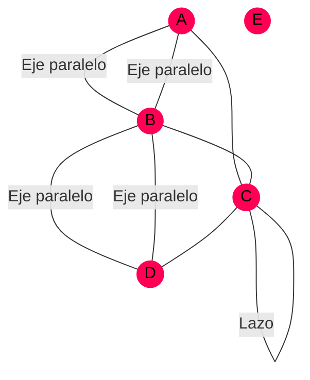

El grafo anterior no es dirigido, tiene dos ejes paralelos entre $A$ y $B$,
además de otros dos entre $B$ y $D$. $C$ tiene un lazo y $E$ es un nodo aislado.

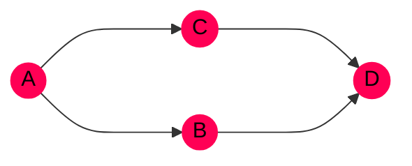

Y este es un grafo dirigido o, directamente, digrafo.


Un par de vértices son **adyacentes** / **vecinos** cuando existe un eje que los
conecta. Se dice que el eje **incide** sobre los vértices $v_1$ y $v_2$ si el
eje $e = \Set{v_1, v_2}$ los conecta. En ese caso, $v_1$ y $v_2$ son los
**extremos** del eje $e$.



Sea $G = (V, E)$ un grafo cualquiera.

- $|V|$ es el **orden** del grafo $G$ (número de vértices)
- $|E|$ es el **tamaño** del grafo $G$ (número de ejes)



## El grado de un vértice


El **grado** de un vértice $v$, $\delta(v)$, es el número de ejes incidentes.


Por tanto, $$ \delta(v) = 0 \iff v \text{ es aislado.} $$

Además, se puede definir la **sucesión de grados** de un grafo $G$:
$$ {\big\\{ \delta(v) \big\\}}_{v \in V} $$



Las suma de todos grados de los vértices es dos veces el número de ejes.

$$ \sum_{v \in V} \delta(v) = 2 |E| $$




El número de vértices de grado impar, es par.


Según el Lema del Apretón de Manos, podemos poner la suma de todos los grados de
la siguiente forma:

$$
    \overbrace{\sum_{v_2 \in V_2} \delta(v_2)}^{\text{Siempre par}} +
    \overbrace{\sum_{v_1 \in V_1} \delta(v_1)}^{\text{???}} = 
    \overbrace{2 |E|}^{\text{Siempre par}}
$$

Por tanto, $???$ tiene que ser impar.

Donde $V_2$ es el conjunto de los vértices de grado par y $V_1$ los vértices de
grado impar.


# Grafos simples


Un grafo se llama **simple** si no tiene lazos ni ejes paralelos.


Varios ejemplos de grafos simples:

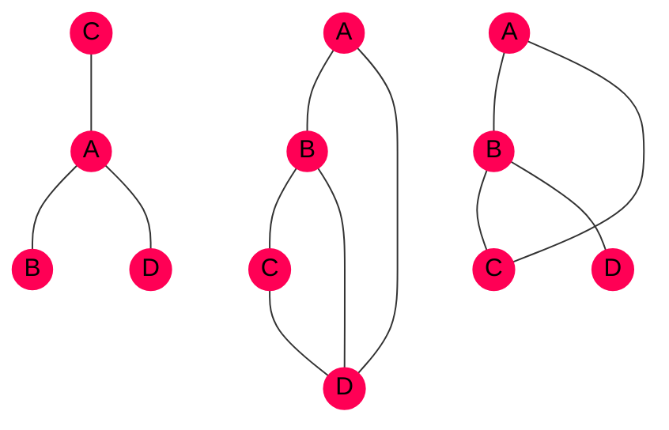


Si un grafo es simple, entonces $$ \forall v \in V, \quad 0 \le \delta(v) \le |V| - 1$$


Si un grafo es simple y todos los vértices tienen el mismo grado $r$, entonces
el grafo es **$r$-regular**.


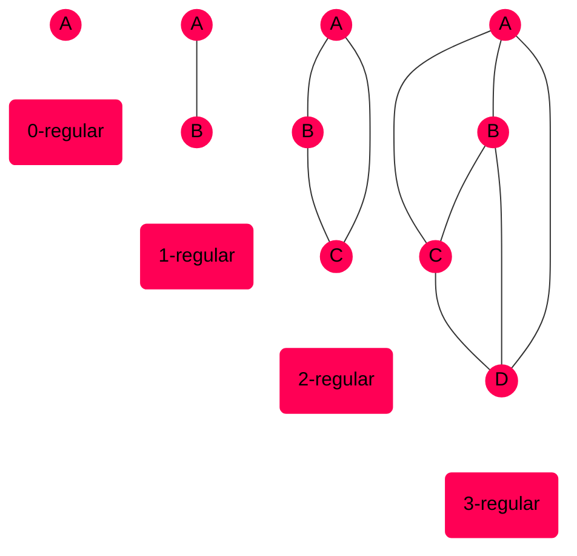

Subtipos de grafos simples:


$$
\begin{align*}
    |V| &= n             \newline
    |E| &= \binom{n}{2}
\end{align*}
$$
```goat
                                                     o
                                                    /|\
                                                   / | \
                                      o-----o     o--+--o
                             o        |\   /|     |\ | /|
                            / \       | \ / |     | \|/ |
     o       o-------o     /   \      |  +  |     |  +  |
                          /     \     | / \ |     | /|\ |
                         o-------o    |/   \|     |/ | \|
                                      o-----o     o--+--o
                                                   \ | /
                                                    \|/
                                                     o

    K1           K2          K3         K4           K6
```



$$
\begin{align*}
    |V| &= |E| = n \newline
    \delta(v) &= 2 \qquad \forall v \in V
\end{align*}
$$
```goat
                                        o               .
                                       / \
                                      /   \
                         o-----o     o     o
                o        |     |     |     |
               / \       |     |     |     |
              /   \      |     |     |     |
             /     \     |     |     |     |
            o-------o    |     |     |     |
                         o-----o     o     o
                                      \   /
                                       \ /
                                        o

                C3         C4           C6
```



$$
\begin{align*}
    |V| &= n + 1 \newline
    |E| &= 2n    \newline
    \delta(v) &= 3 \qquad \forall v \in V - \Set{\text{El nodo central}}
\end{align*}
$$
```goat
                                  o
                                 /|\
                                / | \
                   o-----o     o--+--o                  .
                   |\   /|     |\ | /|
                   | \ / |     | \|/ |
                   |  o  |     |  o  |
                   | / \ |     | /|\ |
                   |/   \|     |/ | \|
                   o-----o     o--+--o
                                \ | /
                                 \|/
                                  o

                     W4           W6
```



$$
\begin{align*}
    |V| &= |E| = n - 1 \newline
    \delta(v) &= 1 \qquad \forall v \in V - \Set{\text{El nodo central}}
\end{align*}
$$
```goat
                         o      o     o       o
                         |       \   /      o | o
                         |        \ /        \|/
       o----o----o       o         o       o--o--o      .
                        / \       / \        /|\
                       /   \     /   \      o | o
                      o     o   o     o       o

            S2          S3        S4          S6
```



$n$ es la dimensión del cubo.
```goat
                                o------o
                                |\     |\
                    o-----o     | o----+-o
                    |     |     | |    | |
               o    |     |     o-+----o |              .
                    o-----o      \|     \|
                                  o------o

               Q1      Q2            Q3
```



# Operaciones con grafos
## Subgrafos


Sean $G = (V, E)$ y $G' = (V', E')$ dos grafos.

Si $V' \subset V$ y $E' \subset E$, $\implies$ **$G'$ es un subgrafo de $G$**.


Por ejemplo,

```goat
                     o
                    /|\
                   / | \
                  o--+--o G   G' o
                  |\ | /|        |\
                  | \|/ |        | \
                  |  o  |        |  o
                  | /|\ |        | / \
                  |/ | \|        |/   \
                  o--+--o        o-----o                 .
                   \ | /
                    \|/
                     o
```

## Resta de grafos


Sea $G = (V, E)$ un grafo y $U \subset V$, $U \ne \empty$.

Sea $G - U$ el subgrafo de $G$ que se obtiene al eliminar los vértices $U$ del
grafo $G$ (y los ejes incidentes).


Por ejemplo,

```goat
G     o-----o-----o      G'    o-----o-----o
      |\   /|                  |
      | \ / |                  |
      |  +  |                  |
      | / \ |                  |
      |/   \|                  |
o-----o-----*-----*      o-----o
```

## Isomorfismo de grafos


Sean $G = (V, E)$ y $G' = (V', E')$ dos grafos.

Se dice que $G$ y $G'$ son **isomorfos** si existen las aplicaciones biyectivas

$$
\begin{align*}
    \varphi : V &\longrightarrow V' \newline
    \psi : E &\longrightarrow E'
\end{align*}
$$

de forma que se cumpla

$$ \allowbreak e = \Set{v_i, v_j} \in E \iff \psi(e) = \Set{\varphi(v_i), \\; \varphi(v_j)} \in E' $$

Es decir, que se mantenga la incidencia entre los mismos nodos.



Determinar si dos grafos son isomorfos es un **problema NP**.



Las **invariantes** son propiedades que se conservan entre dos grafos isomorfos
y que pueden ayudar a determinar si lo son o no.


Ejemplos de algunos invariantes son:

- El orden o número de vértices, $|V|$.
- El tamaño o número de ejes, $|E|$.
- La sucesión de grados, $\Set{\delta(v_i)}_{i = 1}^{|V|}$.


# Representación de grafos
## Tabla de adyacencia

En una columna se colocan todos los vértices y en la otra se listan todos los
vértices que están conectados con él.

Por ejemplo, la tabla de adyacencia siguiente:

```goat
                       .
           G  Vértices | Vértices adyacentes
              ---------+---------------------             .
                    v1 | v2 v3 v4
                    v2 | v1
                    v3 | v1
                    v4 | v1
```

Corresponde con este grafo:

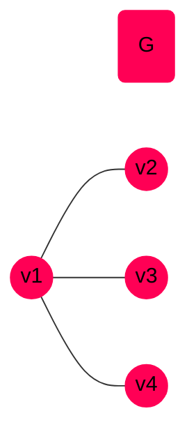


## Matriz de adyacencia


La **matriz de adyacencia** de un grafo $G$ es una matriz de orden $|V| \times |V|$,
$A_G = (a_{i j})$ donde $a_{i j}$ es el número de ejes que conectan el vértice
$v_i$ con $v_j$.


La matriz de adyacencia del grafo anterior sería la siguiente:

$$
A_G =
\begin{pmatrix}   \newline
    0 & 1 & 1 & 1 \newline
    1 & 0 & 0 & 0 \newline
    1 & 0 & 0 & 0 \newline
    1 & 0 & 0 & 0
\end{pmatrix}
$$

Otro ejemplo:

$$
A_{G'} =
\begin{pmatrix}       \newline
    0 & 2 & 1 & 1 & 1 \newline
    2 & 0 & 0 & 0 & 1 \newline
    1 & 0 & 1 & 1 & 0 \newline
    1 & 0 & 1 & 0 & 1 \newline
    1 & 1 & 0 & 1 & 0
\end{pmatrix}
$$

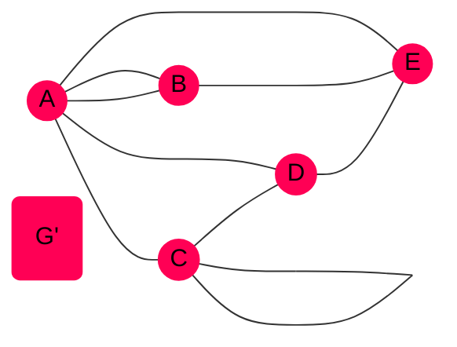


Las matrices de adyacencia para grafos no dirigidos siempre son **simétricas**,
dado que un eje conecta vértices en los dos sentidos.



Si el grafo es simple, la matriz será **binaria** con 0s en la diagonal.



La suma de la fila o columna (contando dos veces la diagonal) es el grado del
vértice.

$$ 2a_{i i} + \sum_{j \ne i} a_{i j} = \delta(v_i) = 2a_{i i} + \sum_{k \ne i} a_{k i}$$



## Matriz de incidencia


La **matriz de incidencia** de un grafo $G$ es una matriz de orden $|E| \times |V|$,
$C_G = (c_{i j})$ donde

$$
c_{i j} =
\begin{cases}
    1 \qquad \text{Si $v_i$ es incidente con $v_j$} \newline
    0 \qquad \text{En otro caso} \newline
\end{cases}
$$

(siempre es una matriz binaria)


La matriz de incidencia para $G$ es

$$
\begin{pmatrix} \newline
    1 & 1 & 1   \newline
    1 & 0 & 0   \newline
    0 & 0 & 1   \newline
    0 & 1 & 0
\end{pmatrix}
$$


# Caminos de un grafo


Sea $G = (V, E)$ un grafo.

Un **camino** o **trayectoria** de un vértice $v$ a otro $w$ es una secuencia de
ejes de $G$ (no necesariamente distintos) de la forma

$$ e_1 = \Set{v, v_1}, \\; e_2 = \Set{v_1, v_2}, \\; \ldots, \\; e_n = \Set{v_n, w} $$


- El número de ejes ($n$) es la **longitud del camino**.
- Un camino donde $v = w$ (el vértice inicial es el vértice final) es un
  **camino cerrado** / **ciclo** / **circuito**.
- Un camino donde todos los ejes son distintos se llama **camino simple**.


Sea $G$ un grafo, $|V| = n$, y $A$ la matriz de adyacencia de $G$. El número de
caminos de longitud $k$ que hay entre $v_i$ y $v_j$ es la entrada $a_{i j}$ de
la matriz $A^k$.


Ejemplo:

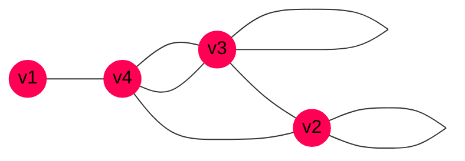

Y la matriz de incidencia:

$$
A =
\begin{pmatrix}   \newline
    0 & 0 & 0 & 1 \newline
    0 & 1 & 1 & 1 \newline
    0 & 1 & 1 & 2 \newline
    1 & 1 & 2 & 0 \newline
\end{pmatrix}
\implies A^3 =
\begin{pmatrix}      \newline
    0 & 3  & 3  & 6  \newline
    3 & 10 & 13 & 12 \newline
    3 & 13 & 16 & 18 \newline
    \textcolor{#f05}{6} & 12 & 18 & 9
\end{pmatrix}
$$

Por tanto, hay 6 caminos de longitud 3 entre $v_1$ y $v_4$.


# Conectividad de un grafo


Se dice que dos vértices $v$ y $w$ de un grafo están conectados si $v = w$ o si
existe un camino entre ambos.



Un grafo es **conexo** si todos los vértices están unidos por un camino.

En otro caso, se llama **disconexo** o **no conexo**.


Ejemplo de un grafo disconexo:

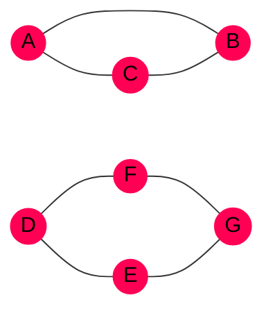



Una **componente conexa** de un grafo es un subgrafo conexo maximal (de tamaño
máximo, es decir, que no está contenido en otro subgrafo conexo).


En el ejemplo anterior, se separaría en 2 componentes conexas:

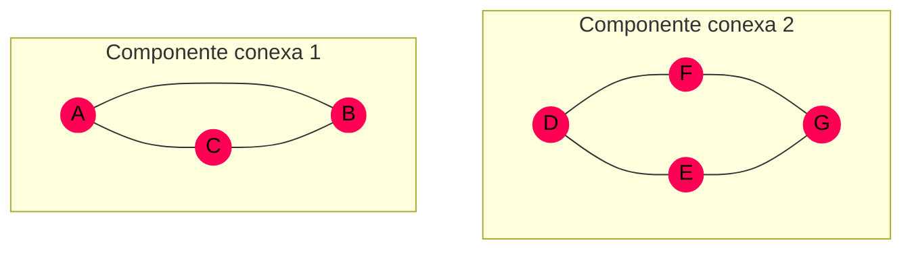


Un grafo es conexo $\iff$ tiene 1 componente conexa.



Sea un grafo $G$ de orden $n$ y $A$ su matriz de adyacencia.

G es conexo $\iff$ las entradas no diagonales ($i \ne j$) de
$\displaystyle \sum_{i = 1}^{n - 1} A^i$ son no nulas.



# Grafos bipartitos


Sea $G = (V, E)$ un grafo.

$V = V_1 \cup V_2$ con $V_1$ y $V_2$ disjuntos ($V_1 \cap V_2 = \empty$) de
forma que no haya ejes que inciden en dos vértices de $V_1$ ni en dos vértices
de $V_2$, entonces, es un **grafo bipartito**.


Ejemplo:

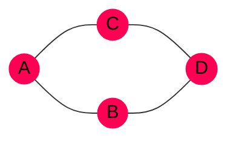

Podemos tomar los conjuntos $V_1$ y $V_2$ como

$$
\begin{align*}
    V_1 &= \Set{A, D} \newline
    V_2 &= \Set{B, C}
\end{align*}
$$

Nótese que $A$ no está conectado con $D$ y que $B$ no está conectado con $C$.


Un grafo bipartito se dice **completo** si todo vértice de $V_1$ está conectado
con $V_2$. Se denotan se la siguiente forma: $$ K_{|V_1|, |V_2|} $$


Además se cumple que

- $K_{m, n} \approx K_{n, m}$
- $|V| = m + n$
- $|E| = mn$

Ejemplos:

<!-- TODO -->

```goat
                                            .------------.       .----------.
                                           |              |     |            |
     o         o        o---------o        o         o    |     o    o    o--+--.
     |        / \       |         |       / \       /|\   |     |\  /|\  /|  |   |
     |       /   \      |         |      /   \     / | \  |     | \/ | \/ |  |   |
     |      /     \     |         |     /     \   /  |  \ |     | /\ | /\ |  |   |
     |     /       \    |         |    /       \ /   |   \|     |/  \|/  \|  |   |
     o    o         o   o---------o   o         o    |    o     o    o    o-'    |
                                      |              |          |                |
                                       '------------'            '--------------'
   K1,1       K1,2          K2,2               K2,3                  K3,3
```


Un grafo es bipartido $\iff$ todos los ciclos tienen longitud **par**.


Ejemplos, el primero no es bipartito, pero sí el segundo.

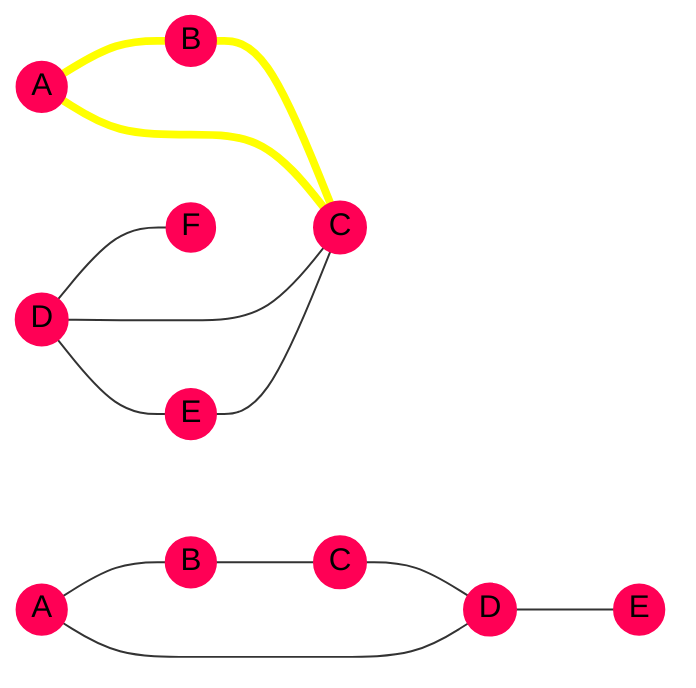

En amarillo aparecen remarcados los ciclos que no son de longitud par (nótese
que solo es necesario encontrar un ciclo).

Se puede obtener la partición, esto es, los dos conjuntos diferenciados de
vértices, con el siguiente algoritmo:


1. Tomamos un vértice $v$ cualquiera.
2. $V_1 := \Set{ w \in V | d(v, w) \text{ es impar} }$
3. $V_2 := \Set{ w \in V | d(v, w) \text{ es par} }$


Donde $d(a, b)$ es la distancia (longitud del camino más corto) entre los nodos $a$ y $b$.

# Grafos Eulerianos


En un grafo $G = (V, E)$ se llama **camino Euleriano** a un camino simple (no se
repiten ejes) que contiene a todos los ejes del grafo.


- Un **circuito** Euleriano es un camino Euleriano que emepieza y termina en el
  mismo vértice. Todo grafo que tenga al menos un 1 circuito Euleriano se llama
  **grafo Euleriano**.

- Un grafo se llama **Semieuleriano** si no tiene un circuito Euleriano pero sí
  un camino Euleriano.


Un grafo conexo es Euleriano $\iff$ todos los vértices tienen grado par:
$\forall v \in V, \\; \delta(v) \equiv 0 \pmod{2} $

Un grafo conexo es Semieuleriano $\iff$ todos los vértices tienen grado par,
excepto dos: los nodos se salida y llegada.


Algunos ejemplos:

```goat
          o---------o
         /|\       /|\
        / | \     / | \        o-----o               o-----o
       /  |  \   /  |  \       |\    |               |\   /|
      /   |   \ /   |   \      | \   |               | \ / |
     o    |    o    |    o     |  o  |               |  o  |
      \   |   / \   |   /      |   \ |               | / \ |
       \  |  /   \  |  /       |    \|               |/   \|
        \ | /     \ | /        o-----o               o-----o
         \|/       \|/
          o---------o

           Euleriano         Semieuleriano   No hay caminos Eulerianos
```


$K_{n,m}$ es Euleriano $\iff$ $n$ y $m$ son pares.

K_n es Euleriano $\iff$ $n \ge 3$ y $n$ es impar.


## Algoritmo FLEURY


Un **eje puente** es un eje $e = \Set{v, w}$ que al eliminarlo, el conjunto de
vértices que estén conectados con $v$ y $w$ sean disjuntos.


Véase un ejemplo:

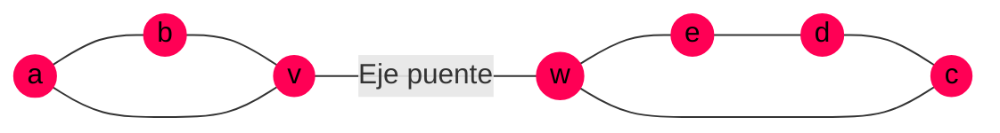

Si se elimina el eje puente, el grafo resultante es no conexo:

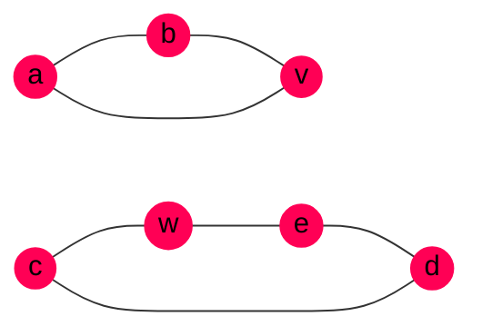

El algorimo de FLEURY permite encontrar un camino Euleriano.


1. Elegimos un vértice cualquiera, en el caso de Semieuleriano, se escoge uno de
   grado impar.

2. Se recorre el grafo con las siguientes condiciones:
    - Cada eje se elimina una vez que fue recorrido, dado que es un camino
      simple.

    - Solo se seleccionan los ejes puente si no hay otra opción.


# Grafos Hamiltonianos


Un **camino Hamiltoniano** es un camino simple (no repite ejes) que contiene
a todos los vértices. No es necesario que pase por todos los ejes.


- Si el camino es cerrado, se llama **circuito Hamiltoniano**.
- Un grafo es **Hamiltoniano** si tiene un circuito Hamiltoniano (problema NP).
- Un grafo es **Semihamiltoniano** si tiene un camino Hamiltoniano.

## Condiciones suficientes


Sea $G = (V, E)$ un grafo conexo de orden $n \ge 2$.

$$ \forall v \in V, \quad \delta(v) \ge \frac{n}{2} \implies \text{G es Hamiltoniano} $$



Sea $G = (V, E)$ un grafo simple y conexo de orden $n \ge 2$.

$$ \delta(v) + \delta(w) \ge n \implies \text{G es Hamiltoniano} $$

Para cualquier par de vértices no adyacentes.



$$ K_{n, m} \text{ es Hamiltoniano} \iff m = n \ne 1$$

$$ \delta(v) = n - 1 \implies K_n \text{ es siempre Hamiltoniano} $$


## Condiciones necesarias


Si $G = (V, E)$ es un grafo Hamiltoniano, entonces para cada subconjunto $U$ de
vértices ($U \subset V$) no nulo ($U \ne \empty$), el grafo $G - U$ tiene como
mucho $|U|$ componentes conexas.


```goat
     a       b                           b
      o-----o                           o
      |\    |
      | \ e |                         e
      |  o  |   U = {a, c}           o
      |   \ |
      |    \|
      o-----o                     o
     d       c                   d
         G                          G-U
```

En este ejemplo, $|U| = 2$, pero $G -U$ tiene 3 componentes conexas, por tanto,
no es Hamiltoniano.

# Grafos planos


Un grafo es **plano** si se puede dibujar en el plano de manera que ningún par
de ejes se curce, solo en los vértices que inciden.


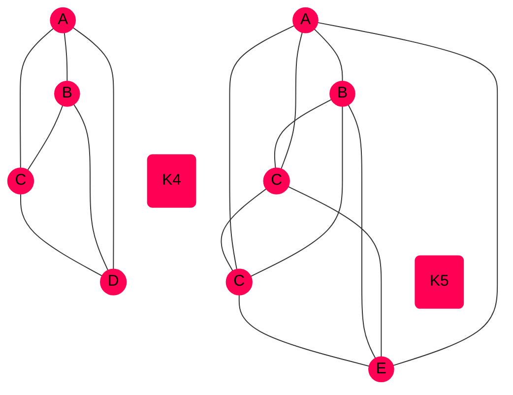

Como se puede ver en diagrama $K_4$ es plano, pero $K_5$ no.


Sea $G$ un grafo simple y conexo.

$G$ es plano $\iff$ no contiene ningún subgrafo isomorfo por divisiones
elementales de $K_5$ o $K_{3, 3}$


Una subdivisión elemental es tomar un eje y añadir un vértice en el medio, sin
cambiar nada más (en el ejemplo se añade $C$ en el medio de $A$ y $B$):

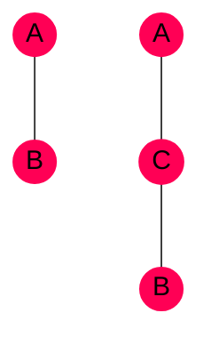


Sea $G = (V, E)$ un grafo plano, simple y conexo. Por tanto se cumple que
$$ |C| + |V| = |E| + 2 $$
donde $|C|$ es el número de caras o regiones cerradas del grafo.



Sea $G = (V, E)$ un grafo plano, simple y conexo.

- $ |V| \ge 3 \implies |E| \le 3 |V| - 6 $.
- $G$ tiene un vértice de grado $\ge 5$.
- Si $|V| \ge 3$ y no tiene circuitos de longitud 3 $\implies |E| \le 2 |V| 4$.



# Grafos ponderados


Sea $G = (V, E)$ un grafo.

Se dice que $G$ es un **grafo ponderado** si existe una aplicación

$$
\begin{align*}
    w: E &\longrightarrow \R^{+} \cup \Set{0} \newline
    e &\longmapsto w(e)
\end{align*}
$$

$w(e)$ es el peso del eje.


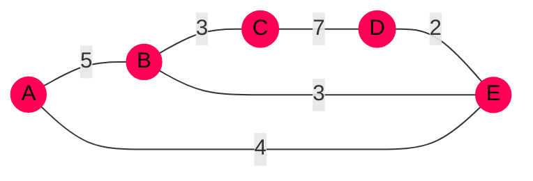
<!--
    A((A))
    A -- 5 --- B((B))
    B -- 5 --- C((C))
    C -- 2 --- D((D))
    D -- 5 --- E((E))
    E -- 1 --- F((F))
    F -- 3 --- G((G))

    G -- 5 --- A
    G -- 3 --- E
    B -- 3 --- E
    B -- 4 --- D
    B -- 5 --- G
-->

- **Problema del viajante**: encontrar un ciclo hamiltoniano de peso mínimo.
- **Algoritmo DIJKSTRA**: calcular el camino más corto entre dos vértices.


# Árboles


Un árbol es un grafo conexo y sin circuitos.


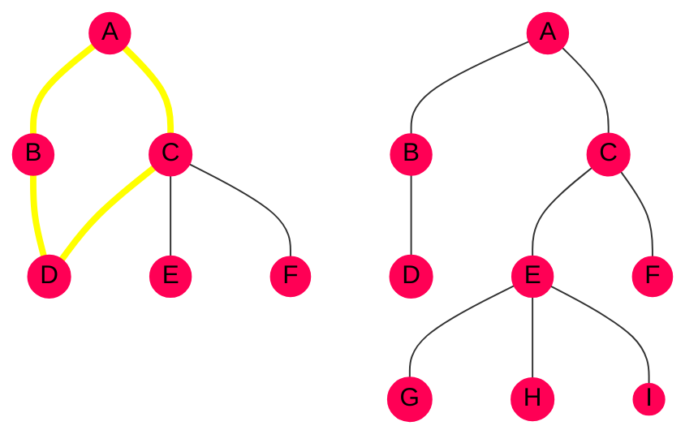

En este ejemplo, solo el grafo de la derecha es un árbol, porque el de la
izquierda tiene un ciclo (marcado en amarillo).


Son equivalentes:

- $G$ es un árbol
- Cada par de vértices está conectado por un **único camino simple**.
- $G$ es conexo y cada eje es un puente.
- $G$ es conexo y $|V| = |E| + 1|$.
- $G$ no tiene ciclos y $|V| = |E| + 1|$.


## Árbol generador


Sea $G$ un grafo conexo. Un **árbol generador** de $G$ es un árbol $T$ subgrafo de
$G$ que contiene todos los vértices de $G$.



Un **árbol generador de peso minimal** es un árbol generador cuyo peso es
mínimo, el menor entre todos los generadores posibles del grafo.


### Algoritmo de Prim (1957)


1. Se elige un vértice cualquiera del grafo $G$: $T_0 = \Set{v}$
2. Se considera el conjunto de los ejes que inciden en todos los vértices del
   árbol seleccionado. De todos ellos, se elige el de peso mínimo que no forme
   un ciclo, siguiendo una estrategia voraz.
3. Se repite el paso 2 hasta que no se puedan añadir más ejes sin formar
   ciclos.



### Algoritmo de Kruskal (1956)


1. Se pone un contador a 1 y se elige el eje de peso mínimo, $e_1$.
2. $1 \le i |V| - 2$, con ejes $e_1, e_2, \ldots e_i$.
   Se toma el eje $e_{i + 1} de peso mínimo entre todos los ejes restantes con
   la condición de que no se formen ciclos.
3. Repetir el paso 2 hasta que no se puedan añadir más ejes.


