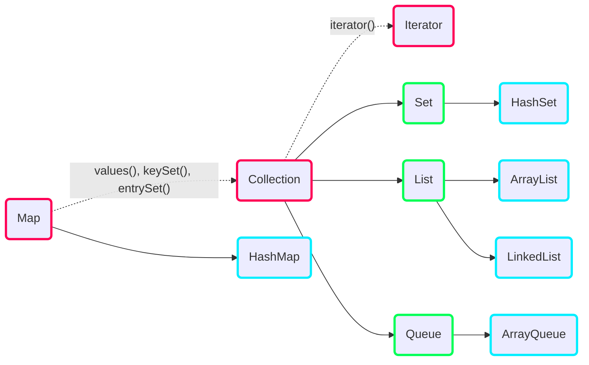


Todas estas clases usan tipos de datos genéricos con plantillas.

```java {linenos=false}
ArrayList array = new ArrayList<>();
```

En esta caso no se ha determinado un tipo de dato genérico, se trata de un _raw
type_, que a efectos prácticos es un `Object`. Esta sintaxis está desaconsejada
y siempre se debe dar un tipo de dato:


```java {linenos=false}
ArrayList<Integer> array = new ArrayList<>();
```

Recuerde que no se pueden usar tipos primitivos, sino que es necesario usar las
clases Wrapper.




<!-- ```mermaid
mindmap
  root(Conjuntos de datos en Java)
    Array
    Collection
      Set
        HashSet
      List
        ArrayList
        LinkedList
      Queue
        ArrayQueue
    Map
      HashMap
    Iterator
``` -->

|              | Completos          | Ordenado           | Acceso aleatorio   | Clave-Valor        | Elementos Duplicados | Null               |
|:-------------|:------------------:|:------------------:|:------------------:|:------------------:|:--------------------:|:------------------:|
| `ArrayList`  | :white_check_mark: | :white_check_mark: | :white_check_mark: | :x:                | :white_check_mark:   | :white_check_mark: |
| `LinkedList` | :white_check_mark: | :white_check_mark: | :x:                | :x:                | :white_check_mark:   | :white_check_mark: |
| `HashSet`    | :white_check_mark: | :x:                | :x:                | :x:                | :x:                | :white_check_mark: |
| `TreeSet`    | ?                  | :white_check_mark: | :x:                | :x:                | :x:                | :x:                |
| `HashMap`    | :white_check_mark: | :x:                | :white_check_mark: | :white_check_mark: | :x:                | :x:                |
| `TreeMap`    | ?                  | :white_check_mark: | :white_check_mark: | :white_check_mark: | :x:                | :x:                |

|              | Complejidad | Capacidad | Memoria vacío | Memoria con 10K | Ajustado? |
|:-------------|:-----------:|----------:|--------------:|----------------:|----------:|
| `ArrayList`  | $O(n)$      | 10        | 88            | 40K             | No        |
| `LinkedList` | $O(n)$      | 1         | 48            | 240K            | Sí        |
| `HashSet`    | $O(1)$      | 16        | 144           | 360K            | No        |
| `HashMap`    | $O(1)$      | 16        | 128           | 360K            | No        |

- **HashSet**: datos sin repetir y desordenados.
- **ArrayList**: datos ordenados por orden de llegada.
- **HashMap**: datos con un identificador unívoco y desordenados.


Recuerde que para muchas de las operaciones es necesario implementar `equals`
y `hashCode`.


# Array

- Mismo concepto que en el lenguaje C
- Conjunto de elementos del mismo tipo en memoria contigua
- Es **el único de este artículo que puede almacenar tipos de datos primitivos**
  directamente
- Se accede a través de un **índice** en el rango $[0, \text{x.length} - 1]$
- También **es un objeto**: uso de `new`, se almacena en el heap, atributo (solo
  lectura) `length`.

```java {linenos=false}
int[] x = new int[8];
```

Problemas:

- El tamaño es fijo
- No se pueden borrar elementos

# Collection

`java.util.Collection<E>` es una interfaz, por lo que no se puede utilizar directamente,
sino que se deben usar sus subclases.

- Conjunto de datos del mismo tipo sobre el que se definen las operaciones de
  **inserción**, **borrado** y **actualización**.
- **No están necesariamente ordenados**: no hay índices, pero se pueden recorrer

```java {linenos=false}
boolean add(E e);         // True si la colección cambió
boolean remove(Object o); // True si la colección cambió

int         size();
boolean     isEmpty();
boolean     contains(E e);
Iterator<E> iterator();
void        clear();

boolean containsAll(Collection<?> c);
boolean addAll(Collection<? extends E> c);
boolean removeAll(Collection<?> c);
boolean retainAll(Collection<?> c);
```

## List

`java.util.List<E>` es una interfaz subclase `Collection<E>`.

- **Colección ordenada por un índice** (`IndexOutOfBoundsException`)
- Puede tener **elementos duplicados**

```java {linenos=false}
E    get(int i);
void set(int i, E e);
E    remove(int i);

int     indexOf(Object o);
List<E> subList(int from, int to);

ListIterator<E> listIterator();
```


Es un tipo de lista que soporta la **redimensión automática**.

- **Implementa todas las operaciones de `List`** y **permite `null`s**.
- Cuando se necesita más espacio, se gestiona automáticamente.
- Si se necesita redimensionar frecuentemente, el rendimiento se verá afectado.
- Los datos se representan internamente con un array  **Acceso aleatorio**

Nótese que `size != capacity`:

- `size`: número de elementos almacenados en la colección
- `capacity`: número de elementos que puede contener la colección hasta
  necesitar una redimensión.

Inicialmente tiene una capacidad para 10 elementos (se pueden cambiar en el
constructor) y cuando se alcance el límite, se copian los datos a un nuevo array
con 10 elementos más.



Lista doblemente enlazada:

- **Implementa todas las operaciones de `List`** y **permite `null`s**.
- Los datos se representan con nodos enlazados  **Acceso secuencial**.
- El tamaño de la lista es exacto, no hay elementos de más para tener en cuenta
  si la lista crece.

También implementa la interfaz de `Deque` (_Double Ended QUEue_), por lo que se
puede usar como cola.


## Set

`java.util.Set<E>` es una interfaz subclase de `Collection<E>`.

- Colección de **datos que no se pueden repetir**  **Uso del método
  `equals`** para verificar la igualdad.


Mediante aliasing podemos romper la condición principal de `Set`:

```java
Mutable m = new Mutable(10);
Set<Mutable> set = new HashSet<>();
set.add(m);
set.add(new Mutable(5));

// Problemas: ahora en el Set hay dos elementos iguales
m.set(5);
```

Por eso se recomienda usar clases inmutables.



- Es un Wrapper de [`HashMap<E, ...>`], por lo que tiene los mismos requisitos.
- Los datos se almacenan acorde a su `hashCode`
- Acceso a cualquier elemento en $O(1)$
- Se permiten `null`, pero uno como mucho

[`HashMap<E, ...>`]: #block-hashmapkv


# Map

`java.util.Map<K, V>` es un conjunto de datos formado por las tuplas
$(\text{clave}, \text{valor})$, donde $\text{clave}$ (`K`) es el valor que identifica
unívocamente cada valor (`V`).

- **Las claves no pueden estar repetidas**.
- Pueden haber varias valores repetidos, siempre y cuando sus claves sean
  distintas.
- Las tuplas **no tienen porqué estar ordenadas**.


```java {linenos=false}
V get(Object key);     // Valor guardado o null
V put(K key, V value); // Valor anterior o null
  -> V putIfAbsent(K key, V value);
V remove(Object key);  // Valor guardado o null

int     size();
boolean isEmpty();
void    clear();

boolean containsValue(Object value);
boolean containsKey(Object key);

// Para iterar
Collection<V>        values();
Set<K>               keySet();
Set<Map.Entry<K, V>> entrySet();
  -> V getValue(); V setValue();
  -> K getKey();   K setKey();
```


- **Implementa todas las operaciones de `Map`**
- **Permite `null`s**, tanto en la clave como en el valor. Solo puede haber una
  entrada con la clave a `null` (`null == null` es `true`).
- Vuelve a aparecer el concepto de **capacidad** y **tamaño**, además del
  **factor de carga**: $$ f_c = \frac{\text{tamaño}}{\text{capacidad}} $$

Proceso de inserción:

1. Calcular el hash de la clave con `hashCode`
2. Acceder a la tabla hash interna con ese hash de índice
3. Si la posición está ocupada, se comprueba con `equals`
     - Si son iguales, se sustituye el elemento
     - Si no son iguales, se ha producido una colisión hash
4. Si no está ocupada, se procede como siempre

Por eso **es necesario implementar los métodos `hashCode` y `equals`**
correctamente.


# Iterator

`java.util.Iterator<E>` es una interfaz que permite iterar / recorrer sobre los elementos
de una colección.

```java {linenos=false}
boolean hasNext();
E       next();
void    remove();  // Elemento apuntado por next()
                   // Si no se llamó a next(): IllegalStateException
```

La función `next()` solo se puede usar una vez por elemento, dado que a la
siguiente llamada, devolverá el siguiente valor.

Funciona de la siguiente forma: hay dos punteros (o índices) que llevan cuenta
de dónde estamos iterando: `cursor` es el elemento que se devolverá al llamar
a `next()`, y `lastRet` es el último elemento que se devolvió (inicialmente es
-1). `hasNext()` comprueba si existe un elemento en `cursor` y `remove()`
elimina el elemento `lastRet` de la colección.

Si una clase **implementa la interfaz `Iterable`**, que requiere un método
`iterator()` que devuelve un iterador, o es un array; se puede usar la sintaxis
del for mejorado:

```java {linenos=false}
for (E item : iterable) {
    // ...
}
```

Es equivalente a lo siguiente:

```java {linenos=false}
for (Iterator<E> iter = iterable.iterator(); iter.hasNext(); ) {
    E item = iter.next();
    // ...
}

// O en el caso de arrays:
for (int i = 0; i < array.length; i++) {
    E item = array[i];
    // ...
}
```

`ConcurrentModificationException` es una excepción que _es posible_ que se lance
cuando una colección **se modifica y se itera sobre ella a la vez**, con
**operaciones para añadir y eliminar elementos**. Generalmente no es buena idea
que un thread modifique una colección mientras otra itera sobre ella, pero esto
también se da en programas de un solo thread. En [esta respuesta de
StackOverflow] se explica bastante bien el porqué.

La forma correcta de trabajar es usando los métodos del iterador, es decir,
`remove()`: no se puede añadir ni modificar elementos. Como es necesario acceder
al iterador, no se puede usar la sintaxis del bucle for mejorado. La excepción
lanzada solo se usa para detectar bugs, así que es posible que no se lance
en algunos casos.

## ListIterator

`java.util.ListIterator<E>` es un tipo de iterador que permite iterar sobre
listas **en cualquier dirección** y **modificarlas**.

```java {linenos=false}
boolean hasPrevious();
E       previous();

int nextIndex();
int previousIndex();

void set(E e);
void add(E e);
```

[esta respuesta de StackOverflow]: https://stackoverflow.com/a/66187801
