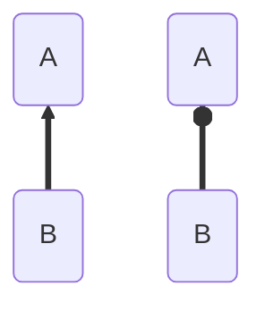
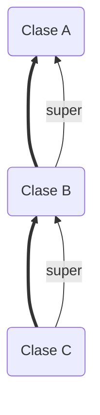
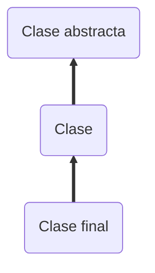
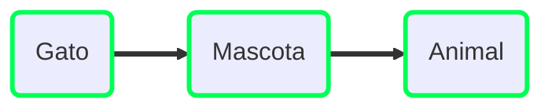
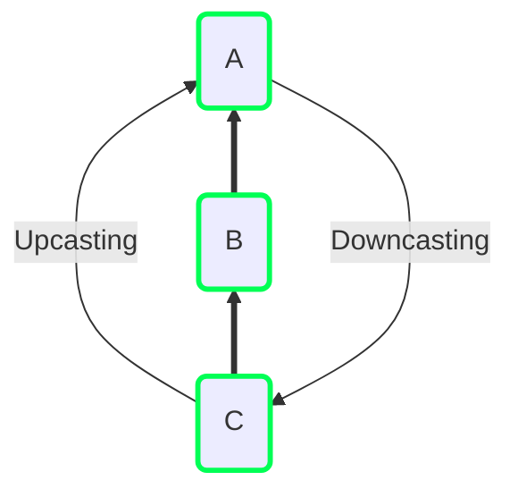

# Herencia

Mecanismo en el que **la clase derivada reutiliza los atributos y métodos de la
clase padre**. Es el mecanismo más básico de reutilización de código, que es un
tema muy importante en programación.

- La clase derivada copia implícitamente (el programador no escribe nada) los
  atributos y métodos de la clase base.
- El objetivo es que **la clase derivada no tenga que programas los mismos
  códigos otra vez**, ya están implementados automáticamente.

Este mecanismo sale de la naturaleza y **ayuda a clasificar y a montar
jerarquías**. La clase derivada se considera una extensión de la clase base, un
tipo o una especialización.


-% Beneficios :%
- Se puede implementar nuevos métodos que expandan la funcionalidad de la clase
  base o sobreescribir los existentes para cambiar su comportamiento.
- **Simplifica el código** a la hora de implementar el mismo método en varios
  sitios.
- **Facilita el mantenimiento**: si se corrige un error en la clase padre, todas
  las clases derivadas reciben el cambio.
- **Facilita la extensibilidad**: nuevas clases se construyen a partir de otras,
  reutilizando el código ya existente.

-% Desventajas :%
- **Niveles de jerarquía profundos**: el código se hace mucho más difícil de
  entender, las relaciones entre las clases y qué métodos tienen cada una.
- Cambios en la clase padre hacen inconsistentes a las clases hijas.
- Modificador de acceso diferente para que las clases hijas puedan
  acceder  **Violación de la encapsulación**.


## Tipos de herencia

```mermaid
flowchart BT
    1[Herencia Simple]
    A1(Clase A)
    B1(Clase B)

    2[Herencia de Varios Niveles]
    A2(Clase A)
    B2(Clase B)
    C2(Clase C)

    3[Herencia Jerárquica]
    A3(Clase A)
    B3(Clase B)
    C3(Clase C)

    4[Herencia Múltiple]
    A4(Clase A)
    B4(Clase B)
    C4(Clase C)

    B1:::a == es un/a ==> A1:::a
    A1 ~~~ 1:::t

    C2:::a ==> B2:::a
    B2:::a ==> A2:::a
    A2 ~~~ 2:::t

    B3:::a ==> A3:::a
    C3:::a ==> A3:::a
    A3 ~~~ 3:::t

    C4:::a ==> A4:::a
    C4:::a ==> B4:::a
    A4 ~~~ 4:::t
    B4 ~~~ 4

    classDef t stroke: none, fill: #222
    classDef a stroke: #0f5, stroke-width: 3px
```



En Java **no hay herencia múltiple**.

# Composición

Mecanismo donde una clase contiene objetos de otras clases a las que **delega**
ciertas operaciones.


-% Beneficios :%
- Reparte responsabilidades entre diferentes objetos
- **Facilita el mantenimiento de los programas**, incluso más que en la
  herencia, dado que un cambio solo afecta al objeto actual.
- Facilita la extensibilidad

-% Desventajas :%
- Genera más código y puede llegar a ser bastante complejo para soportar la
  misma funcionalidad que en herencia.
- Se necesita más tiempo de desarrollo.


# Composición vs Herencia

Hay una cierta diferencia semántica entre ambas opciones, y puede depender del
contexto de cada programa:



- Composición (derecha): **`A` tiene los atributos de `B`**
- Herencia (izquierda): **`B` es un `A`** (un Empleado es una Persona)


- Si las clases no están relacionadas de forma lógica
- Si una clase base tiene una sola clase derivada
- Si las clases derivadas heredan mucho código que no necesitan
- Si es necesario sobreescribir muchos métodos de la clase padre
- Existe la posibilidad de que la clase base cambie


| Caso                  | Herencia                                               | Composición                                      |
|-----------------------|--------------------------------------------------------|--------------------------------------------------|
| Inicio del desarrollo | Más rápido                                             | Más lento                                        |
| Diseño del software   | Más sencillo                                           | Más complejo                                     |
| Efectos no deseados   | Con frecuencia <br> (jerarquías profundas)             | Reducidos <br> (métodos delegados)               |
| Aceptación a cambios  | Complicado con jerarquías profundas y `@Overrides`     | Sencillo dado que solo afecta a clases delegadas |
| Validación            | Complicado con jerarquías profundas y `@Overrides`     | Sencillo dado que solo afecta a clases delegadas |
| Extensibilidad        | Sencillo aunque problemático para jerarquías profundas | Sencillo                                         |

# Herencia en Java

```java
public class A {
    // ...
}

public class B extends A {
    // ...
}
```

En Java no existe la herencia múltiple. Solo se heredan los atributos y métodos
que son visibles desde la clase derivada.

| Tipo de acceso       | ¿Hereda?                                         |
|----------------------|--------------------------------------------------|
| `private`            |          |
| :white_large_square: | Solo si ambas clases están en el mismo paquete   |
| `protected`          |       |
| `public`             |       |


Realmente los métodos y atributos **se heredan todos**, sean del tipo que sean
y tengan el modificador de acceso que sea. Porque de lo contrario, ¿cómo se
pueden ejecutar los métodos públicos que llaman a los métodos privados?

Lo único es que **su visibilidad está restringida**.

Sin embargo, dado que el programador no puede utilizarlos, vamos a considerar
como si no se heredasen.


## Constructores

Los **constructores no se heredan** (ni con `public`), son propios de la clase.

Entonces, ¿cómo se asigna memoria a los atributos de la superclase? Se pueden
distinguir varios casos:

- **El constructor padre no tiene argumentos**.  
  Automáticamente, desde el constructor de la clase derivada, se llama al
  constructor de la clase padre.
- **El constructor padre tiene atributos**.  
  La primera línea del constructor de la clase derivada deber ser
  `super(argumentos)` (o bien `this(argumentos)`, llamando a otro constructor).
  Si no se hace esto, se dará un error de compilación.

`super` también permite acceder a los métodos o atributos visibles de la clase
superior. Nótese que `super` solo hace referencia a la clase _inmediatamente_
superior:



## Sobreescritura de métodos

La sobreescritura de métodos es un mecanismo que permite al programador de la
clase derivada **cambiar la implementación de un método de la clase base**.

Esto se hace cuando el método de la clase base no es válido, ya hemos visto un
par de ejemplos en [métodos especiales] (`toString`, `equals`, `hashCode`...).

El nombre del método, el tipo de datos devuelto y sus parámetros deben ser
iguales al original; y el tipo de acceso puede ser igual o superior (menos
restrictivo).

```java
@Override    // Etiqueta para indicar que se sobreescribe
public String toString() {
    return "HOLA";
}
```

Como se comentó anteriormente, una forma de reutilizar el código, es utilizando
`super`.

```java
@Override
public int sueldo() {
    return (int) (1.2 * super.sueldo());
}
```

## Modificador `final`

La palabra clave `final` se utiliza para indicar que **no puede cambiar**.

- Aplicado a clases, se prohíbe crear una subclase de la misma.
- Aplicado a métodos, se prohíbe que una subclase lo sobreescriba.
- Aplicado a variables, se prohíbe que el su valor cambie. En caso de
  referencias a objetos, se prohíbe que se asigne a otro objeto diferente.

Nótese que **para crear constantes, se necesitan los modificadores `static
final`** en los atributos. Sin embargo, no tiene mucho sentido combinar añadir
ambos a un método: **los métodos estáticos no se pueden sobreescribir**.

## Clases abstractas

Clases especiales declaradas con `abstract` que no pueden tener instancias, es
decir, **no se pueden crear objetos con `new`**.

**Pueden tener métodos, atributos y constructores**. Estos se usan a través de
`super`, por lo que **solo son útiles cuando forman parte de una jerarquía**,
habitualmente los niveles altos. Entonces, tenemos que:



Se pueden usar para modelar diferentes tipos de jerarquías:

- Si es **total**, tiene sentido crear una clase abstracta, dado que no puede
  haber instancias suyas directamente.
- Si es **parcial**, se deben usar clases normales.

### Métodos abstractos

```java
public abstract class Figura {
    public abstract float perimetro();
    public abstract float area();
}
```

Otra utilidad de las clases abstractas es que pueden tener métodos de los que se
desconoce su implementación, **métodos abstractos**.

**Todas las clases derivadas no abstractas, deben sobreescribir este método para
darle una implementación**. Este mecanismo nos permite especificar qué métodos
debería tener cada clase.


- Debería tener el máximo de métodos implementados posibles.  
  Mayor reutilización del código y las clases derivadas tienen que implementar
  menos cosas.
- Debería ocupar los niveles más altos de la jerarquía de clases.
- Su clase base debería ser también abstracta.
- Debería tener constructores.


# Interfaces


Permite establecer de forma muy precisa los requisitos que deben cumplir las
clases de un programa. Esto es muy útil para el diseño de programas.

- Definen los tipos de datos mínimos
- **Definen exactamente los métodos**: nombre, parámetros y valor de retorno.
- Cada clase que _implemente_ una interfaz puede tener más métodos, pero como
  mínimo debe tener los de la interfaz.

Entonces, una interfaz se puede ver como un acuerdo/estándar/plantilla entre
programadores.


<!-- TODO: diagrama 14-11-2023 -->

Un cambio en la clase interna no afectará tanto a otras clases como un cambio en
la propia interfaz  **Las interfaces deben ser invariantes**.

## Interfaces en Java

```java
public interface Interfaz {
    void metodo();
}

public class Clase implements Interfaz, ... {
    // ...

    @Override
    public void metodo() {
        System.out.println("Hola");
    }
}
```

Contienen **métodos abstractos públicos**. No tiene sentido declararlos como
`final` o `protected` dado que las clases que implementen la interfaz deben
sobreescribir los métodos (salvo clases abstractas, que pueden tener métodos
abstractos).

- No se pueden instanciar con `new`
- No tienen atributos ni constructores
- Se pueden definir métodos estáticos (pero no se heredan)
- Se pueden definir métodos por defecto con `default`
- Se pueden definir métodos privados, a modo de ayuda a `default`
- Se pueden definir constantes con `static final`

En caso de que no se especifiquen modificadores, por defecto serán abstractos
para los métodos y `static final` para los atributos, todos ellos **públicos**.

<!-- TODO: diagrama clases vs interfaces -->

Las interfaces tienen herencia múltiple con otras interfaces (que heredarán todo
menos los métodos estáticos), pero no pueden implementar otras interfaces.

- Si hay varios métodos estáticos en común, no pasa nada, porque estos no se
  heredan.
- Si se implementan dos interfaces con el mismo método, una sola implementación
  servirá para ambas interfaces.
- Si hay varios métodos por defecto con el mismo nombre, el programador debe
  escoger cual usa con `<NombreInterfaz>.super.<metodo>()`.


Cuando una clase implementa una interfaz, todo funciona <<como si>> fuese
herencia y la interfaz fuese una clase padre.

Dado que una clase puede implementar más de una interfaz, se puede decir que
existe la **herencia múltiple en Java**.

También se pueden aplicar conceptos de herencia a las interfaces.


| Clases Abstractas                                             | Interfaces                                            |
|---------------------------------------------------------------|-------------------------------------------------------|
| Se definen cuando las clases derivadas tienen métodos comunes | Se definen cuando existen diferentes implementaciones |
| No hay herencia múltiple                                      | Hay herencia múltiple entre interfaces                |
| Hay herencia jerárquica entre clases                          | Implementar interfaces crea una jerarquía             |
| Pueden tener métodos abstractos y concretos                   | Solo métodos abstractos y métodos por defecto         |
| Los métodos pueden ser `public` o `protected`                 | Solo `public` o `private`                             |
| Tienen constructores                                          | No tiene constructores                                |
| Pueden tener cualquier tipo de atributo                       | Solo `static final`                                   |

## Métodos por defecto

El problema de las interfaces es la adaptación de las clases derivadas cuando se
modificar la interfaz. Los métodos por defecto intentar resolver eso.

- Es un método implementado en una interfaz
- Las clases que implementan la interfaz lo heredan
- Son implícitamente públicos
- Las clases <<derivadas>> lo pueden sobreescribir

No genera errores de compilación si no se implementa en la clase: se usa la
implementación por defecto.


En la implementación por defecto, **no se tiene acceso a los atributos
locales**, solo a los métodos definidos en la interfaz.

Por este limitación, hay que valorar si merece la pena hacer métodos por
defecto.


Para llamar a un método por defecto cuando se sobreescribe y reutilizar su
código, se usar la siguiente sintaxis:

```java {linenos=false}
<NombreInterfaz>.super.<método>(...);
```

# Resumen de herencia

Conviene recordar que:

| Tipo de acceso       | ¿Hereda?                                         |
|----------------------|--------------------------------------------------|
| `private`            |          |
| :white_large_square: | Solo si ambas clases están en el mismo paquete   |
| `protected`          |       |
| `public`             |       |

La siguiente tabla muestra si los diferentes tipos de métodos y atributos
(suponiendo que se han declarado como `public`) se heredan de clases normales,
abstractas o interfaces. Habrá dos :white_check_mark: en caso de que se pueda
sobreescribir.

| ¿Se heredan de ...? | Clase                                 | Clase abstracta                                                                     | Interfaz                              |
|:--------------------|:-------------------------------------:|:-----------------------------------------------------------------------------------:|:-------------------------------------:|
| Constructor         | :x:                                   | :x:                                                                                 | No tiene                              |
| Método normal       | :white_check_mark: :white_check_mark: | :white_check_mark: :white_check_mark:                                               | No tiene                              |
| Método `static`     | :white_check_mark:                    | :white_check_mark:                                                                  | :x:                                   |
| Método `final`      | :x:                                   | No tiene                                                                            | No tiene                              |
| Método `abstract`   | No tiene                              | :white_check_mark: :white_check_mark: (sobreescritura obligatoria en algunos casos) | :white_check_mark:                    |
| Método `default`    | No tiene                              | No tiene                                                                            | :white_check_mark: :white_check_mark: |
| Atributo normal     | :white_check_mark:                    | :white_check_mark:                                                                  | No tiene                              |
| Atributo `static`   | :white_check_mark:                    | :white_check_mark:                                                                  | Solo si también es `final`            |
| Atributo `final`    | :white_check_mark:                    | :white_check_mark:                                                                  | Solo si también es `static`           |

En el caso de las interfaces, recuerde que solo hay herencia entre interfaces.
Porque en cuanto a la implementación de interfaces:

| ¿Se implementan?        | Interfaz                              |
|:------------------------|:-------------------------------------:|
| Método `abstract`       | :white_check_mark: :white_check_mark: |
| Método `default`        | :white_check_mark: :white_check_mark: |
| Método `private`        | :x:                                   |
| Método `static final`   | :x:                                   |
| Atributo `static final` | :white_check_mark:                    |

# Polimorfismo

En herencia, el polimorfismo es el mecanismo mediante es el que **un objeto se
puede comportar de múltiples formas** en función del contexto.

- Un objeto se puede comportar como **una instancia de la clase con la que se
  hizo `new`**.
- También se puede comportar como **instancias de alguna de sus superclases**.



```java {linenos=false}
   Animal bigotes = new Gato();
// ~~~~~~           ~~~~~~~~~~
// comportamiento    instancia
```

Ahora mismo, el `Gato` _bigotes_ se comporta como `Animal`, **solo tiene
accesibles los métodos de la clase `Animal`**, no todos los de `Gato`.




- **Upcasting**: se convierte una instancia de una clase a alguna de sus
  superclases.
- **Downcasting**: se convierte una instancia de una clase a alguna de sus
  subclases. Esta es una operación `unsafe`, dado que en caso de que no se pueda
  realizar la conversión, se lanza `ClassCastException`.


```java {linenos=false}
// Upcasting
B b = new C();

// Downcasting para recuperar la instancia
C c = (C) b;
```

En el caso de _Upcasting_, el objeto apuntado por `b` es realmente una instancia
de `C`, dado que se usó su constructor. Se ha convertido a un objeto de tipo
`B`, por lo que solo se tiene acceso a sus métodos. Sin embargo, en memoria no
se ha cambiado nada, **se sigue teniendo una instancia de `C`**, por lo que
podemos recuperarla haciendo _Downcasting_.

```java {linenos=false}
// Downcasting
B b = new B();
C c = (B) c;
```

En este caso, en memoria hay una instancia de `B`, por lo que al intentar
convertirlo a `C` dará un error, naturalmente. De lo contrario, ¿qué sucederá
cuando se intente llamar a un método propio de `C`, si dicho método no existe?

Debido a esto, existe un mecanismo para comprobar de qué tipo es cada clase
realmente: `getClass().getName()` devuelve un String con el nombre completo de
la clase, incluyendo el paquete (`getClass().getSimpleName()` devuelve solo el
nombre). Luego se puede hacer una comparación de Strings y listo.

En otros casos, se quiere comprobar si es una subclase de otra:

```java {linenos=false}
B b = new B();

b instanceof B // true
b instanceof A // true
c instanceof C // false
```

[métodos especiales]: 

