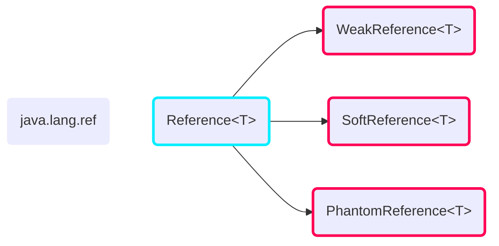

# Referencias y Aliasing


Una referencia es un puntero a un objeto.  
En Java, es un nombre simbólico que se le da a un objeto.


Por ejemplo:

```java {linenos=false}
Persona pepe = new Persona("Pepe Fernández", 27);
```

Aquí `pepe` es una referencia a un objeto de tipo `Persona`.

Esto tiene importantes implicaciones:

```java {linenos=false}
objA = objB;
```

Al asignar una referencia a otra, **no se crea una copia del objeto, sino que se
copia la dirección de memoria**. El objeto A es ahora inaccesible y será
liberado por el recolector de basura, mientras que el objeto B tiene dos
referencias a él. Se ha hecho una **copia por referencia**.


Se da **Aliasing** cuando varias referencias apuntan al mismo mismo objeto. Es
decir, los datos son accesibles desde dos nombres simbólicos.



**El uso de aliasing evita la encapsulación**: con este mecanismo, se puede
modificar los valores privados desde fuera de la clase. Imaginemos la clase
`Mutable`, que contiene un entero con sus correspondientes getters y setters:

```java
public class Mutable {
    private int valor;

    public Mutable(int valor) {
        this.valor = valor;
    }

    public void setValor(int valor) {
        this.valor = valor;
    }

    public int getValor() {
       return this.valor;
    }
}
```

Y la clase `Contenedor` quiere mantener un objeto de esta clase, pero que sea
constante (se declara como `final`):

```java
public class Contenedor {
    private final Mutable m;

    public Aliasing(Mutable m) {
        this.m = m;
    }

    public Mutable getM() {
      return m;
    }
}
```

El problema del aliasing aparece en el siguiente código:

```java
public class Main {
    public static void main(String[] args) {
        Mutable m = new Mutable(10);
        Contenedor c = new Contenedor(m);

        // Imprime 10, según lo esperado
        System.out.println(c.getM().getValor());

        // Ahora se modifica m
        m.setValor(5);

        // Imprime 5
        System.out.println(c.getM().getValor());
    }
}
```

**Se ha escrito un valor en un valor privado de una clase, que no deseaba que sus
valores cambiasen**.

Nótese que en este ejemplo, el atributo `m` de `Contenedor` es una referencia
a un objeto de tipo `Mutable`, por tanto, al añadir el `final` a una referencia
el compilador se asegura de que **no cambie dicha referencia, no el contenido
del objeto**.

Por este motivo, **se prefieren las clases inmutables** como `String` o los
Wrappers (`Integer`, `Character`, `Boolean`...): para cambiar el contenido de
una clase inmutable, es necesario hacer una nueva reserva de memoria, lo que
implica cambiar la dirección de memoria que contiene la referencia (cosa que
`final` habría impedido).


Los programas son más difíciles de mantener dado que la encapsulación no existe
y se tiene poco control sobre los datos. Esto sucede en todos los lenguajes de
Programación Orientados a Objetos. Aun así, tienen la ventaja que los datos son
coherentes en todas partes.

Sin embargo, **si se elimina el aliasing, el rendimiento es mucho menor** por tener
que hacer copias continuamente de los objetos.

Entonces, lo que se hace es utilizar clases inmutables y se clonan determinados
objetos para evitar los problemas de aliasing. Existen dos tipos de clones:

- **Shallow copy** (copia superficial): solo crea un nuevo objeto, pero los
  valores de los atributos son los mismos, por lo que es muy probable que se de
  aliasing.
- **Deep copy** (copia profunda): hace un clon de todo. Muy lento, dado que los
  atributos de tipo clase, tienen  a su vez otros atributos, y así
  sucesivamente.

Considere el siguiente código para ilustrar la diferencia más claramente:

```java
Mutable m = new Mutable(10);
Contenedor c1 = new Contenedor(m);
m.setValor(20); // Aliasing: c1.valor = 20

// Shallow Copy: equivalente a new Contenedor(m)
// Se crea un nuevo objeto, pero el atributo interno
// m sigue apuntando al mismo objeto.
Contenedor c2 = c1.shallowCopy();
m.setValor(30);
// Sigue habiendo aliasing: c2.valor = 30

// Deep Copy: se duplica también el objeto mutable
Contenedor c3 = c1.deepCopy();
m.setValor(40);
// m y c3.m ya no están relacionados: c3.valor = 30
```

En Java, se puede sobreescribir la función `clone()` (al igual que `toString`).
Es decisión del programador realizar un tipo de copia u otro. Tenga en cuenta
que `super.clone()` solo devuelve una _shallow copy_ del objeto, por lo que si
se quiere hacer una _deep copy_, es necesario llamar a `clone()` de cada
atributo mutable.


```java
// La clase Contenedor debe implementar Cloneable
@Override
public Object clone() {
    Contenedor c;
    try {
        // Usar super.clone() si es posible
        c = (Contenendor) super.clone();
    } catch (CloneNotSupportedException e) {
        // De lo contrario, se llama al constructor
        // para crear un nuevo objeto
        c = new Contenedor(this.m);
    }

    return c;
}
```

No sería completamente necesario hacer una llamada al constructor, dado que si
la clase implementa `Cloneable`, en principio, no debería fallar nunca.



```java
// La clase Contenedor debe implementar Cloneable
@Override
public Object clone() {
    Contenedor c;
    try {
        c = (Contenedor) super.clone();
    } catch (CloneNotSupportedException e) {
        c = new Contenedor(this.m);
    }

    // Clonar también el atributo que mutable
    // NOTA: m no puede ser final
    c.m = (Mutable) this.m.clone()
    return c;
}
```

Nótese que `Mutable` también debe implementar `Cloneable` y sobreescribir su
método `clone`.


# Tipos de datos primitivos

Son aquellos tipos de datos que tienen una correspondencia directa con el
hardware:

- Tienen un tamaño fijo.
- En su declaración se reserva memoria para la variable automáticamente.
- **No tienen métodos**

## Wrappers

**Los tipos de datos primitivos no son clases**: no encapsulan, no hay métodos,
etc. Para hacer consistente el esquema, en Java existen unas clases _Wrapper_:

| Tipo de datos primitivo | Clase _Wrapper_ correspondiente |
|:-----------------------:|:-------------------------------:|
| `boolean`               | `Boolean`                       |
| `char`                  | `Character`                     |
| `byte`                  | `Byte`                          |
| `short`                 | `Short`                         |
| `int`                   | `Integer`                       |
| `long`                  | `Long`                          |
| `float`                 | `Float`                         |
| `double`                | `Double`                        |

Estos son clases que encapsulan el valor del tipo de dato y proporcionan métodos
que facilitan su manejo, como la conversión a otros tipos / desde otros tipos.
Nótese que **son clases inmutables**, el valor interno se declaró como `final`.

Dado que utilizar métodos sobre estas clases continuamente para operaciones
básicas (como sumar dos `int`), Java permite tratar la clase _Wrapper_ como un
tipo de dato primitivo y viceversa:

- **Autoboxing**: `Primitivo ---> Wrapper` (meter en la caja automáticamente)  
  Método que require un Wrapper como parámetro recibe un Primitivo.  
  Objeto tipo Wrapper se le asigna un valor Primitivo.  

  ```java {linenos=false}
  Integer a = 10;
  Integer b = 37;
  ```

- **Unboxing**: `Wrapper ---> Primitivo` (quitar de la caja)  
  Método que require un Primitivo como parámetro y recibe un Wrapper.  
  Primitivo se asigna a un objeto de tipo Wrapper.  

  ```java {linenos=false}
  int a = new Integer(10);
  int b = new Integer(37);
  ```

Nótese que estos mecanismos solo son _syntactic sugar_ para tener que evitar
llamar a los métodos `intValue()` y similares constantemente. [Más información].


Se prefiere **usar tipos de datos primitivos siempre que se pueda**, simplifican
el código y son más eficientes (recuerda que es la representación del propio
hardware).

Usar solo Wrappers cuando es necesario realizar **conversiones de tipo** (sobre
todo con `String`s) y **colecciones** (`ArrayList<Integer>`, no se permite
`ArrayList<int>`).



Cada vez que se ejecuta un programa, la máquina virtual de Java (JVM) carga en
memoria un array de `Integer`s de 256 con los números del -128 al 127 (**Integer
Cache**). Cuando escribes:

```java {linenos=false}
Integer a = 10;
Integer b = 10;
```

Ambas referencias, `a` y `b`, tienen la misma dirección de memoria: es uno de
esos `Integer` del array.

```java {linenos=false}
Integer c = new Integer(10);
```

En cambio, aquí se crea explícitamente un nuevo `Integer`. `c` es totalmente
diferente.

Esta caché no existe para `Float` y `Double` (nótese que para `Boolean` no es un
array, sino dos constantes).

Esto se utiliza para hacer el autoboxing más eficiente, dado que en la mayoría
de los casos, no requiere una reserva de memoria.



<!-- TODO?: diagrama de memoria mostrando la diferencia -->

```java
int[] a = new int[]{1, 2, 3, 4};
Integer[] b = new Integer[]{1, 2, 3, 4};
```

`a` es un array de tipos de datos primitivos en la heap (uso de `new`), todos
los valores están contiguos en memoria y pertenecen al array como tal.

`b` es un array de objetos de tipo `Integer` (array de punteros) por lo que
algunos valores del array pueden ser `null`. Los valores `1, 2, 3, 4` están en
el heap (probablemente cacheados) pero no es necesariamente memoria contigua.




Dado que no hay sobrecarga de operadores en Java, no se pueden usar operaciones
`+ - * / %` sobre objetos (`string + string` es una excepción): solo funcionan
sobre tipos de datos primitivos.

Entonces, en el código siguiente:

```java
Integer a = 10;
Integer b = 5;
Integer c = a + b;
```

Hay autoboxing en las línea 1 y 2, como hemos visto. Sin embargo, en la línea
3 hay unboxing de `a` y `b`, se calcula el resultado usando los tipos de datos
primitivos y luego se produce otro autoboxing para asignarlo a `c`.


# El puntero `this`

`this` es una referencia al objeto actual. Su uso es obligatorio cuando hay una
colisión de nombres, un ejemplo muy típico es:

```java
public class Persona {
    private final String nombre;
    private final int edad;

    public Persona(String nombre, int edad) {
        this.nombre = nombre;
        this.nombre = edad;
    }
}
```

También se puede usar para llamar al constructor, con la **restricción de que
sea la primera línea de otro constructor**. Continuando con el ejemplo anterior:

```java
// ...

public Persona(String nombre) {
    this(nombre, 32);
}

public Persona(int edad) {
    this("Federico Mercurio", edad);
}

public Persona() {
    this
}
```

Este también es un claro ejemplo de uso de [sobrecarga de métodos].

Otros usos pueden ser:

- Devolver la instancia actual
- Usar la instancia actual como parámetro a otro método
- Usar `this.<método>()`.

**No se puede utilizar en métodos estáticos**, porque no hay una instancia de un
objeto a la que referirse.

# Máquina Virtual de Java

Java es a la vez un lenguaje compilado e interpretado:

1. Primero se compila el código fuente de los archivos `.java` a `.class`.  
   El contenido de estos archivos no son instrucciones nativas de código
   máquina, sino que es _[bytecode]_ o **lenguaje intermedio**.
2. Como no se puede ejecutar directamente en el procesador, estos archivos
   `.class` se leen e interpretan por la **Máquina Virtual de Java** (JVM).

Gracias a este mecanismo, se puede escribir un programa en Java para cualquier
sistema que tenga una versión de la JVM compatible: **es extremadamente
portable**, a coste de un peor rendimiento.

Debido a esta arquitectura, la JVM no está limitada a solo Java, sino que
también es posible crear compiladores para otros lenguajes de programación
([Kotlin] o [Groovy]) que generen este _bytecode_ y aprovechar su portabilidad.

<!-- TODO: diagrama 3-10-2023 diapositiva 19 -->

- **Class Loader Subsystem**: Carga a memoria las clases que serán utilizadas en
  el programa y las interpreta.
- **Heap**: Espacio de memoria donde se almacenan los objetos.
- **Garbage Collector**: Gestiona el ciclo de vida de todos los objetos del
  programa (creación y eliminación) con el fin de incrementar el rendimiento.

## Almacenamiento de datos

Antes de nada, se debe discutir donde la JVM guarda los datos necesarios para el
programa.


Zona de memoria pequeña y de tamaño limitado.

- Acceso gracias al puntero de pila  Es rápida y eficiente.
- Se debe conocer el tamaño del dato a guardar en tiempo de compilación.
- Se crean y se destruyen datos automáticamente al inicio y final de cada
  método.

Aquí se almacenan:
- Referencias a objetos
- Variables locales, argumentos del método y su valor de retorno
- Código correspondiente a cada método (**Call Stack**).

> :warning: No todos los tipos de datos se almacenan en la pila, como por ejemplo
> los atributos de una clase.



Zona de memoria grande y desordenada. Su gestión corre a cargo del Recolector de
Basura.

- No se necesita conocer el tamaño del dato de antemano, se puede reservar
  memoria en tiempo de ejecución.

Aquí se almacenan: **los objetos creados**, todos lo valores de sus atributos.


Nótese que **una clase no ocupa memoria**, dado que es solo una plantilla.

## Recolector de Basura (_Garbage Colector_)

Dado que el programador no borra los objetos que crea, es necesario de cierto
mecanismo para liberar aquella memoria que ya no se usa. 
El Recolector de Basura se encarga de buscar en la memoria del programa para:

- Identificar qué objetos están en uso y cuáles no
- Y eliminar los objetos que no se usen más
- Realiza una gestión más eficiente de la memoria, evitando errores que se
  comenten en la gestión manual, como en otros lenguajes como C (`free`) o C++
  (`delete`)

Se opera en segundo plano durante la ejecución del programa, realizando
automáticamente la gestión de memoria. Es importante destacar que **el
rendimiento de un programa Java está condicionado por la gestión eficiente del
heap**, o lo que es lo mismo, por el rendimiento del Recolector de Basura.

<!-- TODO: proceso de borrado del GB 3-10-2023, diapositiva 27 -->

1. **Marcado**: El GC recorre todo el heap marcando aquellos objetos que no
   están referenciados por nadie.
2. **Borrado**: Se eliminan los objetos marcados y se mantiene una lista de
   zonas de memoria libre, que luego usará cuando necesite memoria para un
   objeto.
3. **Compactación**: Opcionalmente, para mejorar el rendimiento, se compacta la
   memoria moviendo los objetos referenciados a posiciones de memoria
   consecutivas. Por este motivo, no se usan direcciones de memoria en Java.

Sin embargo, el lector puede advertir que este proceso es muy lento
e ineficiente, sobre todo si se aplica sobre todo el sistema.

La solución es cambiar el esquema de gestión de la memoria. En la mayoría de
programas, el uso de memoria no es uniforme a lo largo del tiempo:

- El tiempo de supervivencia medio de los objetos es pequeño.
- A medida de que pase el tiempo, se mantienen menos objetos en memoria.

Entonces, se puede dividir la memoria en _generaciones_.

<!-- TODO: figura de generaciones 3-10-2023 dispositiva 30 -->

- **Generación nueva**: Se almacenan junto con una fecha de creación.

  Se divide en 3 subzonas: el **Edén** (objetos recién creados), **S0**
  y **S1**.

  Cuando se llena, se hace una **Recolección de Basura Menor** (RBminor) que es
  muy rápida dado que solo se lleva a cabo en esta generación.

  Los objetos que no se eliminen tras un par de pasadas (determinado por un
  **umbral**) pasan a la generación vieja.

- **Generación vieja**: se mueven aquí objetos con una mayor longevidad.

  Cuando se llena, se hace una **Recolección de Basura Mayor** que es más lenta
  dado que aplica a todos los objetos. Sin embargo, no ocurre muchas veces.

- **Generación permanente**: contiene los métodos y clases durante la ejecución.
  Se llena en tiempo de ejecución con metadatos (carga dinámica). En versiones
  posteriores de Java 8 se ha sustituido por el _metaspace_.

El funcionamiento es el siguiente:

1. Cuando se crea un objeto, se almacena en el **Edén**.

2. La Generación Nueva se limpia frecuentemente por RBminor y se van pasando los
   objetos de un lado a otro:

   En la primera recolección de basura:

   ```{linenos=false}
   Supervivientes Edén --> S1
   Supervivientes S0   --> S1
   Borrar S0
   ```

   Y en la siguiente:

   ```{linenos=false}
   Supervivientes Edén --> S0
   Supervivientes S1   --> S0
   Borrar S1
   ```

3. Si algún objeto de mayor edad que la umbral (ha sobrevivido umbral
   recolecciones de basura menores), se pasa a la generación vieja.

Fíjese que este comportamiento es bastante genérico y hay múltiples maneras de
implementarlo y con muchos otros detalles. Por eso, existen un montón de GC
diferentes que se pueden utilizar: `serial GC`, `parallel GC`, `CMS GC`, `G1
GC`, `Epsilon GC`, `ZGC`...

# _String Pool_

La clase `String` es la más usada en todo el lenguaje de programación Java. Esta
también **es inmutable**, por lo que la JVM puede almacenar una copia de cada
_String literal_ en la llamada **String Pool**.

El proceso de rellenar la String Pool se llama _interning_: si el compilador
encuentra un nuevo _String literal_, se buscará en la _String Pool_:

- Si no encuentra el valor, se añade la entrada a la _String Pool_ y le asigna
  la referencia correspondiente (**hay una reserva de memoria**).
- Si encuentra el valor, simplemente **le asigna una referencia a su dirección de
  memoria, sin reservar memoria extra**.

Entonces, en el siguiente código `a` y `b` apuntan al mismo objeto, que se sitúa
en la _String Pool_:

```java {linenos=false}
String a = "HOLA";
String b = "HOLA";
```

A efectos prácticos, sucede lo siguiente:

```java {linenos=false}
String a = new String("HOLA");
String b = a;
```

Tenga en cuenta que al crear un String con `new String("HOLA")`, el objeto
resultante no se almacena en la _String Pool_, aunque se puede hacer manualmente
llamando al método `intern()`.

Antes de Java 7, se almacenaba la String Pool en la generación permanente, lo
que implica que los Strings contenidos no son elegibles por el GC para eliminar.
Sin embargo, a partir de Java 7, la String Pool se almacena en el Heap por lo
que sí es elegible para eliminar. Esto se hizo para reducir el riesgo de
`OutOfMemory`.

Hasta Java 8, los Strings se representaban internamente como un array de
caracteres (`char[]`), codificados en UTF-16, por lo que cada uno ocupa 2 bytes
en memoria. Java 9 trajo los _Compact Strings_, que escoge de forma automática
entre `char[]` y `byte[]` en función del contenido, con el objetivo de ahorrar
memoria.

# Gestión avanzada de referencias

¿Existe alguna forma de acceder a memoria cuya referencia no está disponible?

En Java, se pueden distinguir 4 tipos de referencias:

- Fuerte
- Débil
- Suave
- Fantasma



`Reference<T>` tiene el método `T get()` que **devuelve una referencia fuerte al
objeto**.


- Son las referencias por defecto
- Se crean automáticamente con un objeto
- No se elimina el objeto apuntado hasta que la referencia apunte a `null`.  
  Un ejemplo sería el final del método.

```java {linenos=false}
public static void main(String[] args) {
    String referenciaFuerte = new String("HOLA");
} // Aquí se pierde referenciaFuerte (se quita de la stack)
  // Cuando el GC haga una pasada, borrará el String dado
  // que no hay más referencias apuntando
```



- Instancia de la clase `WeakReference<T>`.
- El objeto apuntado se le pasa al constructor.
- **Esta referencia no obliga al GC a mantener el objeto**

Por eso, si el GC ha borrado el objeto, `wref.get()` puede devolver `null`.



- Instancia de la clase `SoftReference<T>`.
- El GC **solo borrará el objeto apuntado en el único caso en el que necesite
  memoria** para otros objetos.



- Instancia de la clase `PhantomReference<T>`.
- El constructor toma una referencia fuerte a la que apunta y una cola donde se
  almacenará, una `ReferenceQueue`.
- El acceso a las referencias se hace a través de la cola con el método
  `poll()`, `get()` siempre devolverá `null`.
- EL GC añade una referencia fantasma a la cola cuando ejecuta el método
  `finalize()`
- Se utiliza para determinar cuando un objeto se borró de memoria y para evitar
  el uso del método `finalize()`.



Se llama a este método cuando el GC va a eliminar el objeto. Funciona como si
fuese el constructor: se debería usar para liberar los recursos del objeto.

Hay muchos problemas relacionados con el uso de este método:

- No se sabe cuando se va a ejecutar
- Depende de la implementación de la JVM
- No es muy eficiente dado que el GC tiene que realizar muchas otras tareas
- No hay manejo de excepciones, si sucede alguna, el objeto puede terminar
  corrupto

[Más información]

[Más información]: https://www.baeldung.com/java-finalize


[Más información]: http://illegalargumentexception.blogspot.com/2008/08/java-int-versus-integer.html
[bytecode]: https://es.wikipedia.org/wiki/Bytecode
[Kotlin]: https://kotlinlang.org/
[Groovy]: http://www.groovy-lang.org/
[sobrecarga de métodos]: 

