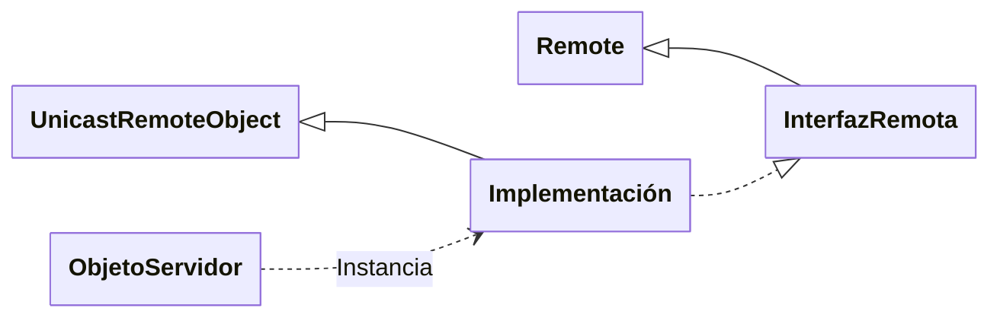
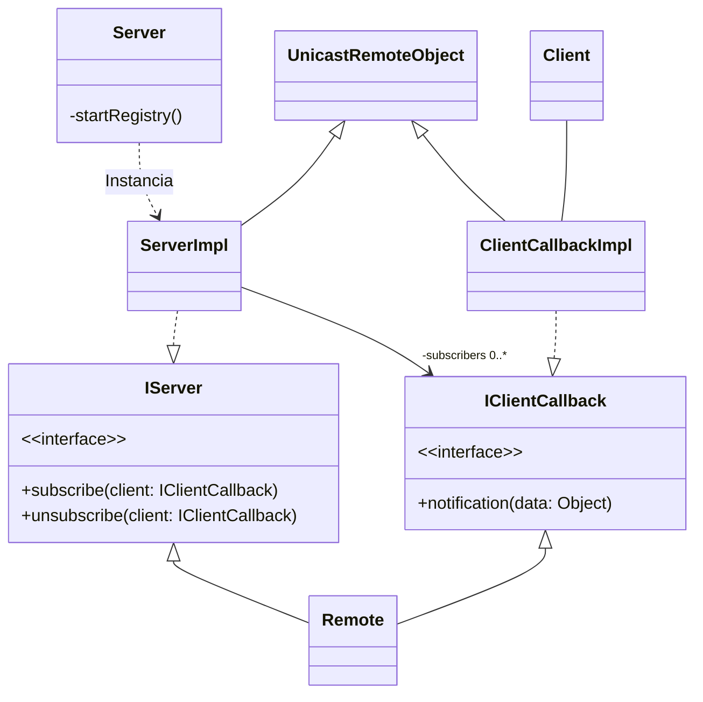

# Remote Procedure Call (RPC)

En el paradigma de _Llamada a Procedimientos Remotos_:

1. Un proceso A realiza una llamada a un procedimiento del proceso B, **pasándole
   datos a través de sus argumentos**.
2. El proceso B ejecuta el procedimiento y le devuelve a A el resultado o **le
   notifica de que ha terminado**.

El funcionamiento es igual que si fuese un procedimiento normal, pero se
necesita realizar algo más para que esto sea posible:



1. En realidad, el proceso A realiza una llamada a un procedimiento _proxy_, que
   obtiene los parámetros de entrada y **los encapsula en un mensaje**.
2. El _proxy_ **envía el mensaje** al otro proceso y **se queda bloqueado**
   hasta recibir una respuesta.
3. El _proxy_ del proceso B recibe la petición, extrae los argumentos del
   mensaje y **llama al método real**.
4. Cuando el método termina, vuelve a **encapsular los resultados** en un
   mensaje para enviarlo de vuelta al proceso A.
5. Cuando el _proxy_ del proceso A recupera el resultado, puede continuar con la
   ejecución del programa principal.

Estos _proxies_, ¿de dónde salen? Existen dos implementaciones principales:

- Open Network Computing Remote Procedure Call (ONC RPC)
- Open Group Distributed Computing Environment RPC (OGDCE RPC)

Ambas proporcionan una herramienta llamada `rpcgen`, que **genera código C** de
los _proxies_ para transformar las llamadas locales a los procedimientos
remotos.

# El paradigma de Objetos Distribuidos


Si el lenguaje a utilizar es Orientado a Objetos, tiene más sentido usar este
paradigma que solamente RPC.


El paradigma de Objetos Distribuidos se basa en el paradigma de llamadas
a procedimientos remotos, pero en su versión orientada a objetos: **se exponen
los métodos de un objeto para que se ejecuten desde otras máquinas**.

Los componentes básicos de un sistema basado en Objetos Distribuidos son los
siguientes:


Una **interfaz remota** es conjunto de métodos que se exponen a ser llamados
desde otras máquinas.



Un **objeto remoto** (_=Objeto Servidor_, _=Objeto Distribuido_, _=Objeto Exportado_)
es aquel que **implementa una interfaz remota**. Por tanto tiene algunos métodos
que pueden invocarse por un proceso remoto, posiblemente situado en otra máquina
conectada a través de la red.


En contrapartida, un **objeto local** solo es accesible desde la misma máquina,
típicamente el mismo proceso.


Una **referencia remota** es un <<manejador>> de un objeto remoto, que se
presenta como la interfaz remota para el programador, pero en realidad contiene
la dirección IP, puerto y cualquier otra información necesaria para poder
identificar la máquina a la que pertenece.



Un **registro de objetos** es un servicio de directorio público que registra los
objetos servidores para proporcionar a los clientes una referencia remota.


## Sistemas o protocolos de Objetos Distribuidos

Se trata de un paradigma bastante común, por lo que existen muchas
implementaciones de herramientas:

- Java Remote Method Invocation ([Java RMI](#java-remote-method-invocation-java-rmi))
- Common Object Request Broker Architecture (CORBA)
- Distributed Component Object Model (DCOM)
- Simple Object Access Protocol (SOAP)


## Paso de mensajes vs Objetos distribuidos

El paradigma del [paso de mensajes] es un modelo natural que simula la
comunicación entre humanos. Sin embargo, no cumple con el nivel de abstracción
que algunas aplicaciones de red complejas requieren.

- El [API de sockets][paso de mensajes] es más cercano al Sistema Operativo
   Más eficiente.
- **Sistemas fuertemente acoplados**: los procesos se comunican directamente
  entre sí. Si un proceso o el medio de comunicación falla, se pierde conexión.
- **Orientado a datos**: se construyen paquetes de datos con formatos
  previamente acordados. Para aplicaciones grandes, no es lo más apropiado.
- **Depuración compleja** y programación propensa a errores

En cambio, los **objetos distribuidos** proporcionan:

- Mayor abstracción
- Basado en los objetos existentes del sistema distribuido
- Versión orientada a objetos: un **estado** (variables y atributos) y **acciones** (métodos).

Entonces, cuando se utiliza este paradigma:

- Los recursos y servicios de la red aparecen como objetos distribuidos.
- **Orientado a acciones**: el programador piensa en la tarea que quiere que se
  realice, y los datos pasan a tener un papel secundario. Se trata de un modelo
  más natural para el desarrollo Orientado a Objetos.
- **Menos propenso a errores**: el formato del mensaje es chequeado por el compilador.
- **Desarrollo más rápido** en comparación con el paradigma del paso de mensajes.

## Arquitectura



El funcionamiento a nivel lógico es bastante sencillo y funciona de forma
totalmente **transparente al programador**:

1. **El objeto servidor se añade en un registro** para que otros puedan obtener
   una referencia.
2. El objeto cliente accede al registro y, a partir de una URL, obtiene la
   referencia del servidor.
3. El objeto cliente realiza una **llamada a los métodos de la interfaz del
   servidor**, como si fuese un objeto más.
4. El objeto servidor ejecuta el método para calcular la respuesta.
5. El objeto cliente recibe el resultado del método como cualquier otro.

Sin embargo, el camino real es el siguiente:

1. Tras la llamada al método de la interfaz, la implementación realmente la
   gestionará el _proxy del cliente_.
2. A continuación, se **obtendrán los parámetros del método** y se encapsularán en
   un paquete con el formato adecuado.
3. Finalmente, _Network support_ **enviará el paquete** a través de la red
   y **bloqueará el proceso** hasta obtener el resultado.
4. Cuando el paquete lo reciba el servidor, realizará el proceso inverso:
   extraerá los argumentos, se seleccionará el objeto remoto indicado, se le
   llamará al método correspondiente.
5. Finalmente, una vez que la ejecución del método ha terminado, el _proxy_ del
   servidor cede el valor de retorno a las siguientes capas para **enviar el
   resultado de vuelta al cliente**.

Esto **también funciona cuando se lanzan excepciones**.

En estos casos, es necesario que un compilador u otras herramientas generen el
código necesario de los _proxies_ para dar soporte al objeto remoto.

# Java Remote Method Invocation (Java RMI)

Se trata de una implementación básica del paradigma de Objetos Distribuidos
exclusivo para el lenguaje Java.

## Arquitectura de Java RMI

En Java RMI, el camino lógico inicia con el servidor de objetos exportando un
objeto remoto y luego lo registra en el directorio. El objeto remoto proporciona
unos métodos, definidos en una interfaz remota, que pueden invocar los clientes.

Por tanto, cuando el cliente quiere interactuar con el servidor, utilizará la
interfaz remota con una sintaxis idéntica a la de los métodos locales.



Sin embargo, [como hemos visto antes](#arquitectura), el camino real tiene
algunos pasos más. El objeto cliente realiza una llamada a lo que Java RMI llama
_**stub**_, un código que sirve de _placeholder_ para la interfaz del objeto
remoto que se encarga de:

1. Serializar (_marshal_) los argumentos y enviar el mensaje a través de la red.
2. Esperar una respuesta
3. Deserializar (_unmarshal_) la respuesta y devolver el resultado.

A su vez, el servidor tiene un _**skeleton**_ que:

1. Inicializa el servidor
2. Espera mensajes a través de la red
3. Deserializa los argumentos y determina el método correspondiente
4. Realiza la llamada
5. Recoge el resultado y lo envía de vuelta

En cuanto a la estructura de las clases, el _setup_ más básico es el siguiente:



## Registro de objetos

El posible utilizar **diferentes servicios de directorio**, pero nosotros usaremos
el más sencillo, `rmiregistry`, dado por el propio Java JDK.

- Es un servicio que se ejecuta en **la máquina del servidor de objetos**.
- Cada máquina servidor debe tener su propio directorio (`localhost`)
   No es posible crear un registro en otra máquina.
- Por convención, utiliza TCP en el puerto 1099.




Y cuando se registra un objeto:

- El objeto debe tener un **nombre unívoco** que se almacena en un único nivel
- El nombre lo establece el programador

## Interfaz Remota

El primer paso es diseñar e implementar la interfaz remota:

- Debe heredar de `java.rmi.Remote`.
- **Todos los métodos lanzan `java.rmi.RemoteException`** por posibles problemas de
  conexión, no encontrar el objeto, etc.
- Estos métodos también pueden lanzar otras excepciones


```java
import java.rmi.Remote;
import java.rmi.RemoteException;

public interface IRemote extends Remote {
    // Método remoto
    int add(int a, int b) throws RemoteException;
    float div(int a, int b) throws RemoteException, DivisionByZeroException;
}
```


## Objeto servidor

Debe:

- **Implementar la interfaz remota**, y por tanto, todos sus métodos. La clase
- Instanciar el objeto servidor y **registrarlo** en un servicio de directorio

Se recomienda que las dos partes se realicen en clases separadas.

La clase que se exporte al registro debe **heredar de `UnicastRemoteObject`**.


Implementación de la interfaz remota:

```java
import java.rmi.RemoteException;
import java.rmi.server.UnicastRemoteObject;

public class Impl extends UnicastRemoteObject implements IRemote {
    @Override
    public int add(int a, int b) throws RemoteException {
        return a + b;
    }

    @Override
    public float div(int a, int b) throws RemoteException, DivisionByZeroException {
        if (b == 0) {
            throw new DivisionByZeroException();
        }

        return (float) a / (float) b;
    }
}
```


El servidor de objetos que instancia y registra el objeto remoto típicamente
tiene la siguiente forma:

```java
import java.rmi.*;

public class Server {
    private static final int REGISTRY_PORT = 1099;
    private static final String REGISTRY_URL = "rmi://localhost:" + REGISTRY_PORT + "/object"

    public static void main(String[] args) {
        try {
            // Instanciar el objeto
            Impl exportedObj = new Impl();

            // Iniciar el registro si no existe
            startRegistry(REGISTRY_PORT);

            // Registrar el objeto
            Naming.rebind(REGISTRY_URL, exportedObj);

        } catch (Exception e) {
            e.printStackTrace();
        }
    }

    private static void startRegistry(int port) throws RemoteException {
        try {
            // Lanza una excepción si no existe
            LocateRegistry.getRegistry(port).list();
        } catch (RemoteException e) {
            // En caso de que no exista, se crea
            LocateRegistry.createRegistry(port);
        }
    }
}
```

La clase `Naming` proporciona métodos para almacenar y obtener referencias en el
registro a partir de una URL de la forma:

```
rmi://<hostname>:<port>/<reference name>
```

- El método `rebind` sobreescribe cualquier referencia con el nombre dado
- El método `bind` da lanza un error si el nombre ya existe

Alternativamente, se puede activar el registro de forma manual a través de un
comando:


```bash
rmiregistry 1099
```


Nótese que si varios clientes ejecutan métodos a la vez, el servidor deberá
responder a ambas peticiones simultáneamente. En Java RMI, **cada petición se
maneja en un nuevo hilo**, por tanto, **los métodos deben ser _thread-safe_**.

Los hilos los gestiona el _middleware_ automáticamente.



Mientras haya objetos exportados, el proceso servidor deberá escuchar por el
puerto y esperar a que los clientes se conecten y soliciten el servicio. 

Por ello, la **JVM no terminará**. Si se necesita que el servidor termine, en
lugar de hacer `System.exit(0)`, lo mejor es quitar los objetos con:

```java
UnicastRemoteObject.unexportObject(exportedObj, true);
```


## Cliente

Se trata de una clase normal, pero determinado momento, para hacer uso del
servicio:

1. Localizar el registro en el servidor
2. Obtener una referencia a la interfaz remota
3. Ejecutar alguno de sus métodos

En código sería algo así:

```java
try {

    // Obtener la referencia a la interfaz remota
    InterfazRemota remote = (InterfazRemota) Naming.lookup(url);

    // Llamar al método remoto
    int result = remote.add(1, 2);

} catch (Exception e) {
    // No se encuentra en el registro, RemoteException...
    e.printStackTrace();
}
```

La URL no es necesariamente `localhost`, sino que puede utilizar los servicios
de cualquier otra máquina.

## Generación de código

El siguiente paso es la compilación del código. Lo que se ha escrito hasta
ahora, puede compilarse como cualquier otro programa Java.

```bash
javac *.java
```

Sin embargo, todavía es necesario generar el _stub_ y el _skeleton_.

```bash
rmic Impl  # Implementación de la interfaz remota
```

El comando anterior, generará los archivos compilados que nos faltaban:
`Impl_stub.class` y `Impl_skel.class` (`!= rpcgen`, que genera código C sin
compilar).

Por tanto, el resultado final debería ser lo siguiente.

| Servidor                | Cliente                |
|-------------------------|------------------------|
| `InterfazRemota.class`  | `InterfazRemota.class` |
| `ServidorObjetos.class` | `Cliente.class`        |
| `Impl.class`            | `Impl_stub.class`      |
| `Impl_skel.class`       |                        |

Nótese que `InterfazRemota.class` es el **único archivo que está repetido**
tanto en el cliente como en el servidor.


En versiones modernas de Java, **no es necesario llamar a `rmic`**: el código se
genera de forma automática en tiempo de ejecución.

Entonces, solo sería necesario:

| Servidor                | Cliente                |
|-------------------------|------------------------|
| `InterfazRemota.class`  | `InterfazRemota.class` |
| `ServidorObjetos.class` | `Cliente.class`        |
| `Impl.class`            |                        |


# Java RMI Avanzado

Java RMI aporta cierto número de características adicionales que, aunque no
sigan totalmente el paradigma de los Objetos Distribuidos, ayudan bastante al
desarrollo de aplicaciones con esta tecnología.

## Stub Downloading

El código _stub_ se genera a partir del servidor de objetos y se sitúa del lado
del cliente. Como consecuencia, **si se modifica el código del servidor, también
será necesario modificar el cliente**.

Sin embargo, Java RMI se ha diseñado para que los clientes puedan obtener
dinámicamente el _stub_. **Se puede colocar en un servidor web** y que el
cliente lo descargue cuando tenga una versión desactualizada.



1. El cliente va a buscar una referencia al registro.
2. El registro le devuelve dicha referencia.
3. Si el _stub_ no está presente o la versión no es adecuada, procede
   a descargarse el archivo desde el servidor HTTP.
4. Ahora con el _stub_ correcto, se pueden realizar las llamadas pertinentes.

Cuando se activa el servidor, es necesario especificar las siguientes opciones:

- URL del _stub_
- El _hostname_ de la máquina servidor de objetos
- El archivo `policy.java`

```bash
java \
    -Djava.rmi.serve.codebase="<URL>" \
    -Djava.rmi.server.hostname=$(hostname) \
    -Djava.security.policy="path/to/java.policy" \
    Server
```

Es necesario establecer ciertas medidas de seguridad a través de una instancia
de un **Java Security Manager** y su configuración en un archivo `java.policy`.


Del lado del servidor:

1. Crear un directorio donde se almacenen todos los archivos de la aplicación
2. Crear la interfaz remota y compilarla  `IRemote.class`
3. Construir el servidor remoto implementando la interfaz  `Impl.class`
4. Generar el _stub_ y el _skeleton_ con `rmic Impl`  `Impl_stub.class` y `Impl_skel.class`
5. Para el ***stub downloading***, copiar el _stub_ al servidor HTTP
6. Activar el registro RMI con `rmiregistry`
7. Crear un archivo de políticas seguridad  `java.policy`
8. Activar el servidor con la URL, el _hostname_ y el `java.policy`

Del lado del cliente:

1. Crear un directorio para almacenar los archivos generados
2. Copiar la interfaz remota  `IRemote.class`
3. Implementar el programa cliente y compilarlo  `Client.class`
4. Si no se va a usar _stub downloading_, copiarlo  `Impl_stub.class`
5. Especificar las políticas de seguridad  `java.policy`
6. Activar el cliente con el nombre del servidor y el `java.policy`


## Archivo `java.policy`

El gestor de seguridad de RMI no permite un acceso a la red, por lo que es
necesario configurar los permisos en un fichero `java.policy`.

```java
grant {
    // Permits socket access to all common TCP ports, including the default
    // RMI registry port (1099) – need for both the client and the server.
    permission java.net.SocketPermission "*:1024-65535", "connect,accept,resolve";

    // Permits socket access to port 80, the default HTTP port – needed
    // by client to contact an HTTP server for stub downloading
    permission java.net.SocketPermission "*:80", "connect";
};
```

En bloque `grant` lista las acciones permitidas y prohíbe todo lo demás. También
es posible usar un bloque `deny` que prohíbe las acciones listadas y acepta el
resto. Nunca se deberían usar ambos bloques conjuntamente.

Este archivo se coloca en donde están los `.class` del servidor, y desde el
cliente también se debe especificar:

```java
java -Djava.security.policy=java.policy Client
```


```java
grant {
    permission java.net.SocketPermission "*:1099", "connect, accept, resolve";

    // This allows RMI clients to contact the RMIRegistry of any host
    permission java.net.SocketPermission "*:1024-65535", "connect, accept, resolve";

    // This allows RMI clients to make network connections to the public ports on
    // any host If you start the RMIregistry on a port in this range, this will
    // help to get around the resolve access violation.
    permission java.net.SocketPermission "localhost:1099", "connect, resolve";
    permission java.net.SocketPermission "129.65.242.5:1024-", "connect, accept";

    // For some reason it is necessary for some people to have the above statements
    // to explicitly allow connection to/from falcon.
    permission java.net.SocketPermission "*:80", "connect";

    // This allows connection to the default web server on any host -
    // needed for stub downloading, among other things.
};
```


## Security Manager

Java RMI involucra el acceso a una máquina remota y posiblemente la _descarga de
código_, por lo que es importante que proteger ambos sistemas ante accesos no
permitido.

Un _Security Manager_ es una clase que se puede instanciar para limitar los
privilegios de acceso en función de un archivo `java.policy`.
`RMISecurityManager` es una posible implementación que aporta Java RMI, pero
también es posible escribir nuestro propio gestor de seguridad.

```java
try {

    System.setSecurityManager(new RMISecurityManager());

} catch (Exception e) {
    e.printStackTrace();
}
```

Esto debería ser lo primero que se ejecute en el programa. Sin embargo, en la
versiones actuales de Java ya se hace automáticamente y el _Security Manager_
por defecto nos será suficiente.

## Client Callback

En el modelo Cliente-Servidor, el servidor es pasivo dado que espera a la
llegada de peticiones y les proporciona respuestas; mientras que la comunicación
la inicia el cliente.

Algunas aplicaciones necesitan que sea el servidor que mande un mensaje primero
en ciertos eventos.

- Monitorización de eventos y envío de notificaciones
- Juegos
- Subastas
- Trabajo colaborativo: un cliente realiza un cambio y el servidor debe notificar al resto de clientes.
- ...



Existen dos estrategias:

- **Polling**: cada cierto tiempo, el cliente envía una petición al servidor
  para ver si ha ocurrido el evento. Es es bastante ineficiente dado que genera
  tráfico innecesario.
- **Callback**: el cliente se subscribe a un evento y espera una respuesta
  o realiza otro trabajo. El servidor, cuando lo detecte, le enviará una
  notificación de vuelta.

### Implementación de un _Callback_

La idea de la implementación es que el cliente proporcione un objeto con métodos
remotos a los que el servidor llamará en caso de que el evento suceda. Esto
tiene la ventaja de que **se evita el sondeo**.

1. El cliente de un callback especifica al método que quiere que se le llame
   creando una interfaz remota.
2. Luego, el cliente se registra en el servidor de objetos enviándole la
   referencia a su interfaz.
3. El servidor la almacena en una estructura dinámica
4. Cuando el servidor recibe el evento, recorre la estructura y ejecuta el
   método de cada interfaz de cada cliente subscrito.

Recuerda que dicha **estructura dinámica debe ser `synchronized`**, dado que
cada petición se manejará en un hilo aparte y podrían darse carreras críticas al
insertar y/o iterar a la vez.

<!-- TODO: diagrama de los pasos + cola del servidor -->

La nueva estructura de archivos será:

| Servidor                        | Cliente                         | Descripción                                                                       |
|---------------------------------|---------------------------------|-----------------------------------------------------------------------------------|
| `IServer.class`                 | `IServer.class`                 | Interfaz remota del servidor                                                      |
| `IClientCallback.class`         | `IClientCallback.class`         | Interfaz remota del cliente que contiene los _callbacks_                          |
| `Server.class`                  | `Client.class`                  | Lógica del cliente y del servidor                                                 |
| `ServerImpl.class`              | `ClientCallbackImpl.class`      | Implementación de sus respectivas interfaces                                      |
| `ServerImpl_skel.class`         | `ServerImpl_stub.class`         | El servidor tiene el _skeleton_ de su interfaz y el cliente el _stub_             |
| `ClientCallbackImpl_stub.class` | `ClientCallbackImpl_skel.class` | El servidor tiene el _stub_ de la interfaz del cliente y este tiene el _skeleton_ |
| `java.policy`                   | `java.policy`                   | Se necesita especificar los permisos de seguridad                                 |



## Serialización de objetos

A veces es necesario pasar como argumento de un método remoto un tipo de datos
complejo: objetos personalizados.

```java
public class Book {
    private final String title;
    private final ArrayList<String> authors;
    private final int pageNumber;

    // ...
}

public interface IRemote {
    void addToStore(Book book) throws RemoteException;
    Book getBookByTitle(String title) throws RemoteException;
    // ...
}
```

En este ejemplo, la interfaz remota hace uso de la clase `Book` contiene varios
atributos, que a su vez también pueden ser otros objetos. Tenga en cuenta que el
para realizar la llamada al método, el _stub_ debe encapsular estos argumentos
en un mensaje para poder enviarlo a través de la red.



<!-- TODO: ¿cómo que código? ¿También se serializa código? -->
En Java RMI es posible gracias al concepto de **serialización**: consiste en
encapsular el objeto (código + datos) en una **cadena de texto** que se puede
enviar. Para ello, se necesita conocer el archivo `.class` del objeto en
cuestión.


Esto es posible en Java gracias al concepto de **serialización**: consiste en
transformar el estado de un objeto a un _byte stream_. El proceso de
**deserialización** es justo lo contrario: se toma ese _byte stream_ y se vuelve
a convertir a un objeto. La propia JVM nos garantiza que la reconstrucción será
correcta y funcionará sin problemas.

Para hacer una clase serializable, simplemente hay que **implementar la interfaz
`java.io.Serializable`**, que no **require de ningún método**: solo sirve a modo
de marcador.

Sin embargo, si se desea un mayor control para realizar algunas acciones
especiales, se pueden sobreescribir los siguientes métodos:

```java
private void writeObject(java.io.ObjectOutputStream out)
    throws IOException;

private void readObject(java.io.ObjectInputStream in)
    throws IOException, ClassNotFoundException;

private void readObjectNoData()
    throws ObjectStreamException;
```

Se utilizan las clases `ObjectOutputStream` para serializar
y `ObjectInputStream` para deserializar:


```java
public class Book implements Serializable { ... }

// ...

Book book = new Book();
book.setTitle("El Quijote");
book.addAuthor("Miguel de Cervantes");
book.setPageNumber(1069);

// Serializar
FileOutputStream fos = new FileOutputStream("file.txt");
ObjectOutputStream oos = new ObjectOutputStream(fos);
oos.writeObject(book);

// Deserializar
FileInputStream fis = new FileInputStream("file.txt");
ObjectInputStream ois = new ObjectInputStream(fis);
Book fromFile = (Book) ois.readObject();

oos.close();
ois.close();
```

Consideraciones:

- Si una clase es serializable, todas sus subclases también lo serán.
- Si una clase tiene una referencia a otra, esa también deberá ser serializable.
  Lo mismo sucede si se trata de una colección: tanto la colección como el tipo de
  los elementos de la misma deben ser serializables. De lo contrario, se lanzará
  `NotSerializableException`.
- Se puede usar la palabra clave `transient` para evitar que un atributo se
  serialice. Cuando se deserialice, se inicializarán llamando al constructor sin
  argumentos.
- Los atributos `static` pertenecen a la clase y no a una instancia, por tanto,
  no se serializan.
- Si una clase implementa `Serializable` pero no su superclase, deberá
  encargarse también de los atributos de la clase padre.
- Cuando se deserialice una clase, su `.class` debe ser accesible.


La JVM asocia un `long` a modo de versión con cada clase serializable. Se
utiliza para verificar que el objeto guardado y cargado tienen los mismos
atributos y por tanto son compatibles.

Si una clase serializable no declara un `private static final long
serialVersionUID`, la JVM generará uno automáticamente. Sin embargo, se
recomienda que lo haga explícitamente el programador (o el IDE), dado que el
valor automático depende del compilador usado, lo que podría causar problemas
entre diferentes implementaciones.


[paso de mensajes]: 
