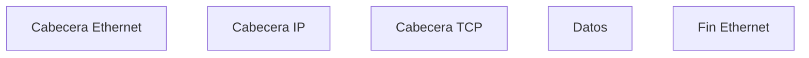
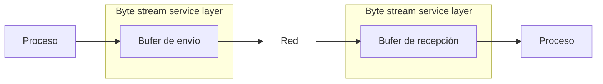
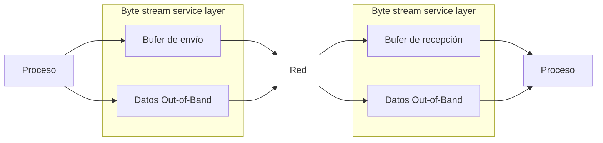
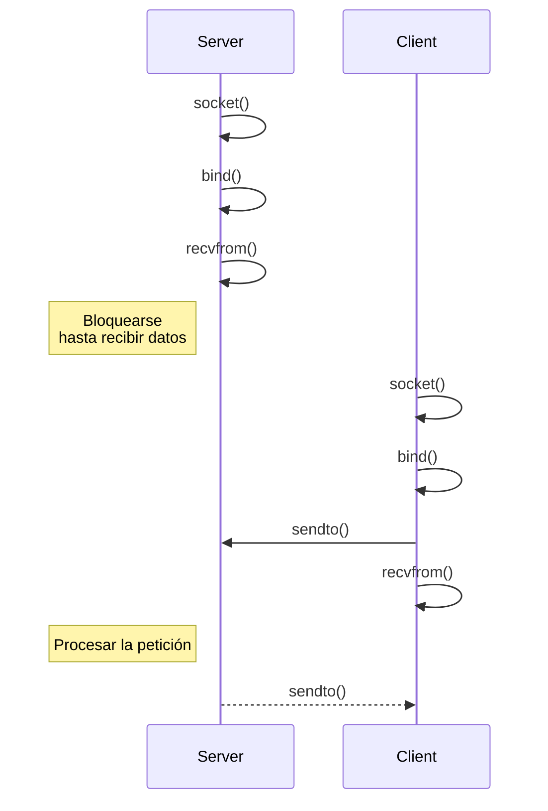
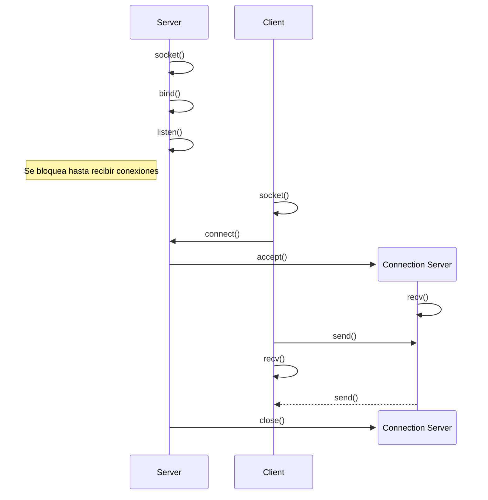
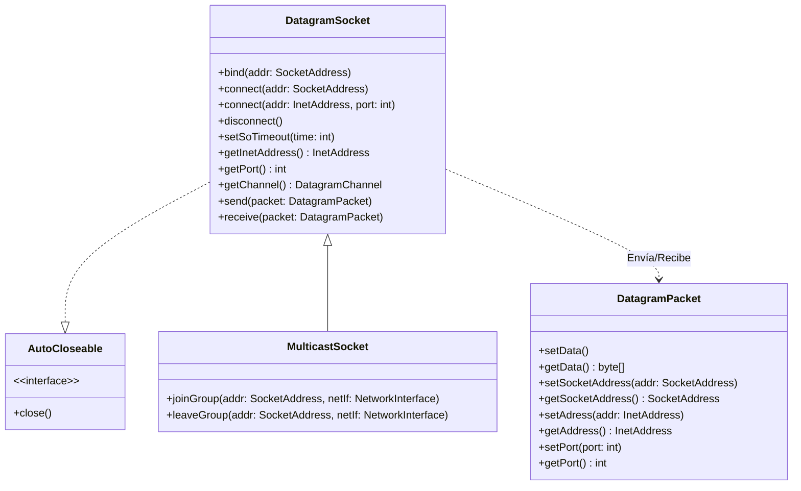
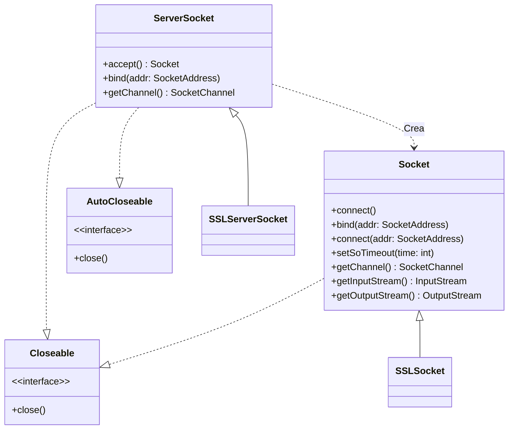

# Historia

En 1972 se diseña [ARPANET], la primera red de largo alcance que implementó el stack
[TCP/IP] (enrutamiento de paquetes). Su ventaja, es que **si cae un nodo, el
resto puede seguir funcionando**. Se creó con la intención de conectar
_mainframes_ de investigación con los investigadores, pero pasó al departamento
de defensa. Años más tarde, se empezarían a añadir universidades.

Por esas fechas, la empresa [AT&T] crea el sistema operativo UNIX. Se
distribuyó de forma Open Source entre varias universidades, que lo utilizaron
para la docencia.

Para entonces, los ordenadores no eran interoperables, sus componentes no eran
intercambiables, por lo que comunicar varios ordenadores de diferentes marcas
era un problema.

Entonces, el departamento de defensa marca un estándar.

La universidad de Berkeley tiene una versión modificada de UNIX y necesitaba
implementar dicho estándar  Nace la API de sockets.

Como UNIX tenía una licencia Open Source, obligaba a que esta implementación
también lo fuese.

# API de Sockets

- Se trata del estándar _de facto_
- Sirve de base para otras abstracciones como RPC
- Proporciona la abstracción de controlar la tarjeta de red como si fuese un
  fichero (en UNIX todo es un archivo)

<!-- TODO: No es necesario si se especifica esto en artículos anteriores -->
# TCP/IP

Como se comentó en la introducción, se diseñó para ARPANET a principios de los
años 80.

- Es independiente del fabricante: permite comunicar máquinas de distintas marcas.
- Disponible desde ordenadores de escritorio a _mainframes_.
- Usado tanto en LAN (Redes de Área Local) y WAN (Redes de Área Amplia)
- Actualmente es lo más utilizado en Internet



    -% Datos o Enlace :%

- Interacción con el hardware: permite intercambiar la tarjeta de red sin
  afectar al resto de capas.
- Múltiples formas de comunicación con la misma interfaz

    -% Red :%

- Proporciona un mecanismo **no fiable** de comunicación entre sistemas
- Introduce las direcciones IP  Cada nodo tiene una dirección de 32 bits


| Clase | Bits iniciales | Campo de red | Campo de host |
|-------|----------------|--------------|---------------|
| A     | `0`            | 7 bits       | 24 bits       |
| B     | `10`           | 14 bits      | 16 bits       |
| C     | `110`          | 21 bits      | 8 bits        |
| D     | `1110`         | -            | -             |

En redes de clase A hay alrededor de 16 millones de direcciones para hosts en
una red, lo que tiene poco sentido. Solo cuando se hacen subredes pueden ser
útiles, pero aún así se están tirando muchas IPs.

Las redes de clase B, con un máximo de 65 mil dispositivos, tampoco tienen mucho
sentido. Dónde más útiles son es en empresas grandes, y aún así se suelen crear
subredes.

Las redes de clase C son lo que tenemos habitualmente en casa.

Las direcciones de clase D son para multicast. Codifican con 28 bits la
posibilidad de unirse (o salir) a grupos _multicast_ de forma dinámica. Para
ello, es necesario que el sistema operativo lo soporte.

- _Unicast_: uno a uno (IP origen y destino)
- _Multicast_: uno a varios
- _Broadcast_: uno a todos (IP origen y destino es `255.255.255.255`)



Hoy en día casi todos los dispositivos están conectados a una red por lo que
todos ellos tienen que tener su propia IP. El problema es que ¡no tenemos para
todos!

El límite teórico es de $2^{32} - 1$ direcciones (4 mil millones), pero el
problema es que muchas de ellas están reservadas y no se pueden usar en
Internet.

Para solucionar este problema, se propusieron varias ideas:

- **IPv6**: direcciones IP de 128 bits (~$10^{39}$), que nos dan direcciones
para una buena temporada. Pero realizar el cambio implicaría cambiar toda la
infraestructura existente.

- **NAT**: asignar a cada nodo una IP privada, que se cambiará por una IP
pública cuando salga de la red.
    - Se necesitan menos IPs, que es lo que queríamos
    - Más seguro
    - No se pueden poner servidores directamente  Es necesario redirigir puertos
    - Es posible que el proveedor cambie la IP pública al conectarse usando DHCP



    -% Transporte :%

- Un proceso interacciona para el envío de datos
- Se añade el concepto de **puerto** para que el SO sepa a qué proceso enviar el
  mensaje.
- Controla el orden de transmisión de los bytes (_Big-Endian_ vs
  _Little-Endian_)  Por convención es _Big-Endian_.


Campo de 16 bits utilizado para identificar el proceso origen y destino de la
comunicación dentro de la máquina. Sin ellos, cuando la máquina reciba un
mensaje, el SO no podrá saber a qué proceso enviarlo.

Por lo general:

- El servidor tiene un puerto fijo y conocido
- Al cliente no le importa cuál sea (dado que solo es temporal), por lo que el
  SO escoge uno libre

El rango $[1, 1023]$ son puertos reservados para servicios conocidos. Se
necesitan privilegios de administrador para utilizarlos.


## UDP

- Muy similar a IP: **no fiable**, delega a la aplicación que los datos se reciban.
- Simple y rápido
- La unidad mínima es el propio paquete
- Los paquetes no están ordenados
- No hay control de congestión
- No hay QoS (_Quality of Service_): no se garantiza un ancho de banda y pueden
  existir retardos.

Útil para aplicaciones que requieren una alta tasa de transferencia y donde las
pérdidas no son importantes (ejemplo: videoconferencia).

## TCP

Orientado a conexión, lo que significa que hay que abrir un canal, enviar los
datos, y luego cerrarlo (de forma similar a un archivo).

- Garantiza la recepción en orden y correcta  Números de secuencia
- Coste: gran latencia (no vale para audio/vídeo)
- Comunicación bidireccional, pero solo 2 procesos (punto a punto)
- Control de congestión

-% Aplicación :%
Protocolos dedicados a propósitos específicos.

- HTTP: páginas web
- SMTP: correo electrónico
- FTP: transferencia de archivos
- ...


Cada una de estas capas necesita su propia cabecera, por lo que el resultado
final tendrá este aspecto:



- **Cabecera Ethernet**: contiene la dirección MAC, que identifica el dispositivo en
  la red actual y mejora la eficiencia en redes de difusión.
- **Cabecera IP**: contiene las IPs origen y destino (32 bits cada una), entre otros.
- **Cabecera TCP**: contienen los puertos origen y destino (16 bits cada uno)
  e información necesaria para garantizar la recepción en orden, control de
  congestión, etc.
- **Datos**: contienen los datos de la aplicación.

Entonces, es necesario tener los siguientes **5 elementos** para que la comunicación
sea posible:


-% Protocolo :% TCP / UDP
-% Dirección :% IP local (32 bits) <br> IP remota (32 bits)
-% Proceso :% puerto local (16 bits) <br> puerto remoto (16 bits)



Varias de estas capas tienen un tamaño máximo de paquete, que se denomina MTU
(_Maximum Transfer Unit_).  Es necesario fragmentar y asignar
número de secuencia o byte.

A continuación, cuando todos los elementos se han recibido, se realiza el
**ensamblado** para montar cada fragmento en orden.


# Out of Band

Generalmente la transmisión de información se realiza a través de una memoria
intermedia.



Pero en algunos casos nos interesa saltarnos ese mecanismo y hacer que se envíe
directamente. Con esto conseguimos que los datos de Out of Band siempre se
envían antes que el resto.



<!-- TODO: contenido de prácticas de redes -->
# IPC de UNIX BSD 4.x

A partir de [BSD] 4.2 se implementó un modelo de IPC a través de **llamadas al
sistema** gracias al concepto de [sockets].


Abstracción software dentro de un nodo de una red de comunicaciones que sirve
como _endpoint_.

1. A través del socket se **envían** y se **reciben** mensajes
2. Para enviar, los mensajes se ponen en una cola en el socket
3. El sistema envía
4. Para recibir, en el socket receptor los mensajes estarán en una cola hasta que
   el proceso destinatario los haya extraído

Ambos procesos deben crear sockets explícitamente para poder comunicar. Es
responsabilidad del programador mantener el buffer vacío, por que si se llena,
será _Buffer Overflow_.

Por defecto, un socket es **bloqueante**  Uso de hilos. <br>
Este comportamiento se puede cambiar, pero es difícil de implementar
(interrupciones hardware).


Como en UNIX todo es un archivo, los sockets funcionan de igual forma.
Se abren mediante la función `socket()` y se devuelve un _descriptor_ de
archivo. Con el se pueden usar las llamadas para archivos `read()` y `write()`.

```c
#include <sys/socket.h>

// Parámetro domain
#define AF_INET ...  // Internet
#define AF_UNIX ...  // IPC

// Parámetro type
#define SOCK_DGRAM  ...  // UDP
#define SOCK_STREAM ...  // TCP

// Protocol a 0

int socket(int domain, int type, int protocol);
// En error devuelve -1, consultar errno
```

Consultar `man socket` para más información.

A continuación, se llama a `bind()` para asignarle un puerto. Si no se deshace
el _bind_, el sistema se podrá reutilizar el puerto (ojo si el programa termina
por `CTRL-C`).

```c
#include <sys/socket.h>

int bind(
    int sockfd,  // Descriptor del socket
    const struct sockaddr *addr,
    socklen_t addrlen
);
// En éxito devuelve 0. En error, -1 (errno)
```

El parámetro `addr` es la dirección que se le quiere asignar. Como se trata de
una función genérica, también debe funcionar para otros protocolos y dominios.
Por ello, también se le debe pasar el tamaño de la estructura.

## UDP o Datagramas

- `sendto()`: con el descriptor del socket, enviar a determinada dirección (IP + puerto)
- `recvfrom()`: recibir mensaje y la dirección de origen. Se especifica también
  el tamaño máximo del buffer (si se supera, se trunca el contenido).
- `close()`: para cerrar el socket

 Con un mismo socket se pueden hablar con varias máquinas <br>
 Primero `recvfrom()` (bloqueante) y luego `sendto()`



## TCP o Flujos / Streams

- `listen()`: crea un buffer en el kernel de conexiones sin aceptar. No debe
  pasar mucho tiempo entre que se reciben y se aceptan/rechazan o el buffer se
  llenará.
- `connect()`: se crea la conexión con el servidor
- `accept()`: se crea un nuevo socket para la conexión. Es una llamada bloqueante
- `recv()` y `send()` para enviar y recibir a través del socket de conexión.
  También se pueden usar `read()` y `write()` respectivamente.
- `close()`: para cerrar el socket



Nótese que para gestionar la conexión **se crea un nuevo socket**, el **socket
de conexión**. Esto se debe a que la conexión es 1 a 1.

# El API de sockets en Java

Para representar las direcciones IP, en Java se utilizan las siguientes clases:

- `InetAddress` representa una dirección de internet (IPv4 o IPv6)
- `SocketAddress` representa una dirección y un puerto asociado a un socket
- `InetSocketAddress` es un `SocketAddress` especializado para direcciones de internet
- `UnixDomainSocketAddress` es lo mismo, pero para IPC

```mermaid
classDiagram
    class SocketAddress
    &lt;&lt;abstract&gt;&gt; SocketAddress

    class InetSocketAddress {
        +InetSocketAddress(addr: String, port: int )
        +InetSocketAddress(addr: InetAddress, port: int)
        +getPort() int
        +getAddress() InetAddress
    }

    class InetAddress {
        +getByName(String) InetAddress$
        %%+getByAddress(byte[]) InetAddress$
        %%+isReachable() bool
        %%+isReachable(timeout: int) bool
        %%+isMulticastAddress() bool
    }

    link SocketAddress "https://docs.oracle.com/en/java/javase/23/docs/api/java.base/java/net/SocketAddress.html"
    link InetSocketAddress "https://docs.oracle.com/en/java/javase/23/docs/api/java.base/java/net/InetSocketAddress.html"
    link InetAddress "https://docs.oracle.com/en/java/javase/23/docs/api/java.base/java/net/InetAddress.html"

    SocketAddress <|-- InetSocketAddress
    SocketAddress <|-- UnixDomainSocketAddress
    InetAddress <|-- Inet4Address
    InetAddress <|-- Inet6Address
```

Luego, si se quiere hacer uso del protocolo UDP para enviar datagramas, se
utilizan las siguientes clases:

- La clase `DatagramSocket` representa un socket capaz de enviar
  `DatagramPacket`s.
- La clase `MulticastSocket` da un mejor soporte para enviar y recibir datos en
  grupos multicast.
- La clase `DatagramPacket` representa un paquete individual y enrutado de forma
  independiente, por lo que ya contiene **dirección y puerto de origen
  y destino**. No se garantiza que se reciba.



Alternativamente, también existen más clases para gestionar sockets por Streams
(TCP).

- `Socket` implementa sockets cliente
- `ServerSocket` implementa sockets servidor: espera por peticiones entrantes,
  las procesa, y posiblemente devuelve una respuesta.

Para recibir y enviar datos, se pueden usar las interfaces de `InputStream`
y `OutputStream`. Otra alternativa es usar `Channel`s.

Ambas clases utilizan `SocketImpl`, que es la clase real que implementa los
sockets. El usuario puede crear su propia versión, tanto para clientes como para
servidores.



## Sockets seguros: JSSE

En el diagrama de clases anterior, he incluido `SSLSocket` y `SSLServerSocket`.
Estas son las implementaciones de los sockets seguros de Java: _Java Secure
Socket Extension_ (JSSE).

- Implementan **SSL** y **TLS**
- Es necesario tener certificados digitales: clave pública y clave privada
- Gestiona el **cifrado y firma de los mensajes**

## Ejemplo de servidor TCP

```java
import java.io.*;
import java.net.*;

public class Server {
    public static final int PORT = 8180;

    public static void main(String[] args) {
        try (ServerSocket socket = new ServerSocket(PORT)) {

            while (true) {
                // Se realiza el accept de una conexión
                try (Socket conSocket = socket.accept()) {

                    // Este trabajo lo podría realizar otro hilo para gestionar
                    // varias conexiones a la vez.

                    DataInputStream input = new DataInputStream(conSocket.getInputStream());
                    DataOutputStream output = new DataOutputStream(conSocket.getOutputStream());

                    ... input.readByte() ...
                    ... output.write() ...
                } // Se cierra automáticamente el socket de conexión
            }

        } catch (Exception e) {
            e.printStrackTrace();
        }
    }
}
```

## Ejemplo de cliente TCP

```java
import java.io.*;
import java.net.*;


public class Client {
    public static void main(String[] args) {
        try (Socket socket = new Socket("127.0.0.1", Server.PORT)) {

            DataInputStream input = new DataInputStream(socket.getInputStream());
            DataOutputStream output = new DataOutputStream(socket.getOutputStream());

            ... input.readByte() ...
            ... output.write() ...

        } catch (Exception e) {
            e.printStrackTrace();
        }
    }
}
```

# Multicast

La multidifusión se construye sobre el protocolo IP para permitir que **un
emisor se envíe un único paquete a muchos receptores**.

Para poder recibir mensajes, es necesario registrarse a un **grupo multicast**,
que se corresponde con una IPv4 de tipo D. Sencillamente, hace que el Sistema
Operativo lea de unas IPs en concreto cuando se registra. Esto tiene la ventaja
de que la **asignación es dinámica**: puedo dejar de escuchar o empezar
a escuchar cuando quiera.

Con este mecanismo, es posible enviar datos a un grupo multicast sin pertenecer
a él. **Solo es necesario unirse para recibir mensajes**.


Más características:

- Todos deben escuchar por el **mismo puerto**.
- Debe usarse **UDP** (uno a muchos).
- El emisor no sabe qué otras máquinas están en el grupo ni el tamaño del mismo.
- Es importante **salir del grupo antes de terminar el programa**. De lo
  contrario, el kernel seguirá escuchando por esos paquetes y desperdiciando
  recursos.

## Routers multicast

Los routers solo implementan 2 capas del stack TCP/IP (Enlace y Red), por lo que
**necesitan algo extra** para soportar multicast.



Entonces, cuando los routers detecten una IP dirigida a un grupo multicast, **lo
reenviarán por todas sus salidas** los paquetes multicast. Esto provoca que el
paquete viajará por _toda_ la red, y posiblemente se quede atrapado en bucles.

La solución es implementar el mecanismo de **TTL** (_Time To Live_). El paquete se
envía con un número de saltos máximo y cada vez que pase por un router, este lo
decrementa en 1. Cuando se llegue a 0, el paquete simplemente se descarta.

## Reservar una dirección

Cuando se crea un grupo temporal, se necesita una dirección IP multicast **libre
para evitar conflictos**. El protocolo IP no resuelve este problema.

Tenemos la ventaja de que si se selecciona un **TTL pequeño**, es difícil entrar en
conflicto con otros grupos.

Sin embargo, para comunicaciones a nivel de internet, sí es necesario reservar
previamente una dirección con las Autoridades de Internet. El programa de
directorio de sesiones (sd) sirve para arrancar o unirse a grupos multicast
grandes, entre otros. En España, la agenda la gestiona [RedIris].

Las direcciones de `244.0.0.1` a `244.0.0.255` están reservadas para grupos
permanentes, incluso si no tienen ningún miembro.


## Aplicaciones

Los principales usos de este mecanismo son los siguientes:

- Difusión de vídeo y audio
- Aplicaciones cooperativas
- Videoconferencias

Sin embargo, hoy en día ya no se utiliza a escala global y casi nadie configura
routers en modo multicast.



Hoy en día, el emisor se conecta a un servidor y se replican los paquetes de
vídeo para los espectadores. Esto es menos eficiente dado que tiene un mayor
consumo de ancho de banda, pero con el hardware actual, no resulta un problema.

[ARPANET]: https://en.wikipedia.org/wiki/ARPANET
[TCP/IP]: TODO
[AT&T]: https://en.wikipedia.org/wiki/AT%26T
[BSD]: https://en.wikipedia.org/wiki/Berkeley_Software_Distribution
[sockets]:https://en.wikipedia.org/wiki/Network_socket
[RedIris]: http://www.rediris.es/mmedia/agenda
