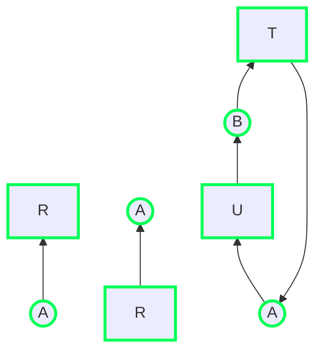

# Recursos


Objetos otorgados por el Sistema Operativo a un proceso.  
En el contexto de los interbloqueos, solo tiene sentido hablar de **recursos
compartidos** por varios procesos.


Existen varios tipos de recursos:

- **Apropiativo**: se le puede quitar al proceso que lo posee sin causar efectos
  dañinos.
- **No apropiativo**: no se le puede quitar a su propietario sin provocar su mal
  funcionamiento.

Estos últimos son los más problemáticos, porque los recursos apropiativos
simplemente se pueden resolver transfiriéndolo al otro proceso. Por ese motivo,
centraremos el análisis en los recursos no apropiativos.

El procedimiento para obtener un recurso es el siguiente:

1. Solicitar el recurso. Si no está disponible, el SO suele **bloquear
   automáticamente al proceso y dejarlo en espera**. Se despertará de nuevo
   cuando vuelva a estar disponible. Otra opción es **devolver un código de
   error**, pero no es particularmente útil si el proceso no puede continuar sin
   el recurso.
2. Usar el recurso.
3. Liberar el recurso.


Dispositivos hardware:

- Impresora
- Memoria RAM
- Grabadora de CD (no apropiativo: si se le quita en el medio del proceso, el CD
  puede quedar mal formateado)

Información:

- Un registro de una Base de Datos
- Memoria compartida entre dos procesos
- Espacio de direcciones en un programa multihilo


# Interbloqueo

Un interbloqueo es una situación en la que dos o más procesos están bloqueados
indefinidamente al entrar en conflicto sus necesidades.

Esto ocurre porque los procesos compiten por el uso de recursos y se comunican
y sincronizan entre ellos. Esto se puede dar en muchas situaciones.


Un conjunto de procesos está en interbloqueo si y solo si cada proceso está
esperando un evento que solo genera alguno de los procesos del conjunto.


El evento referido en la definición usualmente se trata de la liberación de un
recurso que el proceso en cuestión necesita. Sin embargo, ese recurso pertenece
a otro proceso del conjunto, que no se liberará nunca.

Para que pueda existir un interbloqueo, deben darse estas 4 condiciones
simultáneamente, si falla alguna, no será posible que se de:


-% Exclusión mutua :% Dos procesos pueden acceder a la misma memoria o recurso.
-% Contención y espera :% Habiendo solicitado un recurso, se puede solicitar otro.
-% No apropiativo :% El SO no le puede quitar de cualquier forma el recurso a un
   proceso. En sistemas de propósito general, esto causará que el proceso funcione mal.
-% Espera circular :% Se producen ciclos: el proceso $A$ depende de $B$
   y viceversa. Es difícil detectarlos y solucionarlos.


Los interbloqueos se pueden modelar mediante grafos dirigidos:

- Nodo circular: un proceso
- Nodo cuadrado: un recurso
- Arista de cuadrado a círculo: un recurso fue solicitado, luego asignado
  y actualmente en uso por el proceso.
- Arista de círculo a cuadrado: el proceso está bloqueado en espera del recurso.



En el primer grafo, $A$ ha obtenido el recurso $R$; mientras que en el segundo,
el proceso $A$ está bloqueado porque necesita el recurso $R$. En último se
muestra un interbloqueo: **hay un ciclo en el grafo**.

# Estrategias

En general, se utilizan las siguientes estrategias para lidiar con los
interbloqueos:

- **Algoritmo de la Avestruz**: no hacer nada
- **Detectar y resolver interbloqueos a la fuerza**: matando procesos
  y expropiando recursos.
- **Prevención**: no dar recursos a procesos con alta probabilidad de interbloqueos.
- **Atacar a las condiciones**: intentar eliminar una de las condiciones necesarias
  de los interbloqueos.

## Algoritmo de la avestruz

El método más simple para lidiar con los interbloqueos, es **no hacer nada**:
meter la cabeza en la arena y pretender que no hay ningún problema.

Existen varias reacciones frente a esta declaración:

- Un matemático lo encontraría totalmente inaceptable y defendería que los
  interbloqueos se deberían prevenir a toda costa.
- Un ingeriero preguntaría con qué frecuencia sucede el problema y qué grave es.
  Si hay interbloqueos cada 5 años, pero fallos del hardware, compilación
  y errores del sistema operativo constantemente; el ingeniero no estaría
  dispuesto a solucionar interbloqueos.

Solucionar interbloqueos es un problema complejo, y el rendimiento final se
verá afectado.

Los sistemas de propósito general (Windows, Linux) utilizan el algoritmo de la
avestruz, por lo que la responsabilidad de resolver interbloqueos recae en el
usuario (_¿Ha probado usted a apagarlo y volverlo a encender?_).

## Detectar y recuperación de un interbloqueo

### Detección de interbloqueos con un recurso de cada tipo


La idea es **construir el grafo con los recursos y procesos** y **buscar
ciclos** y qué procesos forman parte.


Para encontrar ciclos en un grafo, podemos tomar cada nodo como la raíz de lo
que espera que sea un árbol. Mientras se realiza una búsqueda en profundidad
y se pasa dos veces por el mismo nodo, es que hay un ciclo. Si se agotan las
aristas, se regresa al nodo anterior; y si se llega a la raíz, se puede decir
que no tiene ciclos.

Para cada nodo realizar los siguientes pasos:

1. Inicializar $L$ vacía y designar todos los arcos como no visitados.
2. Agregar el nodo actual $N$ a $L$.
    - Si $N$ existía ya en la lista, el algoritmo concluye con que hay un ciclo.
3. Ver si $N$ tiene arcos salientes no visitados.
    - Si es así, continuar.
    - De lo contrario, ir al paso 5.
4. Elegir un arco saliente al azar y marcarlo como visitado. Seguir el arco
   hasta el siguiente nodo $M$, hacer que $M$ sea el actual e ir al paso 2.
5. Si $N$ es el inicial, el grafo no contiene ciclos y el algoritmo termina.
    - En caso contrario, estamos en un punto muerto. Se elimina $N$ de $L$ y se
      regresa al nodo anterior haciéndolo el actual. Ir al paso 2.

### Detección de interbloqueos con varios recursos de cada tipo

Cuando existen copias del mismo recurso, se necesita un método distinto para
detectar interbloqueos: veremos un algoritmo basado en matrices.

- $n$ procesos: $\Set{P_1, \ldots, P_n}$

- $m$ clases de recursos diferentes

- $\Set{E_1, \ldots, E_m}$ siendo cada $E_i$ el **vector de recursos
  existentes**: propociona el número total de instancias de cada tipo de
  recurso.  
  Si la clase 1 son unidades de cinta, entonces $E_1 = 2$ significa que
  hay 2 unidades de cinta.

- $A$ es el **vector de recursos disponibles**, donde $A_i$ indica el número de
  instancias libres del recurso $i$.

- $C$ es la **matriz de asignaciones actuales** de tamaño $n \times m$. $C_{ij}$
  es el número de instancias que el proceso $P_i$ tiene del recurso $j$ en un
  momento dado.  
  Los procesos son filas y los recursos columnas.

- $R$ es la **matriz de peticiones** también de tamaño $n \times m$. $R_{ij}$ es
  el número de instancias del recurso $j$ que necesita en total el proceso $P_i$.

Partiendo de esto, una observación importante es que la suma de los recursos
asignados y aquellos sin asignar debe ser igual al total:

$$ \sum^n_{i=1} C_{ij} + A_j = E_j $$

El algoritmo de detección se basa en la comparación de vectores. Definamos que
para dos vectores $A$ y $B$, $A \le B$ se cumple si cada elemento de $A$ es
menor o igual que su correspondiente en $B$. Es decir:

$$ A \le B \iff A_i \le B_i \quad 1 \le i \le m $$

1. Buscar un proceso desmarcado, $P_i$ para el que la fila $i$ de $R_i \le A$.
2. Si se encuentra dicho proceso, agregar la fila $i$ de $C$ a $A$, marcar el
   proceso y volver al paso 1.
3. Si no existe dicho proceso, el algoritmo termina.

Es decir: **buscar un proceso que se pueda ejecutar hasta completarse**. Esto
implica que se le puedan asignar todos los recursos que necesita. Para continuar
con el algoritmo, se le asignan y se continúa buscando. Si todos los procesos
pueden ejecutarse hasta terminar, es que no existe interbloqueo.

### Recuperación de un interbloqueo

Una vez se ha determinado que ha ocurrido un interbloqueo, será necesario
solucionarlo. Para esto se plantean varias opciones.



-% Recuperación con apropiación :%
Se retira temporalmente el recurso a su propietario actual y se le transfiere
a otro. Recuerde que si el recursos es no apropiativo, el proceso puede quedar
tonto.

Esta solución es **muy destructiva**.

-% Recuperación con eliminación de procesos :%
La manera más cruda y sencilla es **matar al(os) proceso(s) propietario(s)** que
formen parte del ciclo. Hay que escoger con cuidado solo a aquellos procesos que
siempre puedan volver a ejecutarse.

Esta solución es **muy destructiva**.

-% Recuperación con retroceso :%
Una alternativa es realizar **puntos de comprobación** de forma periódica,
y revertir al más reciente en caso de interbloqueo. Este punto de comprobación
debe contener:

- el estado del proceso,
- la imagen de memoria,
- el estado del recurso,
- ...

Además, esto no se puede realizar con todos los procesos: es posible que haya
realizado alguna **escritura externa**.

Esto tiene un **elevado coste**.


## Prevención de interbloqueos

A medida que los diferentes procesos van solicitando recursos, el sistema debe
ser capaz de **decidir si es seguro otorgar o no un recurso**. Esto solo es posible
si **se conoce cierta información de antemano**.

Supongamos dos recursos de ejemplo: una impresora y un trazador. El eje
horizontal son las instrucciones ejecutadas por el proceso A y el vertical es el
proceso B. Fíjese que la _trayectoria_ **solo puede ir hacia arriba y a la
derecha**.

Además, suponiendo que solo hay una CPU, **no pueden haber líneas diagonales**.



El pseudocódigo asociado al diagrama sería algo así:

```c
// proceso A
bloquear(impresora);
bloquear(trazador);
  // ...
desbloquear(impresora);
desbloquear(trazador);

// proceso B
bloquear(trazador);
bloquear(impresora);
  // ...
desbloquear(trazador);
desbloquear(impresora);
```

Fíjese también que si el **orden de obtención de los recursos en ambos procesos
es el mismo, el estado inseguro no existiría** (espera circular: condición de
interbloqueo #4).

Explicación de los estados:

- **Estado imposible**: estados que violan la exclusión mutua, es decir, ambos
  procesos tienen el mismo recurso. En el diagrama se representan con un rallado.

- **Interbloqueo**: en el la intersección de $I_2$ con $I_6$ ambos procesos
  quedarán bloqueados.

  - $A$ tiene la impresora y necesita el trazador
  - $B$ tiene el trazador y necesita la impresora

  Dado que solo pueden ir hacia arriba y hacia la derecha evitando las zonas
  ralladas, será imposible continuar.

- **Estado inseguro**: el cuadrado delimitado por $I_1 - I_2$ y $I_5 - I_6$ será
  inseguro porque existe la posibilidad de que se llegue a un interbloqueo.

- **Estado seguro**: el resto de estados serán seguros porque no hay posibilidad
  de interbloqueos.

Dado que en este momento el sistema se encuentra en el punto $t$ ($B$ solicita
un recurso), se puede determinar que al otorgarlo se entraría en un estado
inseguro. Por tanto, $B$ quedaría bloqueado para que avance $A$ hasta $I_4$.


Un estado es seguro si a partir de él existe cierto orden de programación en el
que se puede ejecutar cada proceso hasta terminarse.






En la primera figura, hemos encontrado una forma de asignar a todos los procesos
la cantidad de recursos que necesitan, partiendo de la premisa que si el proceso
termina, devolverá todos los recursos que estaba utilizando. Por otro lado, el
estado de la segunda figura se demuestra ser no seguro.


Se buscan procesos que puedan ser satisfechos y se determina si los recursos
liberados cuando termine pueden satisfacer a otro de manera recursiva.

Solo se puede aplicar si **se conoce la cantidad de recursos que necesita cada
proceso** y se asume que el número de procesos es fijo. Por estos motivos, no se
suele utilizar en la práctica.


Se comprueba si al otorgar la petición del recurso se produce un estado
inseguro. Si esto sucede, se deniega la petición. La idea no es encontrar un
camino, sino **garantizar que existe**. Los pasos tomados por el algoritmo no
implica que sean los pasos que deba seguir el SO.

### Algoritmo del banquero para varios recursos

El algoritmo anterior se puede generalizar para cualquier cantidad de recursos
de un número arbitrario de tipos.

Necesitaremos:

- $n$ es el número de procesos
- $m$ es el número de recursos diferentes
- $E$ es el **vector de recursos existentes**, siendo $E_i$ la cantidad de
  recurso del tipo $i$ ($1 \le i \le m$).
- $A$ es el **vector de recursos actuales**.
- $C$ es la **matriz de asignaciones actuales**.
- $R$ es la **matriz de recursos restantes** que necesita.

Cada fila representa un proceso y cada columna representa un recurso (los
vectores son horizontales).

Algoritmo:

1. Buscar una fila de $R$ que se pueda satisfacer con el $A$ actual. Para ello,
   se debe cumplir que $R_i \le A$. Si no existe, ya se determina que el estado
   no es seguro.
2. Suponer que el proceso seleccionado solicita todos los recursos que necesita:
   $C_i := C_i + R_i$. Luego, se asume que el proceso termine y libere todos
   los recursos: $A := A + C_i$. Como el proceso terminó, se marca como
   completado: $R_i := (0 \ldots 0)$.
3. Repetir los pasos 1 y 2 hasta que todos se marquen como terminados.

## Atacar a las condiciones

Al inicio del artículo se presentaron una lista de condiciones que se deben
cumplir para que se de un interbloqueo. ¿Y si procovamos que no se cumplan?


No es sencillo deshacernos de la exclusión mutua por lo discutido en el artículo
anterior: **condiciones de carrera**.

Sin embargo, esto puede darnos la idea de que se puede evitar asignar recursos
que no sean completamente necesarios y restringir al mínimo la cantidad de
procesos que lo reclamen.

A modo de ejemplo, en lugar de proteger la impresora, **hacer que solo sea
accesible por el demonio de impresión**, y sea este el que la gestione.



Se puede poner la restricción de que los procesos **soliciten todos los recursos
a utilizar antes de empezar la ejecución**.

Pero...:

- ¿Cómo sabemos qué recursos antes de hacer nada? De saberlo, podríamos utilizar
  el algorimo del banquero.
- **Muy baja concurrencia**: si no hay recursos suficientes, se debe esperar a que
  el proceso los libere para que otro lo pueda usar: puede que al inicio no los
  necesite.

Aún así, se utiliza en algunos supercomputadores para realizar procesamiento por
lotes: el programador debe especificar qué recursos va a utilizar y así evitar
interbloqueos.

Otra forma es requerir que antes de solicitar un nuevo recurso, **debe liberar
todos los que posee** anteriormente.



Para atacar a esta condición, se pueden **virtualizar recursos**: colocar una
cola de impresión en disco como archivo especial y permitir que solo el demonio
de impresión tenga acceso a la impresora real.

Sin embargo, esto no es posible para todos los recursos posibles. Los registros
de bases de datos o las tablas del SO deben ser bloqueadas.



Esta es la más sencilla: **evitar que se soliciten recursos fuera de orden**.
Cada vez que se necesiten varios recursos, el programador debe hacerlo en un
orden concreto, de lo contrario se lanzará un error.

Otro punto de vista es solo **permitir que soliciten recursos menores** a los que
ya tienen. Esto funciona mejor si ya ha liberado otros recursos anteriormente.



-% Exclusión mutua :% Poner todo en la cola de impresión
-% Contención y espera :% Solicitar todos los recursos al principio
-% No apropiativa :% Poder retirar recursos (virtualización)
-% Espera circular :% Ordenar los recursos y solicitarlos por orden

